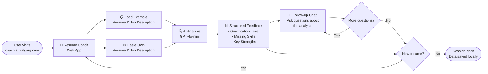
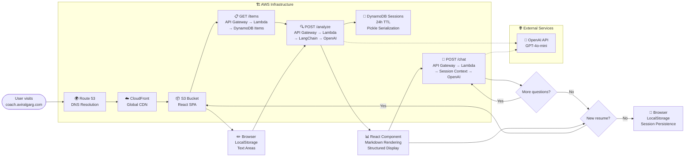

# Resume Coach

_This document tracks the **latest** state of the project for developers._

---

## 📋 Overview

**Resume Coach** is an AI-powered, serverless web application that helps job-seekers
tailor their résumés to a specific job description. Users paste their résumé and
the target JD and receive structured, actionable feedback. The app is live at  
<https://coach.aviralgarg.com>.

### 🌟 Key Features

- **LLM-based résumé analysis** (OpenAI `gpt-4o-mini`)
- **Structured feedback** (qualification level · missing skills · key strengths)
- **Contextual follow-up chat** that remembers prior answers
- **Session persistence** (DynamoDB + TTL, `sessionStorage` on the client)
- **Example loader** for instant demo content
- **Light/dark theme**, Markdown rendering, custom domain

---

## 🏗️ System Architecture

The stack is entirely serverless on AWS:

- **us-west-2** – Lambda, API Gateway, DynamoDB, S3, CloudFront
- **us-east-1** – ACM certificate for CloudFront
- Global – Route 53 DNS

### User Experience Flow



### Technical Implementation Flow



---

## 📁 Project Structure

```
ResumeCoach/
├── .github/workflows/ci.yml      # CI/CD pipeline (see below)
├── Makefile                      # Local helper commands
├── README.md                     # ← you are here
├── requirements.txt              # Root Python libs for misc tooling
│
├── backend/                      # Lambda source
│   ├── handler.py
│   ├── requirements.txt
│   └── prompts/
│       ├── analysis_system_prompt.txt
│       └── chat_system_prompt.txt
│
├── frontend/                     # React + Vite workspace
│   ├── src/ …                    # App.tsx etc.
│   ├── index.html
│   ├── package.json
│   └── dist/                     # ⚠️ build output – **not version-controlled**
│
├── infrastructure/               # AWS CDK (TypeScript v2)
│   ├── bin/infrastructure.ts
│   ├── lib/infrastructure-stack.ts
│   └── package.json
└── .husky/                       # Git hooks (lint-staged, Prettier, ESLint)
```

> **Note** : folders such as `frontend/dist/` and any `node_modules/`
> directories are generated locally or in CI and are **not committed**.

---

## 🖥️ Local Development

### Quick start

```bash
# clone & enter
git clone https://github.com/gaviral/ResumeCoach.git
cd ResumeCoach

# one-shot dev setup (venv + npm deps + hooks)
make dev-setup
```

_Back-end virtual-env uses [`uv`](https://github.com/astral-sh/uv)._

### Pre-push sanity check

```bash
npm run check     # lint → build → CDK synth → pytest (mirrors CI)
```

ESLint, Prettier, **and Python Black** all run automatically on staged files via Husky/lint-staged.

---

## 🛠️ Technology Stack

| Layer / Purpose      | Tech / Service                                    | Notes                                                     |
| -------------------- | ------------------------------------------------- | --------------------------------------------------------- |
| **SPA**              | React 19, Vite, TypeScript                        |                                                           |
| **Styling/Theming**  | Plain CSS + CSS variables                         | Light / dark via `prefers-color-scheme`                   |
| **HTTP client**      | Axios                                             |                                                           |
| **LLM framework**    | LangChain 0.3                                     |                                                           |
| **LLM provider**     | OpenAI `gpt-4o-mini`                              |                                                           |
| **API layer**        | API Gateway HTTP API (v2)                         | CORS `*` in dev                                           |
| **Compute**          | AWS Lambda (Py 3.11, ARM64)                       | Docker bundling                                           |
| **State – defaults** | DynamoDB `ResumeCoachItems`                       | PK=`id`                                                   |
| **State – sessions** | DynamoDB `ResumeCoachSessions`                    | PK=`sessionId`, TTL 24 h                                  |
| **Storage + CDN**    | S3 + CloudFront (OAI)                             |                                                           |
| **Infra as Code**    | AWS CDK v2 (TypeScript)                           |                                                           |
| **Secrets**          | SSM Parameter Store (`/ResumeCoach/OpenAIApiKey`) | Lambda fetches at runtime (falls back to env var locally) |
| **CI/CD**            | GitHub Actions                                    | Single job → synth → deploy                               |
| **Dev tooling**      | ESLint, Prettier, Husky, lint-staged, Pygments    |                                                           |

---

## 🛠️ CI / CD Pipeline

The workflow **`.github/workflows/ci.yml`** runs on every PR and on pushes to
`main`.

1. `npm ci` (root + workspaces) → **ESLint** → **Vite build**
2. `pip install` → **pytest** (placeholder)
3. **CDK synth** (type-checks infra)
4. **CDK deploy** to the production AWS account (main branch only)

Authentication currently uses traditional **access keys** provided as repository
secrets:

- `AWS_ACCESS_KEY_ID`
- `AWS_SECRET_ACCESS_KEY`
- `AWS_REGION` (default `us-west-2`)

Switching to GitHub OIDC is tracked for a future sprint.

---

## ⚙️ Configuration & Secrets

| Where                   | Key                                                      | Purpose                                                               |
| ----------------------- | -------------------------------------------------------- | --------------------------------------------------------------------- |
| `frontend/.env`         | `VITE_API_URL`                                           | Base URL of the API Gateway                                           |
| Lambda env              | `ITEMS_TABLE_NAME` / `SESSIONS_TABLE_NAME` / `LOG_LEVEL` | Injected by CDK                                                       |
| **SSM Parameter Store** | `/ResumeCoach/OpenAIApiKey`                              | OpenAI key (SecureString). Edit/rotate with `aws ssm put-parameter …` |

> The old “paste the key into the Lambda console” method is still accepted for
> quick experiments, but production deploys **must** rely on the SSM parameter.

---

## Database Schemas (DynamoDB)

### `ResumeCoachItems`

| PK (`id`) | `name` | `content` |
| --------- | ------ | --------- |

### `ResumeCoachSessions`

| PK (`sessionId`) | `resume` | `jobDescription` | `initialAnalysis` | `chat_history_blob` | `createdAt` | `lastUpdated` | `ttl` |

TTL is refreshed to **24 h after the last update** every time the session is
written.

---

## API Reference

| Method   | Path          | Description                                    |
| -------- | ------------- | ---------------------------------------------- |
| **GET**  | `/items`      | List default example metadata                  |
| **GET**  | `/items/{id}` | Fetch default content                          |
| **POST** | `/analyze`    | Analyse résumé vs JD → _analysis_, _sessionId_ |
| **POST** | `/chat`       | Follow-up Q & A within a session               |

All endpoints return JSON. CORS `OPTIONS` handled by API Gateway.

---

## Deployment Guide (manual)

```bash
# 1. first-time bootstrap
cd infrastructure
cdk bootstrap aws://$AWS_ACCOUNT/us-west-2

# 2. build front-end
(cd ../frontend && npm ci && npm run build)

# 3. deploy infra + assets
npm ci
cdk deploy
```

After the first deploy:

1. **Create the OpenAI key** (once):
   ```bash
   aws ssm put-parameter \
     --name "/ResumeCoach/OpenAIApiKey" \
     --type SecureString \
     --value "sk-…" \
     --overwrite
   ```
2. (Optional) Insert default examples into **`ResumeCoachItems`**.

---

## Known Limitations / TODO

- Key still readable by Lambda role (good) but **not rotated automatically**.
- No auth / user accounts; sessions are browser-scoped.
- Default list fetch uses **DynamoDB Scan** (OK for < 100 items, not for 10 k).
- CloudFront warns that `S3Origin` class is deprecated – will migrate to
  `S3BucketOrigin` once the CDK fix lands.
- Front-end is a single React component; needs refactor before adding
  complexity.
- Python auto-formatting not wired into pre-commit yet (learning in progress).

---

## Roadmap ✈️

- Secrets Manager + rotation
- User login (Cognito) and saved histories
- Streaming chat responses
- Multi-environment CDK (dev / prod)
- Automated Canary tests & alerts
- Switch CI auth to GitHub OIDC
- Replace `pickle` with JSON serialisation

---

## Troubleshooting

### Front-end

- 404s on API calls → check `VITE_API_URL` in the built code.
- Blank page → look for TypeScript errors in browser console.

### Back-end

- 503 “LLM unavailable” → invalid / missing OpenAI key.
- 404 “Session not found” → item expired (TTL) or wrong `sessionId`.
- Inspect CloudWatch logs: **`ResumeCoachBackendHandler`** in _us-west-2_.

---

© 2025 Aviral Garg – MIT License
