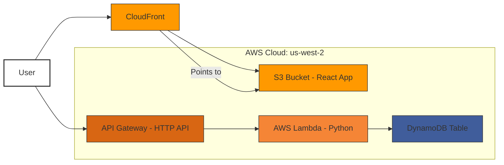

# Foundational Template: ResumeCoach (AWS CDK + Python + React)

This guide provides a comprehensive walkthrough to set up a basic, full-stack serverless web application foundation using AWS CDK (TypeScript) for infrastructure, Python (AWS Lambda) for the backend API, and React (TypeScript/Vite) for the frontend. This serves as a reusable template, demonstrated with simple CRUD operations, intended for projects like 'ResumeCoach'. **This version is configured for deployment to the `us-west-2` region and includes fixes for common deployment errors.**

**Architecture Overview:**

1.  **Frontend (React):** Hosted on S3, served via CloudFront. Interacts with the backend API.
2.  **Backend (Python Lambda):** Provides a RESTful API via API Gateway for CRUD operations.
3.  **Database (DynamoDB):** Stores application data (simple items in this example).
4.  **Infrastructure (AWS CDK):** Defines and deploys all AWS resources using stable constructs, targeted for `us-west-2`.

**Diagram:**



---

## Prerequisites

Before you begin, ensure you have the following installed and configured:

1.  **Node.js and npm/yarn:** (Node.js >= 18.x recommended) [https://nodejs.org/](https://nodejs.org/)
2.  **Python and pip:** (Python >= 3.9 recommended) [https://www.python.org/](https://www.python.org/)
3.  **AWS CLI:** Install and configure with your AWS credentials. **Ensure your default region is set to `us-west-2` or specify `--region us-west-2` in AWS CLI commands if needed.**
    ```bash
    aws configure # Set default region to us-west-2 if possible
    # OR verify current config:
    aws configure list
    ```
4.  **AWS CDK Toolkit:**
    ```bash
    npm install -g aws-cdk
    ```
5.  **Docker:** Install Docker Desktop (or Docker Engine on Linux). **Crucially, ensure the Docker daemon is running before executing `cdk deploy` commands.** CDK uses Docker to build the Lambda function deployment package. [https://www.docker.com/get-started](https://www.docker.com/get-started)
6.  **AWS Account:** An active AWS account with appropriate permissions to create the resources mentioned above.
7.  **Git:** (Optional, but recommended for version control)

**Note on Package Versions:** This guide generally avoids specifying exact package versions to allow package managers (`npm`, `pip`) to install the latest available versions. While this provides up-to-date dependencies, it might occasionally lead to compatibility issues if breaking changes occur in newer library releases. If you encounter issues during setup or runtime, check the documentation for the specific libraries or consider pinning versions in your `package.json`/`package-lock.json` and `requirements.txt` files once your initial setup works, ensuring stable, reproducible builds for your specific project.

---

## Step 1: Project Setup

Create the main project directory and the necessary sub-directories.

```bash
# Create the main project folder and navigate into it
# mkdir ResumeCoach
# cd ResumeCoach

# Create sub-folders
mkdir infrastructure
mkdir backend
mkdir frontend

# Initialize CDK within the infrastructure folder
cd infrastructure
cdk init app --language typescript

# Install necessary CDK dependencies (within the 'infrastructure' folder)
# We only need the core library as we'll use stable constructs
npm install aws-cdk-lib

# Navigate back to the root directory
cd ..
```

Your project structure should now look like this:

```
ResumeCoach/
├── backend/
├── frontend/
└── infrastructure/
    ├── bin/
    ├── lib/
    ├── node_modules/
    ├── test/
    ├── .git/           # (if you initialized git)
    ├── .gitignore
    ├── .npmignore
    ├── cdk.json
    ├── jest.config.js
    ├── package.json
    ├── package-lock.json # Important for locking dependency versions!
    ├── README.md
    └── tsconfig.json
```

---

## Step 2: Backend Implementation (Python Lambda)

Create the Python Lambda function handler and its dependencies file.

1.  **Create `requirements.txt`:**
    Navigate to the `backend` folder and create `requirements.txt`:

    ```bash
    cd backend
    touch requirements.txt
    ```

    Add `boto3` to `requirements.txt`. Pip (via Docker during CDK deployment) will install the latest version.

    ```txt
    # ResumeCoach/backend/requirements.txt
    boto3
    ```
    *(Optional: After initial setup and testing, you might run `pip freeze > requirements.txt` in your local virtual environment to lock down specific working versions for your project).*

2.  **Create `handler.py`:**
    Create the main handler file in the `backend` folder:

    ```bash
    touch handler.py
    ```

    Add the following Python code to `handler.py`. This code handles basic CRUD operations using `boto3` and expects the DynamoDB table name from an environment variable.

    ```python
    # ResumeCoach/backend/handler.py
    import json
    import boto3
    import os
    import uuid
    from datetime import datetime
    import logging

    # Configure logging
    logger = logging.getLogger()
    # Read log level from environment variable, default to INFO
    log_level = os.environ.get('LOG_LEVEL', 'INFO').upper()
    logger.setLevel(log_level)

    # Get the DynamoDB table name from environment variables
    TABLE_NAME = os.environ.get('TABLE_NAME')
    if not TABLE_NAME:
        logger.error("Environment variable TABLE_NAME is not set.")
        # Raise exception to prevent function from proceeding without table name
        raise ValueError("TABLE_NAME environment variable not set.")

    # Use default session, credentials will be picked up from Lambda execution role
    # Boto3 will use the region the Lambda function is deployed in (us-west-2)
    dynamodb_resource = boto3.resource('dynamodb')
    table = dynamodb_resource.Table(TABLE_NAME)
    # Get low-level client from resource if needed (e.g., for specific exceptions)
    dynamodb_client = dynamodb_resource.meta.client

    def create_item(event):
        """Creates a new item in DynamoDB."""
        try:
            # Assuming event body is JSON string from API Gateway HTTP API
            body = json.loads(event.get('body', '{}'))
            item_id = str(uuid.uuid4())
            timestamp = datetime.utcnow().isoformat()
            content = body.get('content') # Get content, check if None later

            if content is None:
                 logger.warning("Create request missing 'content' field")
                 return {
                    'statusCode': 400,
                    'headers': { 'Content-Type': 'application/json', 'Access-Control-Allow-Origin': '*' },
                    'body': json.dumps({'error': 'Missing "content" field in request body'})
                }

            item = {
                'id': item_id,
                'content': content,
                'createdAt': timestamp,
                'updatedAt': timestamp
            }

            table.put_item(Item=item)
            logger.info(f"Created item with ID: {item_id}")
            return {
                'statusCode': 201,
                # Required headers for CORS and JSON content type
                'headers': { 'Content-Type': 'application/json', 'Access-Control-Allow-Origin': '*' },
                'body': json.dumps(item)
            }
        except json.JSONDecodeError:
             logger.error("Error decoding JSON body")
             return {
                'statusCode': 400,
                'headers': { 'Content-Type': 'application/json', 'Access-Control-Allow-Origin': '*' },
                'body': json.dumps({'error': 'Invalid JSON format in request body'})
            }
        except Exception as e:
            logger.error(f"Error creating item: {e}", exc_info=True) # Log stack trace
            return {
                'statusCode': 500,
                'headers': { 'Content-Type': 'application/json', 'Access-Control-Allow-Origin': '*' },
                'body': json.dumps({'error': 'Internal server error during item creation'})
            }

    def get_all_items(event):
        """Retrieves all items (limited scan for simplicity)."""
        try:
            # Warning: Scan operations can be inefficient and costly on large tables.
            # Consider using Query with indexes for production scenarios.
            response = table.scan(Limit=20) # Limit results for demo purposes
            items = response.get('Items', [])
            logger.info(f"Retrieved {len(items)} items via scan.")
            return {
                'statusCode': 200,
                'headers': { 'Content-Type': 'application/json', 'Access-Control-Allow-Origin': '*' },
                'body': json.dumps(items)
            }
        except Exception as e:
            logger.error(f"Error getting all items: {e}", exc_info=True)
            return {
                'statusCode': 500,
                'headers': { 'Content-Type': 'application/json', 'Access-Control-Allow-Origin': '*' },
                'body': json.dumps({'error': 'Internal server error while fetching items'})
            }

    def get_item(event):
        """Retrieves a specific item by ID."""
        item_id = None # Initialize for logging in case of early error
        try:
            # ID comes from path parameters defined in API Gateway route
            item_id = event['pathParameters']['id']
            response = table.get_item(Key={'id': item_id})
            item = response.get('Item')

            if item:
                logger.info(f"Retrieved item with ID: {item_id}")
                return {
                    'statusCode': 200,
                    'headers': { 'Content-Type': 'application/json', 'Access-Control-Allow-Origin': '*' },
                    'body': json.dumps(item)
                }
            else:
                logger.warning(f"Item not found with ID: {item_id}")
                return {
                    'statusCode': 404,
                    'headers': { 'Content-Type': 'application/json', 'Access-Control-Allow-Origin': '*' },
                    'body': json.dumps({'error': 'Item not found'})
                }
        except KeyError:
             logger.error("Missing 'id' in pathParameters")
             return {
                'statusCode': 400,
                'headers': { 'Content-Type': 'application/json', 'Access-Control-Allow-Origin': '*' },
                'body': json.dumps({'error': "Missing 'id' in request path"})
            }
        except Exception as e:
            logger.error(f"Error getting item {item_id}: {e}", exc_info=True)
            return {
                'statusCode': 500,
                'headers': { 'Content-Type': 'application/json', 'Access-Control-Allow-Origin': '*' },
                'body': json.dumps({'error': 'Internal server error while fetching item'})
            }

    def update_item(event):
        """Updates an existing item."""
        item_id = None
        try:
            item_id = event['pathParameters']['id']
            body = json.loads(event.get('body', '{}'))
            content = body.get('content') # Only update content for simplicity

            if content is None:
                 logger.warning(f"Update request for {item_id} missing 'content' field")
                 return {
                    'statusCode': 400,
                    'headers': { 'Content-Type': 'application/json', 'Access-Control-Allow-Origin': '*' },
                    'body': json.dumps({'error': 'Missing "content" field in request body'})
                }

            timestamp = datetime.utcnow().isoformat()

            # Use update_item with ConditionExpression to ensure item exists
            response = table.update_item(
                Key={'id': item_id},
                UpdateExpression='SET content = :c, updatedAt = :u',
                ConditionExpression='attribute_exists(id)', # Only update if item exists
                ExpressionAttributeValues={
                    ':c': content,
                    ':u': timestamp
                },
                ReturnValues='UPDATED_NEW' # Return the updated attributes
            )
            logger.info(f"Updated item with ID: {item_id}")
            return {
                'statusCode': 200,
                'headers': { 'Content-Type': 'application/json', 'Access-Control-Allow-Origin': '*' },
                'body': json.dumps(response.get('Attributes', {}))
            }
        except KeyError:
             logger.error("Missing 'id' in pathParameters for update")
             return {
                'statusCode': 400,
                'headers': { 'Content-Type': 'application/json', 'Access-Control-Allow-Origin': '*' },
                'body': json.dumps({'error': "Missing 'id' in request path"})
            }
        except json.JSONDecodeError:
             logger.error("Error decoding JSON body for update")
             return {
                'statusCode': 400,
                'headers': { 'Content-Type': 'application/json', 'Access-Control-Allow-Origin': '*' },
                'body': json.dumps({'error': 'Invalid JSON format in request body'})
            }
        # Catch specific exception for item not found during conditional update
        except dynamodb_client.exceptions.ConditionalCheckFailedException:
             logger.warning(f"Update failed, item not found with ID: {item_id}")
             return {
                'statusCode': 404,
                'headers': { 'Content-Type': 'application/json', 'Access-Control-Allow-Origin': '*' },
                'body': json.dumps({'error': 'Item not found'})
            }
        except Exception as e:
            logger.error(f"Error updating item {item_id}: {e}", exc_info=True)
            return {
                'statusCode': 500,
                'headers': { 'Content-Type': 'application/json', 'Access-Control-Allow-Origin': '*' },
                'body': json.dumps({'error': 'Internal server error during item update'})
            }

    def delete_item(event):
        """Deletes an item by ID."""
        item_id = None
        try:
            item_id = event['pathParameters']['id']
            # Optional: Add ConditionExpression="attribute_exists(id)" to ensure existence
            # This would return 404 if not found via ConditionalCheckFailedException
            table.delete_item(
                Key={'id': item_id}
                # ConditionExpression='attribute_exists(id)' # Uncomment for strict check
            )
            logger.info(f"Deleted item with ID: {item_id}")
            return {
                'statusCode': 200, # Or 204 No Content (adjust frontend if using 204)
                'headers': { 'Content-Type': 'application/json', 'Access-Control-Allow-Origin': '*' },
                'body': json.dumps({'message': f'Item {item_id} deleted successfully'})
            }
        except KeyError:
             logger.error("Missing 'id' in pathParameters for delete")
             return {
                'statusCode': 400,
                'headers': { 'Content-Type': 'application/json', 'Access-Control-Allow-Origin': '*' },
                'body': json.dumps({'error': "Missing 'id' in request path"})
            }
        # except dynamodb_client.exceptions.ConditionalCheckFailedException:
        #      logger.warning(f"Delete failed, item not found with ID: {item_id}")
        #      return {
        #         'statusCode': 404,
        #         'headers': { 'Content-Type': 'application/json', 'Access-Control-Allow-Origin': '*' },
        #         'body': json.dumps({'error': 'Item not found'})
        #     } # Uncomment if using ConditionExpression
        except Exception as e:
            logger.error(f"Error deleting item {item_id}: {e}", exc_info=True)
            return {
                'statusCode': 500,
                'headers': { 'Content-Type': 'application/json', 'Access-Control-Allow-Origin': '*' },
                'body': json.dumps({'error': 'Internal server error during item deletion'})
            }


    def handler(event, context):
        """Main Lambda handler function routing requests."""
        # Using API Gateway HTTP API payload format v2.0
        try:
            http_method = event['requestContext']['http']['method']
            path = event['requestContext']['http']['path']

            logger.info(f"Received event: Method={http_method}, Path={path}")
            # Log event structure for debugging if needed (be careful with sensitive data)
            logger.debug(f"Full event: {json.dumps(event)}")

            # Simple routing logic based on method and path pattern
            if path == '/items':
                if http_method == 'POST':
                    return create_item(event)
                elif http_method == 'GET':
                    return get_all_items(event)
            # Check if path matches /items/{id} pattern
            elif path.startswith('/items/') and len(path.split('/')) == 3:
                 # Path parameters are automatically extracted by HTTP API into event['pathParameters']
                 if 'pathParameters' in event and 'id' in event['pathParameters']:
                    if http_method == 'GET':
                        return get_item(event)
                    elif http_method == 'PUT':
                        return update_item(event)
                    elif http_method == 'DELETE':
                        return delete_item(event)
                 else:
                     # Should not happen if routes are configured correctly, but good to handle
                     logger.error("Path matched /items/{id} but 'id' path parameter missing")
                     return {'statusCode': 400, 'headers': { 'Content-Type': 'application/json', 'Access-Control-Allow-Origin': '*' }, 'body': json.dumps({'error': "Missing 'id' in request path"})}

            # Default response for unhandled routes/methods
            logger.warning(f"Unhandled route: Method={http_method}, Path={path}")
            return {
                'statusCode': 404,
                'headers': { 'Content-Type': 'application/json', 'Access-Control-Allow-Origin': '*' },
                'body': json.dumps({'error': 'Not Found'})
            }
        except Exception as e:
            # Catch-all for unexpected errors during routing/event processing
            logger.error(f"Unhandled exception in handler: {e}", exc_info=True)
            return {
                'statusCode': 500,
                'headers': { 'Content-Type': 'application/json', 'Access-Control-Allow-Origin': '*' },
                'body': json.dumps({'error': 'Internal Server Error'})
            }

    ```

3.  **Navigate back to the root:**
    ```bash
    cd ..
    ```

---

## Step 3: Infrastructure Implementation (AWS CDK)

Define the AWS resources using CDK in the `infrastructure` folder. This uses the stable `lambda.Function` construct which requires **Docker** to be running during deployment.

1.  **Edit `infrastructure/lib/infrastructure-stack.ts`:**
    Replace the contents of `infrastructure/lib/infrastructure-stack.ts` with the following code. This version includes the fix for the CORS validation error (`allowCredentials: false`).

    ```typescript
    // ResumeCoach/infrastructure/lib/infrastructure-stack.ts
    import * as cdk from 'aws-cdk-lib';
    import { Construct } from 'constructs';
    import * as dynamodb from 'aws-cdk-lib/aws-dynamodb';
    import * as lambda from 'aws-cdk-lib/aws-lambda';
    // Using stable HTTP API constructs from aws-cdk-lib
    import * as apigwv2 from 'aws-cdk-lib/aws-apigatewayv2';
    import { HttpLambdaIntegration } from 'aws-cdk-lib/aws-apigatewayv2-integrations';
    import * as s3 from 'aws-cdk-lib/aws-s3';
    import * as s3deploy from 'aws-cdk-lib/aws-s3-deployment';
    import * as cloudfront from 'aws-cdk-lib/aws-cloudfront';
    import * as origins from 'aws-cdk-lib/aws-cloudfront-origins';
    import * as path from 'path';
    import { Duration, RemovalPolicy } from 'aws-cdk-lib'; // Import Duration and RemovalPolicy

    export class InfrastructureStack extends cdk.Stack {
      constructor(scope: Construct, id: string, props?: cdk.StackProps) {
        super(scope, id, props);

        // --- Database ---
        const dynamoTable = new dynamodb.Table(this, 'ResumeCoachItemsTable', {
          tableName: 'ResumeCoachItems', // Explicit table name
          partitionKey: { name: 'id', type: dynamodb.AttributeType.STRING },
          billingMode: dynamodb.BillingMode.PAY_PER_REQUEST,
          removalPolicy: RemovalPolicy.DESTROY, // Use imported RemovalPolicy for easy cleanup
          timeToLiveAttribute: 'ttl', // Optional: Enable TTL if you want items to expire
        });

        // --- Backend Lambda (Using Stable Function with Docker Bundling) ---
        // This approach requires Docker to be running during `cdk deploy`.
        const backendLambda = new lambda.Function(this, 'ResumeCoachBackendLambda', {
          runtime: lambda.Runtime.PYTHON_3_11, // Choose appropriate Python runtime
          handler: 'handler.handler', // File is 'handler.py', function is 'handler'
          // Define the code asset, pointing to the backend directory
          code: lambda.Code.fromAsset(path.join(__dirname, '../../backend'), {
            // Instruct CDK to build the code using Docker
            bundling: {
              // Use the official AWS Lambda Python image that matches the runtime
              image: lambda.Runtime.PYTHON_3_11.bundlingImage,
              // Commands to run inside the Docker container to prepare the asset
              command: [
                'bash', '-c', `
                pip install -r requirements.txt -t /asset-output &&
                cp -au . /asset-output
                `
                // 1. Install dependencies from requirements.txt into the /asset-output directory
                // 2. Copy the handler code (handler.py, etc.) into the /asset-output directory
              ],
              // Optional: Specify user if needed, default is root
              // user: "root",
              // Optional: Exclude files from the asset bundle (e.g., tests, venv)
              // exclude: ['.venv', '*.pyc', '.pytest_cache', 'tests/'],
            },
          }),
          environment: {
            TABLE_NAME: dynamoTable.tableName, // Pass table name to Lambda
            LOG_LEVEL: 'INFO', // Example environment variable for logging control
          },
          timeout: Duration.seconds(15), // Set a reasonable timeout
          memorySize: 128, // Adjust memory size as needed
          functionName: 'ResumeCoachBackendHandler', // Optional: Explicit function name
          description: 'Handles CRUD operations for ResumeCoach items',
          architecture: lambda.Architecture.ARM_64, // Optional: Use ARM for potential cost savings
        });

        // Grant Lambda permissions to access the DynamoDB table
        dynamoTable.grantReadWriteData(backendLambda);

        // --- API Gateway (HTTP API - Stable Constructs) ---
        const httpApi = new apigwv2.HttpApi(this, 'ResumeCoachHttpApi', {
          apiName: 'ResumeCoachHttpApi',
          description: 'HTTP API for ResumeCoach CRUD operations',
          corsPreflight: { // Configure CORS using stable properties
            allowHeaders: [
                'Content-Type', 'X-Amz-Date', 'Authorization', 'X-Api-Key',
                'X-Amz-Security-Token', 'X-Amz-User-Agent' // Add others if needed
            ],
            allowMethods: [ // Specify allowed methods for CORS
              apigwv2.CorsHttpMethod.OPTIONS, apigwv2.CorsHttpMethod.GET,
              apigwv2.CorsHttpMethod.POST, apigwv2.CorsHttpMethod.PUT,
              apigwv2.CorsHttpMethod.DELETE,
            ],
            // allowCredentials: true, // Cannot be true when allowOrigins is '*'
            allowCredentials: false, // Set to false as '*' is used for allowOrigins. Change if auth requires credentials.
            // Adjust allowOrigins based on your deployment needs. '*' is permissive.
            // For production, restrict this to your CloudFront distribution's domain.
            allowOrigins: ['*'], // TODO: Restrict in production
            maxAge: Duration.days(1), // Optional: Cache preflight response
          },
          // Default stage and auto deploy are enabled by default
        });

        // Create Lambda integration using stable HttpLambdaIntegration
        const lambdaIntegration = new HttpLambdaIntegration(
          'LambdaIntegration', // Logical ID for the integration
          backendLambda
          // Payload format version 2.0 is the default for HttpLambdaIntegration
        );

        // Define API routes using stable methods
        httpApi.addRoutes({
          path: '/items',
          methods: [apigwv2.HttpMethod.POST, apigwv2.HttpMethod.GET],
          integration: lambdaIntegration,
        });

        httpApi.addRoutes({
          path: '/items/{id}', // Path parameter {id} is automatically mapped to event.pathParameters.id
          methods: [
            apigwv2.HttpMethod.GET, apigwv2.HttpMethod.PUT,
            apigwv2.HttpMethod.DELETE,
          ],
          integration: lambdaIntegration,
        });

        // --- Frontend Hosting (S3 + CloudFront) ---
        const frontendBucket = new s3.Bucket(this, 'ResumeCoachFrontendBucket', {
          // Create a unique bucket name using account and region (now explicitly us-west-2)
          // Note: Bucket names must be globally unique. This helps, but collisions are still possible.
          bucketName: `resumecoach-frontend-${this.account}-${this.region}`,
          publicReadAccess: false, // Keep bucket private
          blockPublicAccess: s3.BlockPublicAccess.BLOCK_ALL, // Secure default
          removalPolicy: RemovalPolicy.DESTROY, // Use imported RemovalPolicy
          autoDeleteObjects: true, // Automatically delete objects when stack is deleted
          encryption: s3.BucketEncryption.S3_MANAGED, // Recommended practice
          enforceSSL: true, // Recommended practice
          versioned: true, // Optional: Enable versioning for rollback capabilities
        });

        // CloudFront Origin Access Identity (OAI) to restrict direct S3 access
        const originAccessIdentity = new cloudfront.OriginAccessIdentity(this, 'OAI', {
            comment: `OAI for ResumeCoach frontend bucket (us-west-2)` // Added region comment
        });
        frontendBucket.grantRead(originAccessIdentity); // Grant CloudFront permission to read bucket objects

        // CloudFront Distribution
        const distribution = new cloudfront.Distribution(this, 'ResumeCoachDistribution', {
          comment: 'CloudFront distribution for ResumeCoach frontend (Origin: us-west-2)', // Added region comment
          defaultBehavior: {
            origin: new origins.S3Origin(frontendBucket, { originAccessIdentity }), // Use OAI
            viewerProtocolPolicy: cloudfront.ViewerProtocolPolicy.REDIRECT_TO_HTTPS, // Enforce HTTPS
            allowedMethods: cloudfront.AllowedMethods.ALLOW_GET_HEAD_OPTIONS, // Allow necessary methods
            cachedMethods: cloudfront.CachedMethods.CACHE_GET_HEAD_OPTIONS, // Cache GET, HEAD, OPTIONS
            compress: true, // Enable compression (gzip/brotli)
            cachePolicy: cloudfront.CachePolicy.CACHING_OPTIMIZED, // Use a standard cache policy
          },
          defaultRootObject: 'index.html', // Serve index.html for root requests
          priceClass: cloudfront.PriceClass.PRICE_CLASS_100, // Use cheapest edge locations
          // Handle SPA routing: redirect 403/404 errors to index.html
           errorResponses:[
             {
               httpStatus: 403, // Access Denied from S3 (due to OAI) should serve index.html
               responseHttpStatus: 200,
               responsePagePath: '/index.html',
               ttl: Duration.minutes(0), // Do not cache error responses for SPA routing
             },
             {
               httpStatus: 404, // Not Found should serve index.html for client-side routing
               responseHttpStatus: 200,
               responsePagePath: '/index.html',
               ttl: Duration.minutes(0),
             }
           ],
           minimumProtocolVersion: cloudfront.SecurityPolicyProtocol.TLS_V1_2_2021, // Recommended security policy
           // Optional: Enable logging
           // logBucket: new s3.Bucket(this, 'CfLogsBucket', { removalPolicy: RemovalPolicy.DESTROY, autoDeleteObjects: true }),
           // logFilePrefix: 'cloudfront-logs/',
        });

        // --- S3 Bucket Deployment (for deploying React build output) ---
        // This construct uses a Lambda function behind the scenes to copy files and invalidate cache.
        new s3deploy.BucketDeployment(this, 'DeployReactApp', {
          sources: [s3deploy.Source.asset(path.join(__dirname, '../../frontend/dist'))], // Point to the build output dir
          destinationBucket: frontendBucket, // The bucket to deploy to
          distribution: distribution, // The CloudFront distribution to invalidate
          distributionPaths: ['/*'], // Invalidate all files (index.html, static assets, etc.)
          // Optional: Add memory limit if bundling large assets for the deployment Lambda
          // memoryLimit: 1024,
          // Optional: Prune old files not present in the new deployment
          prune: true,
        });


        // --- Stack Outputs ---
        new cdk.CfnOutput(this, 'ApiGatewayUrl', {
          // Use httpApi.apiEndpoint which includes the stage, e.g., https://<id>.execute-api.<region>.amazonaws.com/
          value: httpApi.apiEndpoint,
          description: 'The base URL of the API Gateway endpoint (us-west-2)',
          exportName: 'ResumeCoachApiEndpoint', // Optional: Export for cross-stack reference
        });

        new cdk.CfnOutput(this, 'CloudFrontDomainName', {
          value: distribution.distributionDomainName,
          description: 'The domain name of the CloudFront distribution',
          exportName: 'ResumeCoachCloudFrontDomain', // Optional: Export
        });

         new cdk.CfnOutput(this, 'FrontendBucketName', {
          value: frontendBucket.bucketName,
          description: 'The name of the S3 bucket hosting the frontend (us-west-2)',
        });
      }
    }
    ```

2.  **Edit `infrastructure/bin/infrastructure.ts`:**
    This file specifies the target deployment region (`us-west-2`).
    Ensure the main application file correctly instantiates your stack. The default generated file is usually sufficient:

    ```typescript
    #!/usr/bin/env node
    // ResumeCoach/infrastructure/bin/infrastructure.ts
    import 'source-map-support/register';
    import * as cdk from 'aws-cdk-lib';
    import { InfrastructureStack } from '../lib/infrastructure-stack';

    const app = new cdk.App();
    new InfrastructureStack(app, 'ResumeCoachFoundationStack', {
      /* If you don't specify 'env', this stack will be environment-agnostic.
       * Account/Region-dependent features and context lookups will not work,
       * but a single synthesized template can be deployed anywhere. */

      /* Uncomment the next line to specialize this stack for the AWS Account
       * and Region that are implied by the current CLI configuration. */
      // env: { account: process.env.CDK_DEFAULT_ACCOUNT, region: process.env.CDK_DEFAULT_REGION },

      /* Specify the AWS Account and Region directly for us-west-2 deployment. */
      /* Uses the account configured in your AWS CLI/environment */
      env: {
        account: process.env.CDK_DEFAULT_ACCOUNT,
        region: 'us-west-2' // Explicitly set region to us-west-2
      },

      /* Uncomment the next line if you know exactly what Account and Region you
       * want to deploy the stack to. */
      // env: { account: '123456789012', region: 'us-west-2' },

      /* For more information, see https://docs.aws.amazon.com/cdk/latest/guide/environments.html */
      description: 'Foundation stack for ResumeCoach application (CDK + Python + React) - Deployed to us-west-2', // Updated description
      tags: { // Optional: Add tags to resources
          Project: 'ResumeCoach',
          Environment: 'Development',
          Region: 'us-west-2' // Add region tag
      }
    });
    ```

---

## Step 4: Frontend Implementation (React + TypeScript + Vite)

Set up the React frontend application.

1.  **Initialize React Project:**
    Navigate to the `frontend` folder and use Vite to create a new React TypeScript project.

    ```bash
    cd ../frontend # Make sure you are in the ResumeCoach/frontend directory

    # Initialize Vite project (choose react-ts template)
    # Use '.' to initialize in the current directory
    npm create vite@latest . -- --template react-ts
    # Or using yarn: yarn create vite . --template react-ts

    # Install dependencies (will install latest versions)
    npm install
    # Or using yarn: yarn install

    # Install axios for API calls
    npm install axios
    # Or using yarn: yarn add axios
    ```

2.  **Create `.env` file:**
    Create a `.env` file in the `frontend` folder to store the API Gateway URL. Vite uses `VITE_` prefix for environment variables exposed to the client.

    ```bash
    touch .env
    ```

    Add the following line (leave the URL empty for now, we'll get it after the first deployment):

    ```env
    # ResumeCoach/frontend/.env
    # This URL will be populated after the first CDK deployment (will point to us-west-2 API Gateway)
    VITE_API_URL=
    ```

3.  **Update `App.tsx`:**
    Replace the contents of `frontend/src/App.tsx` with the following code to create a basic UI for CRUD operations:

    ```typescript
    // ResumeCoach/frontend/src/App.tsx
    import React, { useState, useEffect, useCallback } from 'react';
    import axios, { AxiosError } from 'axios'; // Import AxiosError type
    import './App.css'; // Basic styling

    // Define the structure of an item (matching backend)
    interface Item {
      id: string;
      content: string;
      createdAt: string;
      updatedAt: string;
    }

    // Define a type for API errors for better handling
    interface ApiError {
        message: string;
        status?: number;
    }

    function App() {
      const [items, setItems] = useState<Item[]>([]);
      const [newItemContent, setNewItemContent] = useState<string>('');
      const [updateItemId, setUpdateItemId] = useState<string>('');
      const [updateItemContent, setUpdateItemContent] = useState<string>('');
      const [loading, setLoading] = useState<boolean>(false);
      const [error, setError] = useState<ApiError | null>(null); // Use ApiError type
      const [statusMessage, setStatusMessage] = useState<string>('');

      // Get API URL from environment variables (set by Vite during build)
      const apiUrl = import.meta.env.VITE_API_URL;

      // --- Helper to format errors ---
      const formatError = (err: unknown): ApiError => {
          if (axios.isAxiosError(err)) {
              const serverError = err.response?.data?.error; // Check for error message from backend
              return {
                  message: serverError || err.message || 'An Axios error occurred',
                  status: err.response?.status
              };
          } else if (err instanceof Error) {
              return { message: err.message };
          } else {
              return { message: 'An unknown error occurred' };
          }
      };

      // --- API Call Functions ---

      const fetchItems = useCallback(async () => {
        if (!apiUrl) {
          setError({ message: "API URL is not configured. Please set VITE_API_URL in your .env file and rebuild/redeploy." });
          return;
        }
        setLoading(true);
        setError(null);
        // Clear status message when starting fetch
        // setStatusMessage('');
        console.log(`Fetching items from: ${apiUrl}/items`);
        try {
          // Ensure the expected response type matches the backend
          const response = await axios.get<Item[]>(`${apiUrl}/items`);
          // Sort items by creation date (newest first) for better display
          const sortedItems = response.data.sort((a, b) =>
              new Date(b.createdAt).getTime() - new Date(a.createdAt).getTime()
          );
          setItems(sortedItems);
          // Set status only on successful fetch, cleared otherwise
          setStatusMessage('Items fetched successfully.');
        } catch (err) {
          const formattedError = formatError(err);
          console.error("Error fetching items:", err);
          setError({ message: `Failed to fetch items: ${formattedError.message}`, status: formattedError.status });
          setStatusMessage(''); // Clear status on error
        } finally {
          setLoading(false);
        }
      }, [apiUrl]); // Dependency: only apiUrl

      const createItem = async () => {
        if (!apiUrl) { setError({ message: "API URL not configured." }); return; }
        if (!newItemContent.trim()) { setError({ message: "New item content cannot be empty." }); return; }

        setLoading(true);
        setError(null);
        setStatusMessage('');
        console.log(`Creating item at: ${apiUrl}/items with content: "${newItemContent}"`);
        try {
          // Send content in the request body as expected by the backend
          const response = await axios.post<Item>(`${apiUrl}/items`, { content: newItemContent });
          setNewItemContent(''); // Clear input field after successful creation
          setStatusMessage(`Item "${response.data.content}" created (ID: ${response.data.id}). Refreshing list...`);
          await fetchItems(); // Refetch the list to show the new item
        } catch (err) {
          const formattedError = formatError(err);
          console.error("Error creating item:", err);
          setError({ message: `Failed to create item: ${formattedError.message}`, status: formattedError.status });
          setStatusMessage(''); // Clear status on error
        } finally {
          setLoading(false);
        }
      };

      const updateItem = async () => {
        if (!apiUrl) { setError({ message: "API URL not configured." }); return; }
        if (!updateItemId.trim() || !updateItemContent.trim()) {
            setError({ message: "Both Item ID and New Content are required for update." });
            return;
        }

        setLoading(true);
        setError(null);
        setStatusMessage('');
        const itemToUpdateId = updateItemId; // Capture id before clearing fields
        const itemToUpdateContent = updateItemContent;
        console.log(`Updating item ID ${itemToUpdateId} at: ${apiUrl}/items/${itemToUpdateId} with content: "${itemToUpdateContent}"`);
        try {
          // Send new content in the request body
          await axios.put(`${apiUrl}/items/${itemToUpdateId}`, { content: itemToUpdateContent });
          setUpdateItemId(''); // Clear fields after successful update
          setUpdateItemContent('');
          setStatusMessage(`Item ID ${itemToUpdateId} updated. Refreshing list...`);
          await fetchItems(); // Refetch items to show the update
        } catch (err) {
           const formattedError = formatError(err);
           console.error("Error updating item:", err);
           // Provide specific feedback for 404
           if (formattedError.status === 404) {
               setError({ message: `Failed to update: Item with ID ${itemToUpdateId} not found.`, status: 404 });
           } else {
               setError({ message: `Failed to update item: ${formattedError.message}`, status: formattedError.status });
           }
           setStatusMessage(''); // Clear status on error
        } finally {
          setLoading(false);
        }
      };

      const deleteItem = async (id: string) => {
        if (!apiUrl) { setError({ message: "API URL not configured." }); return; }
        // Confirmation dialog
        if (!window.confirm(`Are you sure you want to permanently delete item ID ${id}?`)) {
            return;
        }

        setLoading(true);
        setError(null);
        setStatusMessage('');
        console.log(`Deleting item ID ${id} at: ${apiUrl}/items/${id}`);
        try {
          await axios.delete(`${apiUrl}/items/${id}`);
          setStatusMessage(`Item ID ${id} deleted. Refreshing list...`);
          await fetchItems(); // Refetch list to reflect deletion
        } catch (err) {
          const formattedError = formatError(err);
          console.error("Error deleting item:", err);
          setError({ message: `Failed to delete item: ${formattedError.message}`, status: formattedError.status });
          setStatusMessage(''); // Clear status on error
        } finally {
          setLoading(false);
        }
      };

      // --- Effects ---

      // Fetch items on initial component mount or when apiUrl changes
      useEffect(() => {
        if (apiUrl) {
            console.log("API URL is set. Fetching initial items.");
            fetchItems();
        } else {
            console.warn("API URL not available on mount.");
            // Display warning persistently if URL is missing
            setError({ message: "API URL is not configured. Please set VITE_API_URL in your .env file, then build and deploy." });
        }
        // eslint-disable-next-line react-hooks/exhaustive-deps
      }, [apiUrl]); // fetchItems is memoized with useCallback, including it is optional but safe

      // --- Render ---

      return (
        <div className="App">
          <h1>ResumeCoach Foundation - CRUD Demo</h1>

          {/* Status Messages */}
          {loading && <p className="status loading"><i>Loading...</i></p>}
          {/* Display error prominently */}
          {error && <p className="status error"><b>Error:</b> {error.message} {error.status ? `(Status: ${error.status})` : ''}</p>}
          {/* Display status only if no error */}
          {statusMessage && !error && <p className="status success"><b>Status:</b> {statusMessage}</p>}
          {!apiUrl && <p className="status warning"><b>Warning:</b> VITE_API_URL is not set in .env</p>}

          {/* --- Create Item --- */}
          <div className="card">
            <h2>Create New Item</h2>
            <input
              type="text"
              aria-label="New item content"
              placeholder="Enter item content"
              value={newItemContent}
              onChange={(e) => setNewItemContent(e.target.value)}
              disabled={loading || !apiUrl}
            />
            <button onClick={createItem} disabled={loading || !apiUrl || !newItemContent.trim()}>
              Create Item
            </button>
          </div>

          {/* --- Update Item --- */}
          <div className="card">
            <h2>Update Item</h2>
            <input
              type="text"
              aria-label="Item ID to Update"
              placeholder="Item ID to Update"
              value={updateItemId}
              onChange={(e) => setUpdateItemId(e.target.value)}
              disabled={loading || !apiUrl}
            />
            <input
              type="text"
              aria-label="New Content for Update"
              placeholder="New Content"
              value={updateItemContent}
              onChange={(e) => setUpdateItemContent(e.target.value)}
              disabled={loading || !apiUrl}
            />
            <button onClick={updateItem} disabled={loading || !apiUrl || !updateItemId.trim() || !updateItemContent.trim()}>
              Update Item
            </button>
             <button onClick={() => { setUpdateItemId(''); setUpdateItemContent(''); setError(null); }} disabled={loading} className="secondary">
                    Clear Update Fields
             </button>
          </div>

          {/* --- Read/List Items --- */}
          <div className="card">
            <h2>Items List</h2>
            <button onClick={fetchItems} disabled={loading || !apiUrl}>
              Refresh List
            </button>
            {items.length === 0 && !loading && apiUrl && <p>No items found in the database.</p>}
            <ul>
              {items.map((item) => (
                <li key={item.id}>
                  <div><strong>ID:</strong> {item.id}</div>
                  <div><strong>Content:</strong> {item.content}</div>
                  <div><strong>Created:</strong> {new Date(item.createdAt).toLocaleString()}</div>
                  <div><strong>Updated:</strong> {new Date(item.updatedAt).toLocaleString()}</div>
                  <div className="item-actions">
                      <button
                          onClick={() => { setUpdateItemId(item.id); setUpdateItemContent(item.content); window.scrollTo(0, 0); setError(null); setStatusMessage(''); }}
                          disabled={loading || !apiUrl}
                          className="edit"
                          aria-label={`Edit item ${item.id}`}
                       >
                        Edit
                      </button>
                      <button
                          onClick={() => deleteItem(item.id)}
                          disabled={loading || !apiUrl}
                          className="delete"
                          aria-label={`Delete item ${item.id}`}
                       >
                        Delete
                      </button>
                  </div>
                </li>
              ))}
            </ul>
          </div>
        </div>
      );
    }

    export default App;
    ```

4.  **Add Basic Styling (Optional):**
    You can add some minimal styling to `frontend/src/App.css`:

    ```css
    /* ResumeCoach/frontend/src/App.css */
    :root {
      font-family: Inter, system-ui, Avenir, Helvetica, Arial, sans-serif;
      line-height: 1.5;
      font-weight: 400;
      color-scheme: light dark;
      color: rgba(255, 255, 255, 0.87);
      background-color: #242424;
      font-synthesis: none;
      text-rendering: optimizeLegibility;
      -webkit-font-smoothing: antialiased;
      -moz-osx-font-smoothing: grayscale;
    }

    body {
      margin: 0;
      display: flex;
      place-items: center;
      min-width: 320px;
      min-height: 100vh;
    }

    #root {
      max-width: 1280px;
      margin: 0 auto;
      padding: 2rem;
      text-align: center;
      width: 100%;
    }

    .App {
      width: 100%;
    }

    .card {
      border: 1px solid #555;
      border-radius: 8px;
      padding: 1.5em;
      margin-bottom: 1.5em;
      background-color: #2f2f2f;
      box-shadow: 0 4px 8px rgba(0,0,0,0.2);
      text-align: left;
    }

    h1 {
      font-size: 2.5em;
      line-height: 1.1;
      margin-bottom: 1em;
    }

    h2 {
        color: #eee;
        margin-top: 0;
        margin-bottom: 0.8em;
        border-bottom: 1px solid #444;
        padding-bottom: 0.3em;
    }

    input[type="text"] {
      padding: 0.7em 1.2em;
      margin: 0.5em 0.5em 0.5em 0;
      border: 1px solid #555;
      border-radius: 4px;
      font-size: 1em;
      background-color: #333;
      color: #eee;
      display: block; /* Make inputs take full width */
      width: calc(100% - 2.4em - 2px); /* Adjust width considering padding and border */
      box-sizing: border-box;
    }
    .card input[type="text"]:not(:last-of-type) {
        margin-bottom: 1em;
    }


    button {
      border-radius: 8px;
      border: 1px solid transparent;
      padding: 0.6em 1.2em;
      font-size: 1em;
      font-weight: 500;
      font-family: inherit;
      background-color: #1a1a1a;
      color: #ffffff;
      cursor: pointer;
      transition: border-color 0.25s, background-color 0.25s;
      margin: 0.8em 0.5em 0.2em 0; /* Adjust margin */
      vertical-align: middle;
      background-color: #535bf2;
    }
    button:hover {
      border-color: #747bff;
      background-color: #6168e4;
    }
    button:focus,
    button:focus-visible {
      outline: 4px auto -webkit-focus-ring-color;
    }
    button:disabled {
      background-color: #444;
      color: #888;
      cursor: not-allowed;
      opacity: 0.7;
      border-color: transparent;
    }
    button.secondary {
        background-color: #666;
    }
    button.secondary:hover {
        background-color: #777;
        border-color: #888;
    }
    button.delete {
        background-color: #f44336; /* Red */
    }
    button.delete:hover {
        background-color: #da190b;
        border-color: #ff6659;
    }
     button.edit {
        background-color: #ff9800; /* Orange */
    }
    button.edit:hover {
        background-color: #e68a00;
        border-color: #ffac33;
    }

    ul {
      list-style: none;
      padding: 0;
      margin-top: 1em;
    }

    li {
      border-bottom: 1px solid #444;
      padding: 1em 0.5em;
      text-align: left;
      word-wrap: break-word;
    }
    li:last-child {
        border-bottom: none;
    }
    li strong {
        display: inline-block;
        min-width: 70px;
        font-weight: 600;
        color: #ccc;
    }
    li div {
        margin-bottom: 0.3em;
    }
    .item-actions {
        margin-top: 0.8em;
    }
    .item-actions button {
        font-size: 0.9em;
        padding: 0.4em 0.8em;
        margin-right: 0.5em;
    }

    /* Status message styling */
    .status {
        padding: 0.8em 1.2em;
        margin: 1em 0;
        border-radius: 4px;
        font-weight: 500;
        text-align: left; /* Align text left */
    }
    .status.loading {
        background-color: #334;
        color: #aaa;
        border: 1px solid #445;
    }
    .status.error {
        background-color: #5c1f1f;
        color: #ffcccc;
        border: 1px solid #7c3f3f;
    }
    .status.success {
        background-color: #1f5c3a;
        color: #ccffdd;
        border: 1px solid #3f7c5a;
    }
    .status.warning {
        background-color: #5c5a1f;
        color: #ffffcc;
        border: 1px solid #7c7a3f;
    }

    /* Dark mode adjustments (already default) */

    /* Light mode adjustments */
    @media (prefers-color-scheme: light) {
      :root {
        color: #213547;
        background-color: #ffffff;
      }
      a:hover {
        color: #747bff;
      }
      button {
        background-color: #f9f9f9; /* Default button background in light mode */
      }
      .App { color: #333; }
      .card { background-color: #ffffff; border-color: #e0e0e0; box-shadow: 0 2px 4px rgba(0,0,0,0.05); }
      h1, h2 { color: #222; }
      h2 { border-bottom-color: #eee; }
      input[type="text"] { background-color: #fff; color: #333; border-color: #ccc; }
      li { border-bottom-color: #eee; }
      li strong { color: #555; }
      button { background-color: #535bf2; color: white; } /* Primary button */
      button:hover { background-color: #6168e4; }
      button:disabled { background-color: #ccc; color: #888; }
      button.secondary { background-color: #e0e0e0; color: #333; }
      button.secondary:hover { background-color: #d5d5d5; }
      button.delete { background-color: #e53935; color: white; }
      button.delete:hover { background-color: #c62828; }
      button.edit { background-color: #fb8c00; color: white; }
      button.edit:hover { background-color: #f57c00; }
      .status.loading { background-color: #f0f0f0; color: #555; border-color: #ddd; }
      .status.error { background-color: #ffebee; color: #c62828; border-color: #f4c7c7; }
      .status.success { background-color: #e8f5e9; color: #2e7d32; border-color: #c8e6c9; }
      .status.warning { background-color: #fffde7; color: #f57f17; border-color: #fff9c4; }
    }
    ```

5.  **Navigate back to the root:**
    ```bash
    cd ..
    ```

---

## Step 5: Deployment Process

This revised flow builds the frontend initially to avoid asset errors during the first deployment. **Ensure Docker is running before starting.**

1.  **Bootstrap CDK (If first time in the `us-west-2` region/account):**
    Navigate to the `infrastructure` directory and run bootstrap. This only needs to be done once per account/region combination.

    ```bash
    cd infrastructure
    echo "Bootstrapping CDK environment for us-west-2 (if needed)..."
    # CDK will use the account/region specified in bin/infrastructure.ts or AWS CLI profile
    cdk bootstrap
    ```

2.  **Initial Frontend Build (Create `dist` directory):**
    Before the first CDK deployment, build the frontend once. This creates the `frontend/dist` directory that `BucketDeployment` needs, preventing the "Cannot find asset" error.

    ```bash
    cd ../frontend
    echo "Installing frontend dependencies..."
    npm install
    echo "Performing initial frontend build..."
    npm run build
    cd ../infrastructure # Go back to infrastructure directory
    ```

3.  **Deploy Infrastructure & Initial Frontend (Stage 1):**
    Deploy the CDK stack to `us-west-2`. **Make sure Docker is running!** This creates all backend resources and performs the *first* upload of the (potentially basic) frontend assets from `dist`.

    ```bash
    # Ensure latest infrastructure dependencies are installed
    echo "Installing infrastructure dependencies..."
    npm install

    # Compile TypeScript CDK code to JavaScript
    echo "Compiling CDK code..."
    npm run build

    # Deploy the stack to your configured AWS account in us-west-2
    echo "Deploying CDK stack to us-west-2 (Stage 1 - Requires Docker)..."
    # Make sure Docker Desktop or Docker Engine is running!
    cdk deploy
    ```
    Wait for the deployment to complete. Note the `ApiGatewayUrl` output (it will be an `execute-api.us-west-2.amazonaws.com` URL). Copy this URL.

4.  **Configure Frontend:**
    *   Open the `.env` file located at `ResumeCoach/frontend/.env`.
    *   Paste the copied `ApiGatewayUrl` value (the `us-west-2` URL) into the `VITE_API_URL` variable. **Ensure no trailing slash (`/`).**

        ```env
        # ResumeCoach/frontend/.env
        VITE_API_URL=https://abcdef123.execute-api.us-west-2.amazonaws.com
        ```

5.  **Final Frontend Build (With API URL):**
    Navigate back to the `frontend` directory and build the React application *again*. This time, the build will include the correct `VITE_API_URL`.

    ```bash
    cd ../frontend
    echo "Building final frontend application with API URL..."
    npm run build
    # Or using yarn: yarn build
    ```

6.  **Deploy Final Frontend Assets (Stage 2):**
    Navigate back to the `infrastructure` directory and run `cdk deploy` again. This uploads the *final* contents of `frontend/dist` (with the API URL configured) to the S3 bucket and invalidates the CloudFront cache.

    ```bash
    cd ../infrastructure
    # No need to run `npm run build` (CDK build) again unless you changed CDK code
    echo "Deploying final frontend assets via CDK (Stage 2)..."
    cdk deploy
    ```
    Wait for the deployment to complete. Note the `CloudFrontDomainName` output.

---

## Step 6: Testing the Application

1.  Open your web browser and navigate to the `CloudFrontDomainName` URL provided in the CDK output (e.g., `https://d123xyzabc.cloudfront.net`). **Make sure to use `https://`.**
2.  You should see the React application interface ("ResumeCoach Foundation - CRUD Demo").
    *   **Troubleshooting:** If you see an old version, a blank page, or errors immediately:
        *   Wait 2-5 minutes for CloudFront invalidation to complete.
        *   Perform a hard refresh in your browser (e.g., Ctrl+Shift+R or Cmd+Shift+R) to bypass the local browser cache.
        *   Check your browser's developer console (F12) for any JavaScript errors or network request failures (e.g., 403 Forbidden, 404 Not Found, CORS errors). Ensure the `VITE_API_URL` in `.env` was set correctly *before* the **final** `npm run build`. Verify the API Gateway URL is correct and accessible (you can try accessing `/items` directly in the browser or using `curl`). Check CloudWatch Logs for your Lambda function in the **`us-west-2`** region for backend errors. Verify Docker was running during the `cdk deploy` (Stage 1).
3.  Test the CRUD operations (Create, Read, Update, Delete). They should function correctly, hitting the backend API in `us-west-2`.

4.  Observe status messages, loading indicators, and error handling. Check CloudWatch Logs in `us-west-2` for the `ResumeCoachBackendHandler` Lambda function for detailed backend execution logs and errors.

---

## Step 7: Cleanup

To avoid ongoing AWS charges, destroy the stack when you are finished experimenting.

1.  Navigate to the `infrastructure` directory:
    ```bash
    # Make sure you are in ResumeCoach/infrastructure
    echo "Destroying AWS CDK stack from us-west-2..."
    # CDK destroy will use the environment specified in bin/infrastructure.ts
    cdk destroy
    ```
2.  Confirm the deletion by typing `y` when prompted.
3.  Wait for the process to complete. This removes the resources from the `us-west-2` region.
    *   **Note:** If you change removal policies or if the S3 bucket deletion fails for some reason (e.g., permissions, ongoing activity), manual cleanup via the AWS Console or CLI might be required.

---

## Next Steps & Extensibility

This foundation provides a solid starting point. You can extend it by:

*   **Adding Authentication/Authorization:** Secure your API using AWS Cognito, Lambda Authorizers, or other methods. Update frontend logic to handle login/logout and attach tokens to API requests. Adjust API Gateway CORS `allowOrigins` and `allowCredentials`.
*   **Implementing Resume-Specific Logic:** Replace the generic 'items' CRUD with endpoints for uploading resume files (to S3), triggering analysis (Lambda, Step Functions), storing extracted data (DynamoDB with a more complex schema), and providing feedback via the API.
*   **Integrating ML Models:** Deploy ML models (e.g., using SageMaker endpoints, AWS Lambda container images, or Lambda Layers) and invoke them from your backend Lambda function for tasks like skill extraction, experience parsing, or scoring.
*   **Improving Frontend UI/UX:** Build a more sophisticated user interface using component libraries (like Material UI, Chakra UI, Ant Design), add file upload components, display analysis results visually, manage user profiles, etc.
*   **Adding More Complex Database Queries:** Utilize DynamoDB queries with specific Key Conditions, Filter Expressions, and potentially add Global Secondary Indexes (GSIs) or Local Secondary Indexes (LSIs) for efficient data retrieval based on attributes other than the primary key (`id`). Avoid table scans (`table.scan`) in production for performance.
*   **Setting up CI/CD:** Create automated pipelines (e.g., using AWS CodePipeline/CodeBuild/CodeDeploy, GitHub Actions, GitLab CI) to build, test (`pytest` for backend, Vitest/React Testing Library for frontend), and deploy changes to your infrastructure and application code.
*   **Custom Domain:** Configure a custom domain name (e.g., `app.yourdomain.com`) for your CloudFront distribution using Amazon Route 53 and AWS Certificate Manager (ACM) for SSL/TLS certificates.
*   **Monitoring and Logging:** Enhance logging in the Lambda function (e.g., using structured logging libraries like `aws-lambda-powertools-python`). Set up CloudWatch Alarms based on metrics (errors, latency, invocation count) or log patterns. Enable AWS X-Ray for distributed tracing to analyze request flows.
*   **Error Handling:** Implement more granular error handling on both frontend and backend, providing clearer feedback to the user and logging detailed error information for debugging.
*   **State Management (Frontend):** For more complex frontend applications, introduce a dedicated state management library like Zustand, Redux Toolkit, or Jotai to manage application state more effectively.
*   **Version Pinning:** Once your initial setup is stable and you begin active development, freeze your dependency versions using lock files (`package