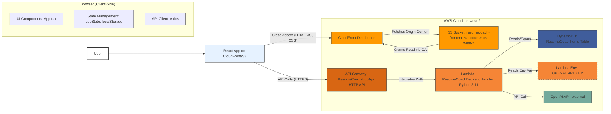
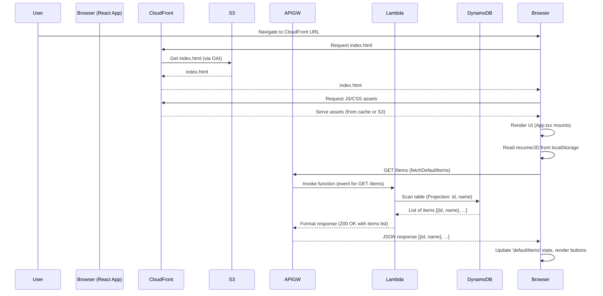
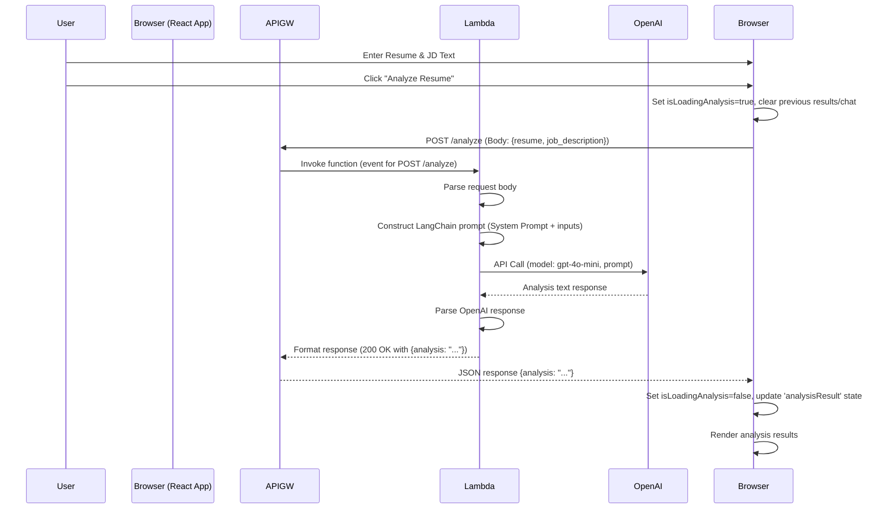
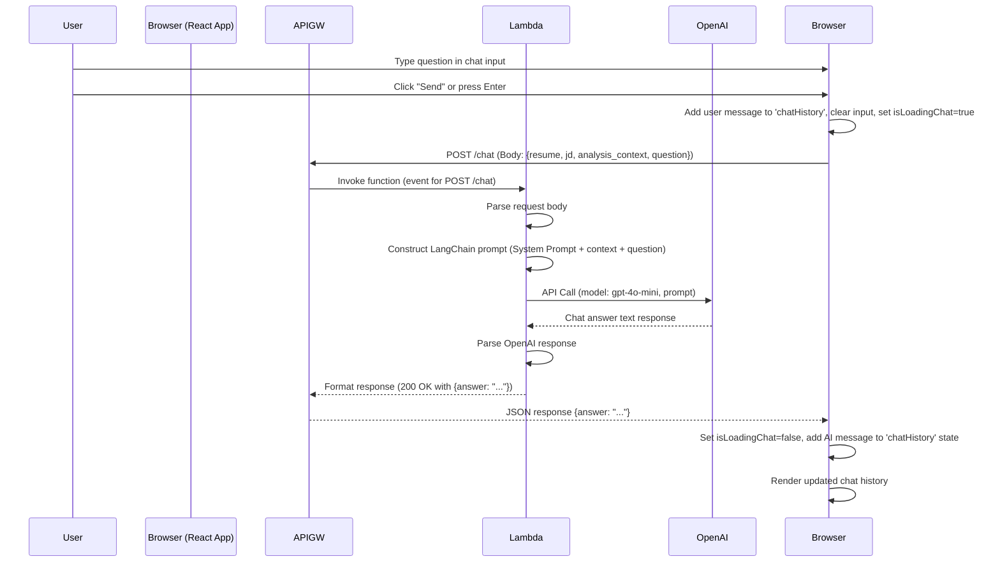

# About Resume Coach (v2)

## 1. Introduction & Purpose

Welcome to the Resume Coach project! This document provides an exhaustive deep-dive into the architecture, components, data flow, design decisions, and operational aspects of this application. Its goal is to equip any Software Development Engineer (SDE) with the knowledge needed to understand, maintain, extend, and troubleshoot the system effectively.

**What is Resume Coach?**

Resume Coach is a serverless single-page web application (SPA) designed to provide AI-powered feedback to job applicants. Users can paste their resume text and the text of a job description they are interested in. The application then leverages a Large Language Model (LLM) – specifically OpenAI's `gpt-4o-mini` – to analyze the resume against the job description and provide structured coaching advice, including:

*   **Qualification Assessment:** An evaluation of how well the resume matches the job requirements.
*   **Gap Identification:** Highlighting key skills or experiences mentioned in the job description that are missing from the resume.
*   **Strength Highlighting:** Pointing out key qualifications from the resume that align well with the job description.

Furthermore, the application offers a **Follow-up Chat** feature, allowing users to ask clarifying questions based on the initial analysis provided by the AI.

**Target Audience for this Document:** Software Development Engineers involved in the development, maintenance, or extension of the Resume Coach application.

**Assumption:** The reader has access to and understands that the current state of the project is the result of sequentially executing all steps outlined in `version_1_setup.md` followed by `version_2_setup.md`, plus the manual addition of three specific default resumes to the DynamoDB table.

## 2. Project Evolution: From Foundation (V1) to Functionality (V2)

The Resume Coach project didn't start with its current functionality. It evolved from a foundational template:

*   **Version 1 (Foundation):** As detailed in `version_1_setup.md`, the initial project was a generic, reusable full-stack serverless template. It featured:
    *   A React frontend (TypeScript/Vite) performing basic CRUD (Create, Read, Update, Delete) operations.
    *   A Python AWS Lambda backend providing a simple REST API via API Gateway for these CRUD operations.
    *   A DynamoDB table for basic data persistence (storing simple items with `id` and `content`).
    *   Infrastructure defined using AWS CDK (TypeScript), deploying resources to `us-west-2`.
    *   Frontend hosting via S3 and CloudFront.
    *   This version served purely as a demonstration of integrating these technologies and establishing the deployment pipeline.

*   **Version 2 (Resume Coach):** As detailed in `version_2_setup.md`, this version transformed the V1 foundation into the functional Resume Coach application. Key changes included:
    *   **Backend Overhaul:** Replacing the CRUD logic with LLM integration (OpenAI `gpt-4o-mini` via LangChain) for resume analysis (`/analyze`) and follow-up chat (`/chat`). The `/items` endpoints were repurposed to dynamically fetch *default/example* data from DynamoDB.
    *   **Frontend Overhaul:** Replacing the CRUD UI with a dedicated interface for resume/JD input, analysis display, chat interaction, and loading default examples.
    *   **Database Usage:** Shifting DynamoDB's role from general CRUD storage to specifically holding predefined example resumes and job descriptions.
    *   **Configuration:** Implementing specific methods for handling secrets (OpenAI API Key via Lambda environment variables) and frontend configuration (API URL via `.env`).
    *   **State Management:** Introducing simple frontend state persistence using browser local storage.

Understanding this evolution is key to grasping why certain components exist and how they were adapted.

## 3. Core Functionality (User Perspective)

From a user's point of view, the application offers the following:

1.  **Input:** Two main text areas allow users to paste their full resume text and the target job description text.
2.  **Default Examples:** Users can load pre-defined example resumes and job descriptions into the input fields via dedicated buttons. A "Refresh Examples List" button fetches the latest available examples.
3.  **Analysis:** Clicking "Analyze Resume" sends the input text to the backend for processing by the LLM. The results are displayed in a structured format covering qualification, missing elements, and strengths.
4.  **Follow-up Chat:** After receiving an analysis, a chat interface appears, allowing the user to ask specific questions about the feedback received. The AI's responses are based on the context of the resume, job description, and the initial analysis.
5.  **Persistence:** The text entered into the resume and job description fields is automatically saved in the browser's local storage, so it reappears if the user reloads the page.

## 4. System Architecture (V2)

The application follows a standard serverless web application pattern deployed in the `us-west-2` AWS region.

**High-Level Diagram:**



**Component Roles:**

*   **User:** Interacts with the application via a web browser.
*   **Browser (React App):** Renders the UI, manages local state, handles user input, makes API calls to the backend, and persists input text to local storage.
*   **CloudFront:** Global Content Delivery Network (CDN) that serves the static frontend assets (HTML, CSS, JavaScript) stored in S3. It provides caching, HTTPS termination, and routes traffic to the S3 origin. It's configured to handle SPA routing by redirecting 403/404 errors to `index.html`.
*   **S3 Bucket:** Stores the built static files of the React application (`frontend/dist`). Access is restricted via an Origin Access Identity (OAI) so files can only be accessed through CloudFront.
*   **API Gateway (HTTP API):** Provides the public HTTPS endpoints for the backend API. It handles request routing, CORS preflight requests, and integrates directly with the backend Lambda function.
*   **Lambda Function:** The core backend compute service. Runs Python code (`handler.py`) that processes API requests. It interacts with DynamoDB to fetch default data and calls the external OpenAI API for analysis and chat responses. It reads configuration (like the table name and OpenAI key) from its environment variables.
*   **DynamoDB Table:** A NoSQL database storing the default/example resume and job description items. Each item has at least an `id` (partition key), `name`, and `content`. Accessed via `Scan` (for list) and `GetItem` (for specific content).
*   **OpenAI API:** External third-party service providing the `gpt-4o-mini` LLM used for analysis and chat generation.

## 5. Technology Stack & Justifications

| Component         | Technology/Service                               | Justification                                                                                                                               |
| :---------------- | :----------------------------------------------- | :------------------------------------------------------------------------------------------------------------------------------------------ |
| **Frontend**      | React (v18+), TypeScript, Vite                 | Inherited from V1. Modern, efficient stack for building interactive SPAs. Vite provides fast development server and optimized builds.         |
| **Backend API**   | AWS Lambda (Python 3.11 runtime)                 | Serverless compute: pay-per-use, automatic scaling, reduced operational overhead. Python is suitable for data processing and ML integration. |
| **API Layer**     | AWS API Gateway (HTTP API v2.0)                  | Managed, scalable, secure way to expose Lambda functions as RESTful APIs. HTTP API is cost-effective and simpler than REST API for this use case. |
| **Database**      | AWS DynamoDB (Pay-per-request)                   | Serverless NoSQL database: scalable, highly available, fits the simple key-value nature of default examples. Pay-per-request is cost-effective for variable load. |
| **Infrastructure**| AWS CDK (v2, TypeScript)                         | Infrastructure as Code (IaC): repeatable, version-controlled deployments, leverages familiar programming language (TypeScript).                |
| **Hosting/CDN**   | AWS S3, AWS CloudFront                           | Standard, highly scalable, and cost-effective pattern for hosting static web applications globally. OAI ensures secure S3 access.           |
| **LLM Framework** | LangChain (Python: `langchain`, `langchain-openai`) | Simplifies interaction with LLMs: provides abstractions for prompts (`ChatPromptTemplate`), models (`ChatOpenAI`), output parsing (`StrOutputParser`), and chaining (LCEL). |
| **LLM Service**   | OpenAI API (`gpt-4o-mini` model)                 | Provides access to a powerful and cost-effective LLM capable of performing the required analysis and chat tasks via a simple API call.      |
| **Dependencies**  | `boto3`, `openai` (Python); `axios` (JS)         | Standard SDKs/libraries for interacting with AWS services, OpenAI API, and making HTTP requests from the frontend.                          |
| **Packaging**     | Docker (via CDK Bundling)                        | CDK uses Docker to create the Lambda deployment package, ensuring consistent builds by installing Python dependencies in a Lambda-like environment. |
| **State Mgmt**    | React `useState`, Browser `localStorage`         | Simple client-side state management sufficient for V2 requirements. Local storage provides basic persistence without backend complexity.      |

## 6. Detailed Component Breakdown

### 6.1. Frontend (`frontend/`)

*   **Framework & Build:** Built with React (using functional components and Hooks) and TypeScript, bundled using Vite. The entry point is `src/main.tsx`, which renders the main `src/App.tsx` component into the `index.html` root element.
*   **Core Component (`src/App.tsx`):** This single component encapsulates the entire UI and frontend logic.
    *   **State:** Uses `useState` extensively to manage:
        *   `resumeText`, `jobDescriptionText`: Content of the input text areas.
        *   `analysisResult`: Stores the analysis string received from the backend.
        *   `chatHistory`: An array of `ChatMessage` objects (`{ sender: 'user' | 'ai', text: string }`).
        *   `chatInput`: The current text in the chat input field.
        *   `isLoadingAnalysis`, `isLoadingChat`, `isLoadingDefaults`: Boolean flags for displaying loading indicators.
        *   `error`: Stores API error details (`ApiError` interface) for display.
        *   `statusMessage`: Stores success/status messages.
        *   `defaultItems`: An array of available default items (`{ id: string, name: string }`) fetched from the backend.
    *   **Effects (`useEffect`):**
        *   Persists `resumeText` and `jobDescriptionText` to `localStorage` whenever they change.
        *   Fetches the list of default items (`/items`) via `fetchDefaultItems` when the component mounts (or `apiUrl` changes).
        *   Scrolls the analysis and chat sections into view using `useRef` when their content updates.
    *   **API Interaction (`axios`):**
        *   `fetchDefaultItems`: Calls `GET /items` to retrieve the list of default item names/IDs.
        *   `loadDefaultContent`: Calls `GET /items/{id}` to fetch the content for a specific default item and updates the corresponding state (`resumeText` or `jobDescriptionText`).
        *   `handleAnalyze`: Calls `POST /analyze` with the current `resumeText` and `jobDescriptionText` in the request body. Updates `analysisResult` or `error` state based on the response. Clears previous analysis and chat.
        *   `handleChatSubmit`: Calls `POST /chat` with the current `resumeText`, `jobDescriptionText`, the `analysisResult` (as context), and the user's `chatInput` (question). Appends the user message and the AI's response (or an error message) to the `chatHistory` state.
    *   **Configuration:** Reads the backend API base URL from `import.meta.env.VITE_API_URL`, which Vite populates from the `frontend/.env` file during the build process.
    *   **UI Rendering:** Conditionally renders UI elements based on state (loading indicators, error messages, analysis results section, chat interface). Uses standard HTML elements (`textarea`, `button`, `pre`, `div`) styled via CSS. `pre` tags are used for analysis and chat to preserve formatting from the LLM.
*   **Styling (`src/App.css`):** Contains CSS rules for layout, appearance, and responsiveness. Includes basic light/dark mode adjustments based on user preference.
*   **Build Output (`dist/`):** Running `npm run build` generates optimized static HTML, CSS, and JavaScript files in this directory, which are then deployed to S3.

### 6.2. Backend API (`backend/` & API Gateway)

*   **API Gateway (`ResumeCoachHttpApi`):**
    *   **Type:** HTTP API (Payload Format v2.0). Chosen for simplicity and cost-effectiveness over REST API.
    *   **Integration:** Uses a single Lambda proxy integration (`HttpLambdaIntegration`) pointing to the `ResumeCoachBackendHandler` function. All defined routes trigger this function.
    *   **Routes:**
        *   `GET /items`: Fetches the list of default example metadata.
        *   `GET /items/{id}`: Fetches the content of a specific default example.
        *   `POST /analyze`: Triggers resume analysis. Expects JSON body: `{ "resume": "...", "job_description": "..." }`.
        *   `POST /chat`: Handles follow-up chat questions. Expects JSON body: `{ "resume": "...", "job_description": "...", "analysis_context": "...", "question": "..." }`.
    *   **CORS:** Configured via `corsPreflight` to allow requests from any origin (`*` - **should be restricted to the CloudFront domain in production**). Allows common headers and the necessary HTTP methods (GET, POST, OPTIONS). `allowCredentials` is `false`.
    *   **Deployment:** Managed by CDK, automatically deployed with changes via `cdk deploy`. The API endpoint URL is output by the CDK stack.
*   **Lambda Function (`ResumeCoachBackendHandler`):**
    *   **Runtime:** Python 3.11 (ARM64 architecture for potential cost savings).
    *   **Handler (`handler.py::handler`):** The main entry point. It inspects the incoming `event` object (from API Gateway) to determine the HTTP method and path, then routes the request to the appropriate internal Python function (`get_all_default_items`, `get_default_item`, `analyze_resume`, `chat_follow_up`).
    *   **Configuration (`environment`):** Receives `TABLE_NAME` and `LOG_LEVEL` from CDK. Crucially, it expects `OPENAI_API_KEY` to be set manually in the Lambda console post-deployment.
    *   **Dependencies (`requirements.txt`):** Includes `boto3` (AWS SDK), `openai` (OpenAI client), `langchain`, `langchain-openai`. These are installed into the deployment package by CDK using a Docker container during `cdk deploy`.
    *   **Core Logic (`analyze_resume`, `chat_follow_up`):**
        *   Initializes the `ChatOpenAI` client using the API key from environment variables.
        *   Defines `ChatPromptTemplate`s with specific instructions (system prompts) for the LLM for both analysis and chat tasks.
        *   Uses LangChain Expression Language (LCEL) to construct simple chains: `RunnablePassthrough | prompt | llm | StrOutputParser`.
        *   Invokes the chain with the required input data (resume, JD, context, question).
        *   Returns the LLM's string output in the API response.
    *   **Default Data Logic (`get_all_default_items`, `get_default_item`):**
        *   `get_all_default_items`: Performs a DynamoDB `Scan` operation on the `ResumeCoachItems` table. Uses `ProjectionExpression` to fetch only `id` and `name`. Includes basic pagination handling.
        *   `get_default_item`: Performs a DynamoDB `GetItem` operation using the `id` provided in the path parameter to fetch the full item, returning its `id` and `content`.
    *   **Permissions:** The Lambda function's execution role is granted `dynamodb:Scan`, `dynamodb:GetItem`, and potentially other DynamoDB permissions (like `PutItem` if defaults were managed via API) by the CDK stack (`dynamoTable.grantReadWriteData(backendLambda)`). It implicitly has permissions to make outbound HTTPS calls (to OpenAI) and write logs to CloudWatch.
    *   **Logging:** Uses Python's standard `logging` module. Log level is configurable via the `LOG_LEVEL` environment variable. Logs are sent to CloudWatch Logs under a log group named `/aws/lambda/ResumeCoachBackendHandler`.
    *   **Error Handling:** Includes `try...except` blocks for JSON decoding errors, potential LLM errors, DynamoDB errors, and general exceptions. Returns appropriate HTTP status codes (400, 404, 500, 503) and error messages in the JSON response body.

### 6.3. Database (`ResumeCoachItems` DynamoDB Table)

*   **Purpose:** Stores the predefined example resumes and job descriptions that users can load via the frontend. It is *not* used to store user-submitted resumes or analysis results in V2.
*   **Schema:**
    *   **Partition Key:** `id` (String) - Must be unique for each item (e.g., `DEFAULT_RESUME_1`, `DEFAULT_JOB_DESC_1`).
    *   **Required Attributes for Defaults:**
        *   `name` (String): The display name used for the button in the frontend (e.g., "Example SWE Resume").
        *   `content` (String): The actual text content of the resume or job description.
    *   **Optional V1 Attributes:** Items created during V1 testing might have `createdAt` and `updatedAt` attributes, which are ignored by the V2 logic.
    *   **TTL:** The `ttl` attribute is configured, but likely not actively used unless specific expiry times are set on items.
*   **Access Patterns:**
    *   `Scan` (by `get_all_default_items`): Reads `id` and `name` for all items. Acceptable due to the expected small number of default items.
    *   `GetItem` (by `get_default_item`): Reads the full item (including `content`) based on its `id`.
*   **Billing Mode:** Pay-per-request, suitable for unpredictable or low traffic patterns typical of development/small projects.
*   **Management:** Items are currently added/updated manually via the AWS DynamoDB Console.

### 6.4. Infrastructure (`infrastructure/`)

*   **Tool:** AWS Cloud Development Kit (CDK) v2, using TypeScript.
*   **Core File (`lib/infrastructure-stack.ts`):** Defines all AWS resources within a single `cdk.Stack`.
    *   `dynamodb.Table`: Creates the `ResumeCoachItems` table.
    *   `lambda.Function`: Defines the backend Lambda function, including runtime, handler, code location (`../backend`), bundling configuration (using Docker to install `requirements.txt`), environment variables (with placeholder for API key), timeout/memory settings, and IAM permissions grant (`grantReadWriteData`).
    *   `apigwv2.HttpApi`: Creates the API Gateway, configures CORS, and defines routes (`addRoutes`) linking paths/methods to the `HttpLambdaIntegration`.
    *   `s3.Bucket`: Creates the private S3 bucket for frontend assets. Configured for automatic deletion on stack destroy.
    *   `cloudfront.OriginAccessIdentity`: Creates an OAI to allow CloudFront to securely read from the private S3 bucket.
    *   `cloudfront.Distribution`: Creates the CDN distribution, linking it to the S3 origin via OAI, enforcing HTTPS, configuring caching, setting the default root object (`index.html`), and setting up error responses for SPA routing.
    *   `s3deploy.BucketDeployment`: A CDK construct that handles uploading the contents of `frontend/dist` to the S3 bucket and invalidating the CloudFront cache during `cdk deploy`.
*   **Entry Point (`bin/infrastructure.ts`):** Instantiates the `InfrastructureStack`, sets the target AWS account/region (`us-west-2`), and adds optional tags/description.
*   **Deployment:** Managed via the AWS CDK CLI (`cdk deploy`, `cdk destroy`). Requires AWS credentials configured and Docker running.

### 6.5. External Services

*   **OpenAI API:**
    *   **Endpoint:** Accessed via HTTPS by the backend Lambda function using the `openai` Python library.
    *   **Model:** `gpt-4o-mini` is specified in the `ChatOpenAI` initialization.
    *   **Authentication:** Requires an API key, which is securely passed from the Lambda environment variable `OPENAI_API_KEY` to the `ChatOpenAI` client. **This key must be configured manually in the Lambda console after deployment.**
    *   **Usage:** Called by the `analyze_resume` and `chat_follow_up` functions to generate text based on the provided prompts and context.

## 7. Data Flow Diagrams

### 7.1. Initial App Load & Fetching Defaults



### 7.2. Performing Resume Analysis



### 7.3. Asking a Follow-up Question



## 8. Deployment Process Overview

Deploying changes involves a coordinated effort managed primarily by AWS CDK, with some manual steps:

1.  **Prerequisites:** AWS CLI configured, Node.js, Python, Docker running, AWS CDK installed, OpenAI API Key obtained.
2.  **CDK Bootstrap (First time only):** `cdk bootstrap` in the `infrastructure` directory prepares the AWS account/region (`us-west-2`) for CDK deployments.
3.  **Code Changes:** Modify code in `frontend/`, `backend/`, or `infrastructure/` directories.
4.  **Frontend Build:** If frontend code (`src/` or dependencies) changed, run `npm run build` in the `frontend` directory. This creates/updates the `frontend/dist` directory.
5.  **CDK Deployment:** Run `cdk deploy` in the `infrastructure` directory. This process:
    *   Synthesizes the CDK code into an AWS CloudFormation template.
    *   Compares the template to the currently deployed stack.
    *   **Builds Lambda Code (if backend changed):** Uses Docker to create a deployment package by running `pip install -r requirements.txt` and copying `backend/` files into an asset directory.
    *   Uploads assets (Lambda code bundle, `frontend/dist` contents) to an S3 staging bucket managed by CDK.
    *   Executes the CloudFormation changeset to update AWS resources (Lambda function code/config, API Gateway routes, etc.).
    *   **Updates Frontend Assets:** The `s3deploy.BucketDeployment` construct uploads the contents of `frontend/dist` to the target S3 bucket and creates a CloudFront invalidation (`/*`) to purge the CDN cache.
6.  **Manual API Key Configuration (Crucial):** After the *first* deployment of V2 (or any deployment that recreates the Lambda function), manually navigate to the Lambda function (`ResumeCoachBackendHandler`) in the AWS Console (`us-west-2`) and update the `OPENAI_API_KEY` environment variable with the actual secret key.
7.  **Manual DynamoDB Data:** Add/update default items in the `ResumeCoachItems` table via the AWS console, ensuring `id`, `name`, and `content` attributes are present.

## 9. Configuration & Secrets Management

*   **Frontend Configuration (`frontend/.env`):**
    *   `VITE_API_URL`: Stores the base URL of the deployed API Gateway endpoint. This value is embedded into the built JavaScript code by Vite during `npm run build`. It **must** be set correctly *before* the final build that gets deployed.
*   **Backend Configuration (Lambda Environment Variables):**
    *   `TABLE_NAME`: Set by CDK, tells the Lambda code which DynamoDB table to use.
    *   `LOG_LEVEL`: Set by CDK (default 'INFO'), controls logging verbosity.
    *   `OPENAI_API_KEY`: **Set manually in the AWS Console.** This is the primary secret. It's read by the Lambda function at runtime to authenticate with the OpenAI API.
*   **Secrets Handling Approach:** Using Lambda environment variables for the OpenAI key was chosen for simplicity in this V2 iteration.
    *   **Pros:** Easy to set up via console/CLI, no extra service cost.
    *   **Cons:** Less secure than dedicated secrets management (visible in console to those with permissions), no built-in rotation, harder to audit access. For production, migrating to **AWS Secrets Manager** or **AWS Systems Manager Parameter Store (SecureString)** would be recommended. The key is explicitly *not* hardcoded in CDK or source code.

## 10. Default Data (`ResumeCoachItems` Table)

*   **Purpose:** To provide users with ready-to-use examples without requiring them to find/paste their own text initially. This facilitates testing and demonstration.
*   **Location:** Stored as items in the `ResumeCoachItems` DynamoDB table.
*   **Structure:** Each item *must* have:
    *   `id` (String): Unique identifier (e.g., `DEFAULT_RESUME_1`).
    *   `name` (String): User-friendly name displayed on the frontend button (e.g., "Backend Engineer Resume").
    *   `content` (String): The full text of the resume or job description.
*   **Current Examples (as per setup):**
    *   `id: DEFAULT_RESUME_1`, `name: Backend Engineer Resume` (Content: Perfect match example)
    *   `id: DEFAULT_RESUME_2`, `name: Full-Stack Engineer Resume` (Content: Medium match example)
    *   `id: DEFAULT_RESUME_3`, `name: Frontend Developer Resume` (Content: No match example)
    *   `id: DEFAULT_JOB_DESC_1`, `name: Example SWE Job Desc` (Content: Corresponding job description)
    *   *(Note: The exact IDs and names might differ slightly based on precise manual entry, but the structure is key).*
*   **Loading Mechanism:**
    1.  Frontend calls `GET /items`.
    2.  Backend Lambda scans DynamoDB for items with `id` and `name`.
    3.  Frontend displays buttons using the `name` for each item returned.
    4.  User clicks a button (e.g., "Load: Backend Engineer Resume").
    5.  Frontend calls `GET /items/{id}` (e.g., `GET /items/DEFAULT_RESUME_1`).
    6.  Backend Lambda gets the specific item from DynamoDB.
    7.  Frontend populates the appropriate text area with the `content` from the response.

## 11. Code Structure Overview

```
ResumeCoach/
├── backend/
│   ├── handler.py         # Main Lambda function code (routing, LLM logic, DB access)
│   └── requirements.txt   # Python dependencies
├── frontend/
│   ├── dist/              # Built frontend assets (generated by `npm run build`)
│   ├── public/            # Static assets (e.g., favicon)
│   ├── src/
│   │   ├── App.css        # Main CSS styling
│   │   ├── App.tsx        # Main React component (UI and frontend logic)
│   │   ├── main.tsx       # React application entry point
│   │   └── vite-env.d.ts  # Vite TypeScript environment types
│   ├── .env               # Frontend environment variables (VITE_API_URL)
│   ├── index.html         # HTML entry point
│   ├── package.json       # Node.js dependencies and scripts
│   ├── tsconfig.json      # TypeScript configuration
│   └── vite.config.ts     # Vite build tool configuration
└── infrastructure/
    ├── bin/
    │   └── infrastructure.ts # CDK App entry point (instantiates stack)
    ├── lib/
    │   └── infrastructure-stack.ts # Main CDK stack definition (defines AWS resources)
    ├── cdk.json           # CDK toolkit configuration
    ├── jest.config.js     # Jest test runner config (if tests were added)
    ├── package.json       # CDK Node.js dependencies and scripts
    └── tsconfig.json      # CDK TypeScript configuration
```

## 12. Key Design Decisions & Tradeoffs

*   **Serverless First:** The architecture heavily relies on managed AWS services (Lambda, API Gateway, DynamoDB, S3, CloudFront) to minimize operational burden and leverage pay-per-use pricing.
*   **Infrastructure as Code (CDK):** Ensures infrastructure is defined, versioned, and deployed consistently. TypeScript was chosen for CDK to align with the frontend language (though Python could also be used).
*   **Single Page Application (React):** Provides a dynamic and responsive user experience without full page reloads for most interactions.
*   **HTTP API vs. REST API (API Gateway):** HTTP API was chosen for its lower cost and simpler feature set, which is sufficient for this application's needs (basic routing, Lambda integration, CORS).
*   **LangChain Abstraction:** Used to simplify prompt engineering, interaction with the OpenAI API, and make the LLM logic more structured and potentially easier to modify or swap models later.
*   **Lambda Environment Variable for API Key:** Prioritized simplicity for V2 over the more robust (but complex) setup of AWS Secrets Manager. This is a **security tradeoff** – easier setup vs. better secret management practices.
*   **Client-Side State Persistence (Local Storage):** Used to retain user input across page loads without requiring backend user accounts or database storage for session data. Tradeoff: State is local to the browser, not shared across devices.
*   **DynamoDB Scan for Defaults:** Used `Scan` in `get_all_default_items` for simplicity, assuming a small number of default items. Tradeoff: Performance degrades significantly as the number of items grows. Mitigated slightly by projecting only needed attributes. A `Query` on a GSI based on an item 'type' attribute would be more scalable if managing many defaults became a requirement.
*   **No Dependency Version Pinning:** The setup guides intentionally omitted specific versions in `requirements.txt` and `package.json` to allow installation of the latest packages. Tradeoff: Ensures latest features/fixes but risks potential breaking changes or compatibility issues between library updates. Pinning versions (using `package-lock.json` and `pip freeze > requirements.txt`) is recommended for stable production environments.
*   **Single `App.tsx` Component:** For V2 simplicity, all frontend logic resides in one component. Tradeoff: Can become difficult to manage as features grow. Refactoring into smaller, reusable components would be necessary for significant expansion.

## 13. Potential Future Enhancements

This V2 application provides a solid base. Future iterations could include:

*   **Authentication & User Accounts:** Implement user login (e.g., using AWS Cognito) to save user history, preferences, or provide personalized experiences.
*   **Resume Upload:** Allow users to upload resume files (PDF, DOCX) instead of pasting text. Requires backend parsing logic (e.g., using libraries like `python-docx`, `pypdf`) potentially in a separate Lambda or Step Function workflow.
*   **More Sophisticated Analysis:**
    *   Improve LLM prompts for more nuanced feedback.
    *   Use different LangChain chains or agents for specific tasks (e.g., skill extraction).
    *   Fine-tune models or use specialized NLP techniques.
    *   Provide quantitative scoring or visual feedback.
*   **Enhanced State Management:** Introduce a dedicated frontend state management library (Zustand, Redux Toolkit) if the application complexity increases.
*   **Database for User Data:** If user accounts are added, use DynamoDB (or another database) to store user profiles, saved analyses, chat history, etc., likely requiring a more complex data model and GSIs for efficient querying.
*   **CI/CD Pipeline:** Automate testing, building, and deployment using AWS CodePipeline, GitHub Actions, or similar tools.
*   **Improved Error Handling & Monitoring:** Implement more granular error handling, structured logging (e.g., `aws-lambda-powertools-python`), CloudWatch Alarms, and potentially AWS X-Ray tracing.
*   **Cost Optimization:** Analyze usage patterns and optimize resource configurations (Lambda memory/timeout, DynamoDB capacity mode if switching from on-demand, CloudFront caching strategies).
*   **Custom Domain & Production CORS:** Configure a custom domain name via Route 53/ACM and restrict API Gateway CORS `allowOrigins` to that specific domain.
*   **Secrets Management:** Migrate the OpenAI API key to AWS Secrets Manager for better security and rotation capabilities.

## 14. Troubleshooting Tips

*   **Frontend Issues (UI glitches, buttons not working):**
    *   Check the **Browser Developer Console (F12 -> Console tab)** for JavaScript errors.
    *   Check the **Browser Developer Console (F12 -> Network tab)** for failed API requests (look for 4xx or 5xx status codes). Inspect the request payload and response body. Verify the `VITE_API_URL` is correct.
    *   Perform a **hard refresh** (Ctrl+Shift+R or Cmd+Shift+R) to clear the browser cache.
    *   Verify CloudFront invalidation has completed after deployment (can take a few minutes).
*   **Backend Issues (Analysis/Chat failing, errors displayed):**
    *   Check **AWS CloudWatch Logs** for the `ResumeCoachBackendHandler` Lambda function in the `us-west-2` region. Look for errors related to:
        *   `OPENAI_API_KEY` missing or invalid.
        *   Errors calling the OpenAI API (rate limits, authentication issues).
        *   Errors interacting with DynamoDB (permissions, item not found).
        *   Timeout errors (Lambda function ran too long).
        *   Code errors within `handler.py`.
    *   Verify the **OpenAI API Key** is correctly configured in the Lambda environment variables.
    *   Verify the **DynamoDB table** (`ResumeCoachItems`) exists and default items have the correct structure (`id`, `name`, `content`).
    *   Test API endpoints directly using tools like `curl` or Postman, providing the correct JSON payloads.
*   **Deployment Issues (`cdk deploy` failing):**
    *   Ensure **Docker** is running.
    *   Check CDK/CloudFormation error messages in the terminal for details (permissions errors, resource conflicts, syntax errors in CDK code).
    *   Ensure AWS credentials are correctly configured and have sufficient permissions.
    *   Check the AWS CloudFormation console in `us-west-2` for more detailed stack event logs.

This document provides a snapshot of the Resume Coach V2 application based on the provided setup guides. As the project evolves, this documentation should be updated accordingly.