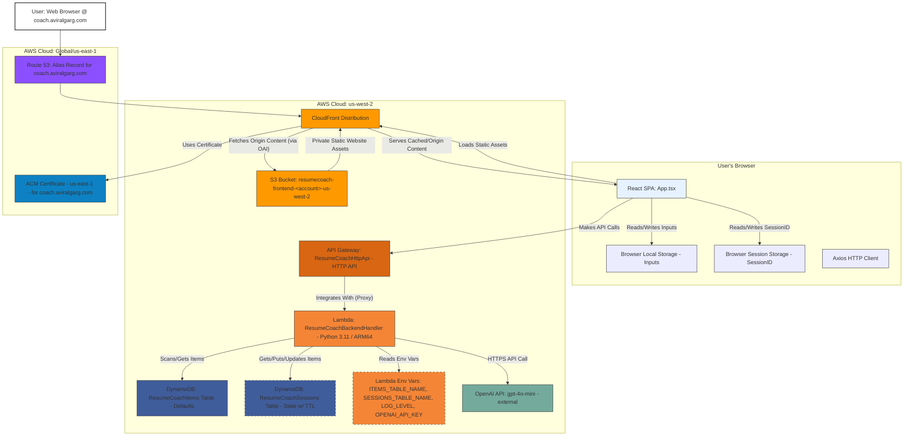
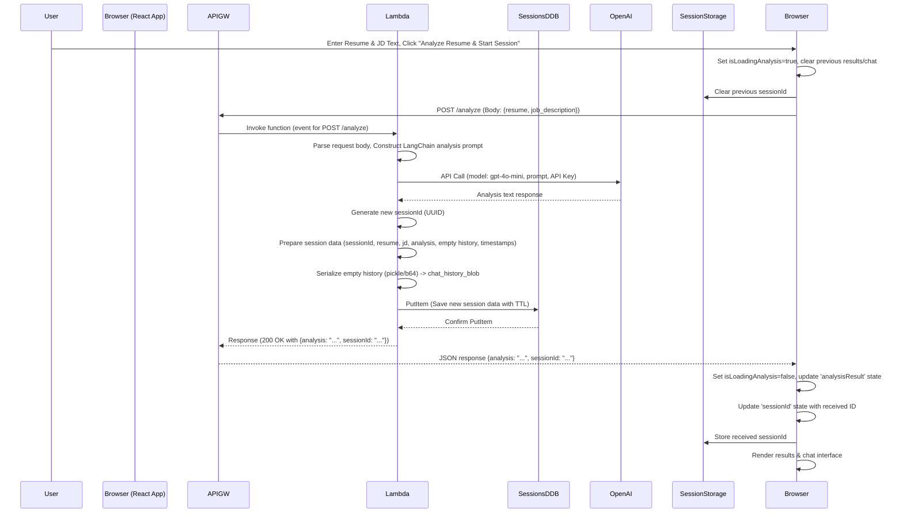
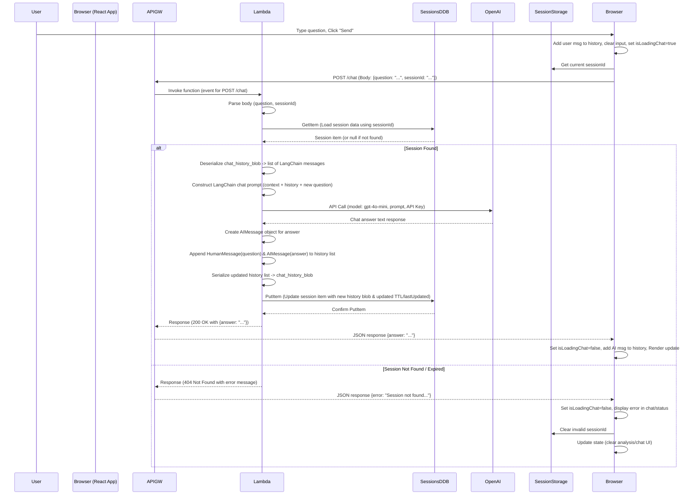

# Resume Coach

**Current Version Focus:** This document describes the current, latest state of the Resume Coach application. It is intended for Software Development Engineers involved in the development, maintenance, and extension of this project. It details the architecture, components, data flow, design decisions, and operational aspects as they exist now.

## 📋 Overview

ResumeCoach is an AI-powered, serverless web application designed to help job seekers optimize their resumes for specific job descriptions. Deployed on AWS and accessible via `coach.aviralgarg.com`, it allows users to paste their resume and a target job description to receive structured AI feedback.

### 🌟 Key Features

*   **AI Resume Analysis**: Compares resume text against a job description using OpenAI's `gpt-4o-mini`.
*   **Structured Feedback**: Provides:
    *   **Qualification Assessment**: Evaluation of resume alignment (e.g., Highly Qualified, Qualified).
    *   **Gap Identification**: Missing skills/experiences from the job description.
    *   **Strength Highlighting**: Key resume points matching job requirements.
*   **Contextual Follow-up Chat**: Allows users to ask clarifying questions based on the resume, job description, initial analysis, and chat history within a persistent session.
*   **Session Management**: Backend sessions store context (resume, JD, analysis, chat history) in DynamoDB with a TTL, allowing users to continue conversations across page reloads within the same browser session.
*   **Default Examples**: Load pre-defined resume/JD examples from DynamoDB to quickly test functionality.
*   **Markdown Rendering**: Displays AI analysis and chat messages with proper formatting.
*   **Client-Side Persistence**: Saves user inputs (resume/JD) in `localStorage` and the active `sessionId` in `sessionStorage`.
*   **Custom Domain**: Accessible via `https://coach.aviralgarg.com`.
*   **Theming**: Supports light and dark modes based on system preference.

## 🏗️ System Architecture

The application employs a serverless web architecture deployed primarily within the `us-west-2` AWS region, with global content delivery via CloudFront and DNS/Certificate management involving `us-east-1`.

**Detailed Architecture Diagram:**



## 📁 Project Structure

```
./ (ResumeCoach)
├── .gitignore                 # Specifies intentionally untracked files
├── README.md                  # This file: Project overview and documentation
├── RECENT_COMMIT_LOG.md       # Log of the 10 most recent commits (auto-generated)
├── extract_commits.py         # Python script to generate RECENT_COMMIT_LOG.md
├── requirements.txt           # Root Python dependencies (primarily for local dev/IDE)
├── backend/
│   ├── handler.py             # Main Lambda function code (routing, LLM logic, DB access, session mgmt)
│   └── requirements.txt       # Python dependencies for the Lambda function
├── frontend/
│   ├── README.md              # Default Vite+React README
│   ├── dist/                  # Built frontend assets (generated by `npm run build`, deployed to S3)
│   ├── node_modules/          # (ignored) Frontend Node.js dependencies
│   ├── public/                # (contains vite.svg - potentially unused) Static assets copied to dist
│   ├── src/
│   │   ├── App.css            # Main application component styling
│   │   ├── App.tsx            # Main React component (UI, state, API calls, session handling)
│   │   ├── index.css          # Global base styles and CSS variables (theming)
│   │   └── main.tsx           # React application entry point
│   ├── .env                   # (ignored locally, required for build) Frontend env vars (VITE_API_URL)
│   ├── index.html             # HTML entry point for the SPA
│   ├── package-lock.json      # Exact versions of frontend dependencies
│   ├── package.json           # Frontend Node.js dependencies and scripts
│   ├── tsconfig.app.json      # TypeScript config for the application source
│   ├── tsconfig.json          # Root TypeScript config for frontend project references
│   ├── tsconfig.node.json     # TypeScript config for Node.js context (e.g., vite.config.ts)
│   └── vite.config.ts         # Vite build tool configuration
└── infrastructure/
    ├── .npmignore             # Specifies files to exclude from CDK npm package
    ├── README.md              # Default CDK README
    ├── bin/
    │   └── infrastructure.ts  # CDK App entry point (instantiates stack, sets region/domain)
    ├── cdk.context.json       # CDK context cache (e.g., Route53 lookup results)
    ├── cdk.json               # CDK toolkit configuration (how to run the app)
    ├── lib/
    │   └── infrastructure-stack.ts # Main CDK stack definition (defines all AWS resources)
    ├── node_modules/          # (ignored) CDK Node.js dependencies
    ├── package-lock.json      # Exact versions of infrastructure dependencies
    ├── package.json           # CDK Node.js dependencies and scripts
    ├── test/
    │   └── infrastructure.test.ts # Placeholder CDK unit tests
    └── tsconfig.json          # TypeScript configuration for the CDK project
```

## 🛠️ Technology Stack

| Component             | Technology/Service                                       | Justification / Role                                                                                                                        |
| :-------------------- | :------------------------------------------------------- | :------------------------------------------------------------------------------------------------------------------------------------------ |
| **Frontend Framework**| React (v19+), TypeScript, Vite                         | Modern, performant SPA framework with type safety. Vite for DX and optimized builds.                                                        |
| **Frontend Styling**  | CSS Modules (`App.css`), Global CSS (`index.css`), CSS Variables | Standard CSS with variables for theming (light/dark) and maintainability.                                                                   |
| **Frontend State**    | React `useState`, `useRef`, `useEffect`                  | Standard React hooks for component-level state and side effects.                                                                            |
| **Frontend API Client**| Axios                                                    | Promise-based HTTP client for browser-to-backend communication.                                                                             |
| **Frontend Persistence**| Browser `localStorage` (Inputs), `sessionStorage` (SessionID) | Client-side persistence: `localStorage` for inputs across sessions, `sessionStorage` for ephemeral session tracking.                      |
| **Markdown Rendering**| `react-markdown`, `remark-gfm`                           | Renders Markdown content from AI responses in the UI.                                                                                       |
| **Backend Compute**   | AWS Lambda (Python 3.11 runtime, ARM64)                  | Serverless compute. Python for scripting & AI libraries. ARM64 for efficiency.                                                              |
| **Backend API Layer** | AWS API Gateway (HTTP API v2.0)                          | Managed, scalable, cost-effective API endpoint for Lambda proxy integration. Handles CORS.                                                  |
| **Database (Defaults)**| AWS DynamoDB (`ResumeCoachItems` Table, Pay-per-request) | Serverless NoSQL DB for storing predefined key-value examples.                                                                              |
| **Database (Sessions)**| AWS DynamoDB (`ResumeCoachSessions` Table, Pay-per-request, TTL) | Serverless NoSQL DB for session state. `sessionId` PK. TTL for automatic cleanup.                                                           |
| **AWS SDK (Backend)** | Boto3 (Python Library)                                   | Official AWS SDK for Python (Lambda -> DynamoDB).                                                                                           |
| **Session State Ser/De**| Python `pickle`, `base64`                                | Serialize/deserialize LangChain message objects for DynamoDB storage.                                                                       |
| **Infrastructure**    | AWS CDK (v2, TypeScript)                                 | Infrastructure as Code (IaC) using TypeScript.                                                                                              |
| **Hosting/CDN**       | AWS S3, AWS CloudFront                                   | Standard pattern for hosting static web apps globally with security (OAI) and performance (CDN).                                            |
| **DNS**               | AWS Route 53                                             | Manages `aviralgarg.com` hosted zone and Alias record for `coach.aviralgarg.com`.                                                           |
| **SSL/TLS Certificate**| AWS Certificate Manager (ACM)                            | Provides SSL/TLS certificate for the custom domain (in `us-east-1` for CloudFront).                                                         |
| **LLM Framework**     | LangChain (Python: `langchain`, `langchain-openai`)       | Simplifies LLM interactions (prompting, model invocation, chaining).                                                                        |
| **LLM Service**       | OpenAI API (`gpt-4o-mini` model)                         | Provides the AI model for analysis and chat.                                                                                                |
| **LLM Client**        | OpenAI (Python Library)                                  | Official Python client used by LangChain.                                                                                                   |
| **Packaging (Lambda)**| Docker (via CDK Bundling)                                | Creates consistent Lambda deployment package with Python dependencies.                                                                      |
| **Dev Tooling**       | `extract_commits.py`, `Pygments`, `pyautogui`            | Root Python dependencies for local development tasks (e.g., commit log generation).                                                         |

## 💽 Database Structure

ResumeCoach utilizes two DynamoDB tables configured for pay-per-request billing:

### 1. `ResumeCoachItems` Table
Stores predefined default examples (resumes and job descriptions) for users to load.

| Attribute | Type   | Description                           | Example Value         | Role         |
| :-------- | :----- | :------------------------------------ | :-------------------- | :----------- |
| `id`      | String | Unique identifier for the example     | `DEFAULT_RESUME_1`    | Partition Key|
| `name`    | String | Display name shown in the UI          | `Backend Engineer Resume` | Attribute    |
| `content` | String | The actual text of the resume/JD      | `"Experienced..."`    | Attribute    |

### 2. `ResumeCoachSessions` Table
Stores the state for active user sessions, enabling contextual chat history and persistence. Includes a Time-To-Live (TTL) attribute for automatic cleanup.

| Attribute          | Type   | Description                                                        | Example Value                     | Role          |
| :----------------- | :----- | :----------------------------------------------------------------- | :-------------------------------- | :------------ |
| `sessionId`        | String | Unique identifier for the session (UUID)                           | `a1b2c3d4-e5f6-7890-1234-567890abcdef` | Partition Key |
| `resume`           | String | The resume text associated with this session                       | `"Software Engineer..."`          | Attribute     |
| `jobDescription`   | String | The job description text associated with this session              | `"Seeking a motivated..."`        | Attribute     |
| `initialAnalysis`  | String | The initial AI analysis result provided at the start of the session| `"Qualification: Qualified..."`   | Attribute     |
| `chat_history_blob`| String | Base64 encoded, pickled list of LangChain message objects          | `"gASVBwAAAAAAAACMC..."`          | Attribute     |
| `createdAt`        | String | ISO 8601 timestamp when the session was created                    | `2025-04-15T19:44:00.123Z`        | Attribute     |
| `lastUpdated`      | String | ISO 8601 timestamp when the session was last updated               | `2025-04-15T19:50:00.456Z`        | Attribute     |
| `ttl`              | Number | Unix epoch timestamp (seconds) for expiration (24h after last update)| `1744900200`                      | TTL Attribute |

## 🔌 API Endpoints

The backend Lambda function exposes the following endpoints via API Gateway:

| Method | Endpoint       | Description                                    | Request Body (`application/json`)            | Success Response (200 OK) (`application/json`) | Error Responses         |
| :----- | :------------- | :--------------------------------------------- | :------------------------------------------- | :--------------------------------------------- | :---------------------- |
| `GET`  | `/items`       | List metadata of all default examples          | N/A                                          | `[{ "id": "...", "name": "..." }, ...]`        | 500 (Internal Error)    |
| `GET`  | `/items/{id}`  | Get content of a specific default example      | N/A (ID from path parameter)                 | `{ "id": "...", "content": "..." }`            | 404 (Not Found), 500    |
| `POST` | `/analyze`     | Analyze resume, create session, return result  | `{ "resume": "...", "job_description": "..." }` | `{ "analysis": "...", "sessionId": "..." }`    | 400 (Bad Request), 500, 503 (LLM Unavailable) |
| `POST` | `/chat`        | Ask follow-up question in an existing session  | `{ "question": "...", "sessionId": "..." }`    | `{ "answer": "..." }`                          | 400, 404 (Session Not Found/Expired), 500, 503 |

*Note: All endpoints support CORS preflight `OPTIONS` requests.*

## 🌊 Data Flow Diagrams

### 1. Initial App Load & Fetching Defaults

```mermaid
sequenceDiagram
    participant User
    participant Browser (React App @ coach.aviralgarg.com)
    participant Route53
    participant CloudFront
    participant S3
    participant APIGW (us-west-2)
    participant Lambda (us-west-2)
    participant ItemsDDB (us-west-2)
    participant SessionStorage

    User->>Browser: Navigate to coach.aviralgarg.com
    Browser->>Route53: DNS Lookup for coach.aviralgarg.com
    Route53-->>Browser: CloudFront Distribution IP/Domain
    Browser->>CloudFront: Request index.html & assets (HTTPS)
    CloudFront->>S3: Get assets (via OAI)
    S3-->>CloudFront: Assets
    CloudFront-->>Browser: Assets (index.html, JS, CSS)
    Browser->>Browser: Render UI (App.tsx mounts)
    Browser->>LocalStorage: Read saved resume/JD text
    Browser->>SessionStorage: Read existing sessionId (if any)
    Browser->>APIGW: GET /items (fetchDefaultItems)
    APIGW->>Lambda: Invoke function (event for GET /items)
    Lambda->>ItemsDDB: Scan table (Projection: id, name)
    ItemsDDB-->>Lambda: List of items [{id, name}, ...]
    Lambda-->>APIGW: Format response (200 OK with items list)
    APIGW-->>Browser: JSON response [{id, name}, ...]
    Browser->>Browser: Update 'defaultItems' state, render buttons
    Browser->>Browser: Display status if existing session detected
```

### 2. Performing Resume Analysis & Starting Session



### 3. Asking a Follow-up Question (Existing Session)



## 🧩 Detailed Component Breakdown

### 1. Frontend (`frontend/`)
*   **Framework:** React SPA built with Vite and TypeScript.
*   **Core Logic:** `src/App.tsx` handles UI rendering, state management (`useState`, `useRef`, `useEffect`), user interactions, API calls (`axios`), and session ID management (`sessionStorage`).
*   **State:** Component state for inputs, loading status, errors, analysis results, chat history, default items list, and the current `sessionId`.
*   **Persistence:** Resume/JD text saved to `localStorage`; `sessionId` saved to `sessionStorage`.
*   **API Interaction:** Communicates with the backend via API Gateway endpoints (`/items`, `/items/{id}`, `/analyze`, `/chat`). Reads API base URL from `VITE_API_URL` environment variable (set at build time).
*   **Rendering:** Uses `react-markdown` with `remark-gfm` to display formatted AI responses.
*   **Styling:** Global styles and CSS variables in `src/index.css` (including light/dark mode); component-specific styles in `src/App.css`.
*   **Build:** `npm run build` creates optimized static assets in `frontend/dist/`.

### 2. Backend API (`backend/` & AWS Resources)
*   **Compute:** AWS Lambda function (`ResumeCoachBackendHandler`) running Python 3.11 on ARM64 architecture.
*   **Code:** `backend/handler.py` contains all logic.
    *   **Routing:** Handles requests based on HTTP method and path (`/items`, `/items/{id}`, `/analyze`, `/chat`).
    *   **Session Management:** Creates sessions (`/analyze`), loads/updates sessions (`/chat`) using helper functions (`get_session`, `save_session`) interacting with `ResumeCoachSessions` DynamoDB table. Handles serialization (`pickle`/`base64`) of chat history (LangChain messages) and manages TTL.
    *   **LLM Interaction:** Uses LangChain (`ChatOpenAI`, `ChatPromptTemplate`, `MessagesPlaceholder`, LCEL chain) to interact with OpenAI's `gpt-4o-mini` model for analysis and chat responses. Reads API key from environment variables.
    *   **Default Data:** Fetches default examples from `ResumeCoachItems` DynamoDB table (`Scan`, `GetItem`).
*   **API Layer:** AWS API Gateway (HTTP API `ResumeCoachHttpApi`) provides the HTTPS endpoint, routes requests to Lambda, and handles CORS.
*   **Dependencies:** Defined in `backend/requirements.txt`, installed during CDK deployment using Docker bundling.
*   **Permissions:** Lambda execution role granted necessary permissions by CDK to read/write DynamoDB tables and write CloudWatch Logs.

### 3. Databases (DynamoDB)
*   **`ResumeCoachItems`:** Stores default examples. Accessed read-only by the Lambda function (`Scan`, `GetItem`). Managed manually.
*   **`ResumeCoachSessions`:** Stores active session state. Accessed read/write by the Lambda function (`GetItem`, `PutItem`). Items created/updated programmatically and automatically cleaned up via TTL.

### 4. Infrastructure (`infrastructure/`)
*   **Framework:** AWS Cloud Development Kit (CDK) v2 using TypeScript.
*   **Definition:** `lib/infrastructure-stack.ts` defines all AWS resources.
*   **Key Resources:** 2 DynamoDB Tables, 1 Lambda Function, 1 API Gateway HTTP API, 1 S3 Bucket, 1 CloudFront Distribution, 1 OAI, Route 53/ACM resources for custom domain.
*   **Deployment:** Managed via `cdk deploy` command, which synthesizes and deploys CloudFormation stacks.

### 5. External Services
*   **OpenAI API:** Provides the `gpt-4o-mini` LLM service. Requires an API key configured in the Lambda environment.

## 🔄 Session Management Explained

Sessions are key to the contextual chat feature:

1.  **Creation:** A new session is created when the user successfully runs an analysis (`POST /analyze`). The backend generates a unique `sessionId` (UUID).
2.  **State Storage:** The initial state (resume, JD, analysis result, empty chat history) is saved as an item in the `ResumeCoachSessions` DynamoDB table, keyed by the `sessionId`. A `ttl` attribute is set (24 hours from creation).
3.  **Client Tracking:** The `sessionId` is returned to the frontend, which stores it in `sessionStorage`.
4.  **Chat Context:** When the user sends a chat message (`POST /chat`), the frontend includes the `sessionId`.
5.  **Loading State:** The backend uses the `sessionId` to fetch the corresponding item from DynamoDB.
6.  **History Deserialization:** The `chat_history_blob` (base64/pickled data) is deserialized back into a list of LangChain `HumanMessage` and `AIMessage` objects.
7.  **LLM Call:** The prompt sent to the LLM includes the static context (resume, JD, analysis) and the deserialized chat history.
8.  **Updating State:** After receiving the LLM response, the backend appends the new user question and AI answer (as LangChain message objects) to the history list.
9.  **Saving State:** The updated history is serialized back into the `chat_history_blob`, the `lastUpdated` timestamp is refreshed, and the `ttl` attribute is recalculated (24 hours from `lastUpdated`). The entire item is saved back to DynamoDB (`PutItem`).
10. **Expiration:** DynamoDB automatically deletes session items when their `ttl` timestamp is reached, ensuring cleanup of inactive sessions. If the frontend sends an expired/invalid `sessionId`, the backend returns a 404 error.

## 🚀 Deployment Process

Deployment uses the AWS CDK and requires specific prerequisites and steps:

1.  **Prerequisites:**
    *   AWS CLI configured (targeting `us-west-2` or using `--region us-west-2` for CDK commands, ensure correct account).
    *   Node.js (check `package.json` versions, >=18 recommended).
    *   Python (>= 3.9).
    *   Docker (daemon **must** be running for Lambda bundling).
    *   AWS CDK Toolkit installed globally (`npm install -g aws-cdk`).
    *   OpenAI API Key obtained.
    *   Route 53 Hosted Zone for `aviralgarg.com` existing in the target AWS account.
2.  **CDK Bootstrap (First time per region/account):** Run `cdk bootstrap aws://<YOUR_ACCOUNT_ID>/us-west-2` (and potentially `us-east-1` if needed for ACM validation support).
3.  **Code Modifications:** Make changes to files in `frontend/`, `backend/`, or `infrastructure/`.
4.  **Frontend Build (If frontend code changed):**
    *   Navigate to `ResumeCoach/frontend/`.
    *   Run `npm install` (if dependencies changed).
    *   **Crucially:** Ensure the `frontend/.env` file exists and contains the correct `VITE_API_URL` pointing to the API Gateway endpoint (obtainable after first deployment).
    *   Run `npm run build`. This generates the `frontend/dist/` directory.
5.  **CDK Deployment:**
    *   Navigate to `ResumeCoach/infrastructure/`.
    *   Run `npm install` (if CDK dependencies changed).
    *   Run `cdk deploy`.
        *   CDK synthesizes CloudFormation templates.
        *   CDK builds the Lambda deployment package using Docker.
        *   CDK uploads assets to the CDK staging S3 bucket.
        *   CloudFormation creates/updates the stack resources in `us-west-2` (and ACM/Route53 globally/`us-east-1`).
        *   `s3deploy.BucketDeployment` updates the S3 hosting bucket and invalidates the CloudFront cache (`/*`).
6.  **Manual Step: Configure OpenAI API Key:**
    *   After the first deployment (or any deployment recreating the Lambda function), navigate to the AWS Lambda Console (`us-west-2`).
    *   Find the `ResumeCoachBackendHandler` function.
    *   Go to Configuration -> Environment variables.
    *   Edit and **replace the placeholder value** of `OPENAI_API_KEY` with your actual secret key. Save changes.
7.  **Manual Step: Populate/Verify Default Data:**
    *   Navigate to the AWS DynamoDB Console (`us-west-2`).
    *   Find the `ResumeCoachItems` table. Ensure it contains desired default items with `id` (String), `name` (String), `content` (String). Add/edit items via the console if necessary.
8.  **Verification:** Access the application via `https://coach.aviralgarg.com`. Allow time for DNS propagation and CloudFront deployment.

## ⚙️ Configuration & Secrets Management

*   **Frontend (`frontend/.env`):**
    *   `VITE_API_URL`: API Gateway endpoint URL. Embedded into JS at build time. **Must be set before `npm run build`**.
*   **Backend (Lambda Environment Variables):**
    *   `ITEMS_TABLE_NAME`: Name of the defaults DynamoDB table (Injected by CDK).
    *   `SESSIONS_TABLE_NAME`: Name of the sessions DynamoDB table (Injected by CDK).
    *   `LOG_LEVEL`: Logging level (e.g., 'INFO', 'DEBUG') (Injected by CDK).
    *   `OPENAI_API_KEY`: **Secret key for OpenAI API. Must be set manually post-deployment.**
*   **Client-Side State:**
    *   `localStorage`: Persists user input (resume, JD) across browser sessions.
    *   `sessionStorage`: Persists the active `sessionId` for the duration of the browser tab session.
*   **Secrets Strategy & Security Warning:**
    *   The OpenAI API key currently uses Lambda environment variables for simplicity.
    *   ⚠️ **Security Best Practice:** Storing secrets directly in Lambda environment variables is **not recommended for production**. Keys are visible in the console and lack rotation/auditing features.
    *   **Recommendation:** For production or enhanced security, migrate the `OPENAI_API_KEY` to **AWS Secrets Manager** or **AWS Systems Manager Parameter Store (SecureString type)**. Update the Lambda function's code and IAM permissions to retrieve the secret securely at runtime.

## 💾 Default Data (`ResumeCoachItems` Table)

*   **Purpose:** Provide example content (resume/JD pairs) for easy testing.
*   **Location:** `ResumeCoachItems` DynamoDB table in `us-west-2`.
*   **Required Structure:** Items must have `id` (String, PK), `name` (String), `content` (String).
*   **Management:** Items are currently managed manually via the AWS DynamoDB Console.

## 🤔 Key Design Decisions & Tradeoffs

*   **Serverless Architecture:** Minimizes ops overhead, auto-scales (within limits), pay-per-use. Tradeoffs: Cold starts, distributed complexity, potential vendor lock-in.
*   **IaC (CDK/TypeScript):** Repeatable, version-controlled infrastructure. Tradeoffs: Learning curve, maintenance overhead.
*   **React SPA (Vite):** Modern FE dev experience, dynamic UI. Tradeoffs: Initial load size, SEO challenges (less relevant here).
*   **API Gateway HTTP API:** Lower cost, simpler than REST API for this use case. Tradeoffs: Fewer built-in features (validation, transforms).
*   **DynamoDB for Sessions:** Enables stateful backend, avoids large context passing. Tradeoffs: DB costs, state management complexity, reliance on `pickle`.
*   **DynamoDB TTL:** Simple, automatic session cleanup. Tradeoffs: Approximate timing, fixed expiration.
*   **Pickle/Base64 Serialization:** Easy storage of complex Python objects. Tradeoffs: Portability, potential security risks (mitigated), versioning challenges.
*   **Client-Side Session Tracking (`sessionStorage`):** Simple FE mechanism. Tradeoffs: Session lost on browser close, no cross-device state.
*   **LangChain Framework:** Simplifies LLM interactions. Tradeoffs: Abstraction layer, potential overhead.
*   **Manual API Key Config (Env Var):** Simple setup. Tradeoffs: **Poor security practice.**
*   **Single Frontend Component (`App.tsx`):** Simple for current scope. Tradeoffs: Reduced maintainability/scalability.
*   **DynamoDB Scan for Defaults:** Simple implementation. Tradeoffs: Inefficient at scale (acceptable for few defaults).
*   **Custom Domain:** Professional branding. Tradeoffs: Requires domain/DNS setup, ACM certificate management.

## 🚧 Known Limitations

*   **Security:** OpenAI API key stored in Lambda environment variables is not ideal for production. CORS allows all origins (`*`).
*   **User Management:** No user accounts or authentication; sessions are ephemeral and tied to the browser session.
*   **Error Handling:** Basic error handling; could be more robust for LLM rate limits, network issues, etc.
*   **Scalability:** DynamoDB `Scan` for defaults is inefficient for large numbers of examples.
*   **State Serialization:** Reliance on `pickle` has potential portability and security considerations (though risk is low in this controlled context).
*   **Frontend Build Dependency:** `VITE_API_URL` must be manually set in `.env` before building the frontend for deployment.
*   **Manual Steps:** Deployment requires manual configuration of the API key and default data population.

## 🔮 Potential Future Enhancements

*   **Security:** Migrate API key to Secrets Manager/Parameter Store. Restrict CORS origins. Implement AWS WAF.
*   **User Experience:** Allow resume file uploads (PDF, DOCX). Implement streaming responses. Refactor `App.tsx`. Add loading indicators.
*   **Functionality:** Implement user accounts (Cognito). Use advanced LangChain Memory. Offer different analysis types/models. Add analysis saving/history.
*   **Operational:** Implement CI/CD pipeline. Enhance monitoring/alerting (CloudWatch Alarms, X-Ray). Implement structured logging (`aws-lambda-powertools-python`). Optimize costs.
*   **Admin:** Create an interface for managing default examples.

## 🐞 Troubleshooting

### Frontend Issues
*   **Symptom:** UI glitches, buttons inactive, no response after clicking.
    *   **Check:** Browser DevTools (F12) Console for JS errors (e.g., `VITE_API_URL` undefined?).
    *   **Check:** Browser DevTools Network tab for failed API calls (4xx/5xx errors). Inspect request/response. Verify API URL in built code.
    *   **Check:** Browser DevTools Application tab for `localStorage` (inputs) and `sessionStorage` (`sessionId`).
    *   **Try:** Hard refresh (Ctrl+Shift+R / Cmd+Shift+R) and clear cache.
    *   **Verify:** CloudFront deployment/invalidation status.
    *   **Verify:** Custom domain DNS (Route 53), CloudFront config, ACM cert status (`us-east-1`).

### Backend Issues
*   **Symptom:** Analysis/Chat fails, errors displayed in UI, 5xx API responses.
    *   **Check:** CloudWatch Logs for `ResumeCoachBackendHandler` Lambda (in `us-west-2`). Look for:
        *   OpenAI API Key errors (missing, invalid, rate limits).
        *   DynamoDB errors (permissions, item structure, throttling, `pickle`/`base64` issues).
        *   Session Not Found errors (check `sessionId` in `ResumeCoachSessions` table, check TTL).
        *   Lambda timeout errors (exceeded 60s).
        *   Python code errors (`handler.py`).
    *   **Verify:** `OPENAI_API_KEY` is correctly set and saved in Lambda environment variables.
    *   **Verify:** DynamoDB tables (`ResumeCoachItems`, `ResumeCoachSessions`) exist and have correct structure/data. Check TTL status on sessions table.
    *   **Test:** API endpoints directly (`curl`, Postman) with correct payloads (including `sessionId` for `/chat`).

### Deployment Issues
*   **Symptom:** `cdk deploy` fails.
    *   **Ensure:** Docker daemon is running locally.
    *   **Check:** Terminal output for CDK/CloudFormation error messages (IAM permissions, resource conflicts, code syntax errors, ACM/Route53 issues).
    *   **Verify:** AWS CLI credentials have sufficient permissions for all services involved.
    *   **Check:** CloudFormation console (`us-west-2`, and `us-east-1` for cert issues) for detailed stack event logs.

## 📄 License

This project is licensed under the MIT License. (Assuming MIT - add a LICENSE file if needed).

## 👥 Contributing

Contributions are welcome! Please follow standard fork-and-pull-request workflow. Ensure code quality, add tests where applicable, and update documentation.
