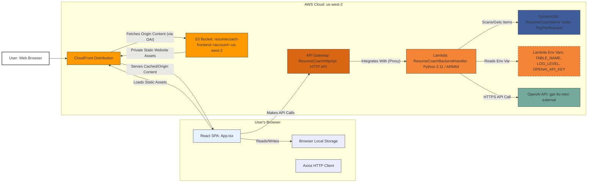
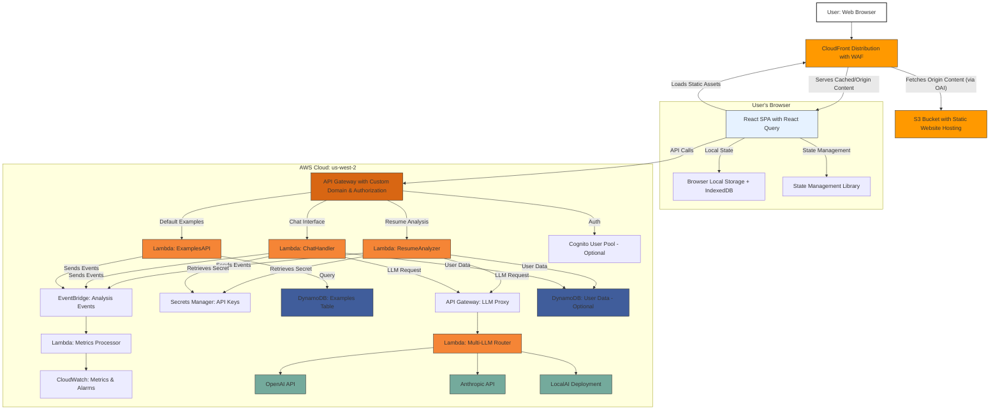
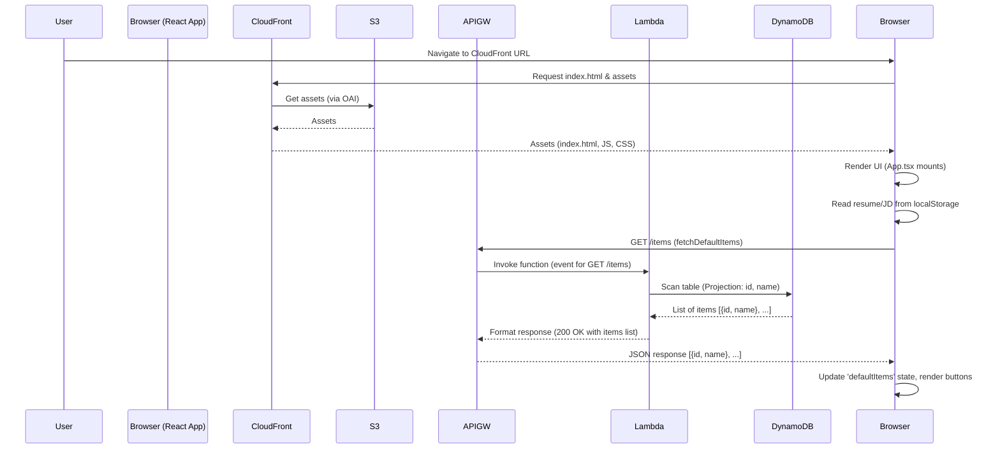
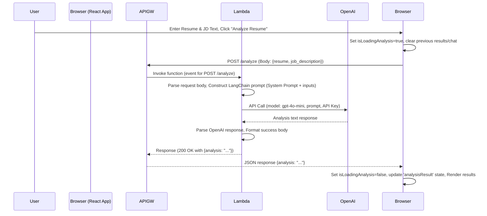
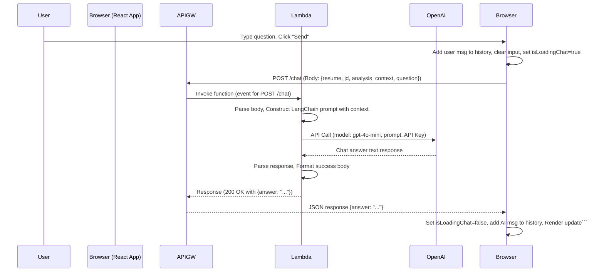

# Resume Coach (v2)

## 1. Introduction & Purpose

Welcome to the Resume Coach project! This document provides an exhaustive deep-dive into the architecture, components, data flow, design decisions, and operational aspects of this application. Its goal is to equip any Software Development Engineer (SDE) with the knowledge needed to understand, maintain, extend, and troubleshoot the system effectively.

**What is Resume Coach?**

Resume Coach is a serverless single-page web application (SPA) deployed in the `us-west-2` AWS region. It's designed to provide AI-powered feedback to job applicants. Users can paste their resume text and the text of a job description they are interested in. The application then leverages a Large Language Model (LLM) – specifically OpenAI's `gpt-4o-mini` – via the LangChain framework to analyze the resume against the job description. It provides structured coaching advice covering:

*   **Qualification Assessment:** An evaluation of how well the resume matches the job requirements (e.g., Highly Qualified, Qualified, Partially Qualified, Not Qualified) with justification.
*   **Gap Identification:** Highlighting key skills or experiences mentioned in the job description that appear to be missing from the resume.
*   **Strength Highlighting:** Pointing out key qualifications from the resume that align well with important job description requirements.

Furthermore, the application offers a **Follow-up Chat** feature, allowing users to ask clarifying questions based *only* on the context of the resume, job description, and the initial analysis provided by the AI.

**Target Audience for this Document:** Software Development Engineers involved in the development, maintenance, or extension of the Resume Coach application.

## 2. Code Structure Overview

```
ResumeCoach/
├── backend/
│   ├── handler.py         # Main Lambda function code (routing, LLM logic, DB access)
│   └── requirements.txt   # Python dependencies
├── frontend/
│   ├── dist/              # Built frontend assets (generated by `npm run build`)
│   ├── public/            # Static assets (e.g., favicon)
│   ├── src/
│   │   ├── App.css        # Main CSS styling
│   │   ├── App.tsx        # Main React component (UI and frontend logic)
│   │   ├── main.tsx       # React application entry point
│   │   └── vite-env.d.ts  # Vite TypeScript environment types
│   ├── .env               # Frontend environment variables (VITE_API_URL)
│   ├── index.html         # HTML entry point
│   ├── package.json       # Node.js dependencies and scripts
│   ├── tsconfig.json      # TypeScript configuration
│   └── vite.config.ts     # Vite build tool configuration
└── infrastructure/
    ├── bin/
    │   └── infrastructure.ts # CDK App entry point (instantiates stack)
    ├── lib/
    │   └── infrastructure-stack.ts # Main CDK stack definition (defines AWS resources)
    ├── cdk.json           # CDK toolkit configuration
    ├── jest.config.js     # Jest test runner config (if tests were added)
    ├── package.json       # CDK Node.js dependencies and scripts
    └── tsconfig.json      # CDK TypeScript configuration
```

## 3. Project Evolution: From Foundation (V1) to Functionality (V2)

The Resume Coach project evolved in two distinct stages based on the setup guides:

*   **Version 1 (Foundation):** (see `v1` tag in the version control history) This stage established a generic, reusable full-stack serverless template. It was *not* the Resume Coach application itself but the technical groundwork. Key characteristics:
    *   **Frontend:** React (TypeScript/Vite) SPA performing basic CRUD operations via buttons and lists.
    *   **Backend:** Python AWS Lambda providing a simple REST API (`GET`, `POST`, `PUT`, `DELETE` on `/items` and `/items/{id}`) via API Gateway (HTTP API).
    *   **Database:** DynamoDB table (`ResumeCoachItems`) storing simple items with `id`, `content`, `createdAt`, `updatedAt`.
    *   **Infrastructure:** Defined using AWS CDK (TypeScript), deploying resources to `us-west-2`. Included S3 for hosting and CloudFront for delivery.
    *   **Purpose:** To demonstrate the integration of the chosen technologies (React, Python Lambda, DynamoDB, API Gateway, CDK, S3, CloudFront) and establish a working deployment pipeline, including Docker-based Lambda bundling.

*   **Version 2 (Resume Coach):** (see `v2` tag in the version control history) This stage transformed the V1 foundation into the functional Resume Coach application by making specific, targeted changes:
    *   **Backend Overhaul:**
        *   Replaced V1 CRUD logic in `handler.py` with LLM integration using `openai` and `langchain` libraries.
        *   Introduced `analyze_resume` function (`POST /analyze`) to call `gpt-4o-mini` for analysis.
        *   Introduced `chat_follow_up` function (`POST /chat`) to handle contextual chat.
        *   Repurposed `get_all_default_items` (`GET /items`) to perform a DynamoDB `Scan` and return metadata (`id`, `name`) of default examples.
        *   Repurposed `get_default_item` (`GET /items/{id}`) to fetch the `content` of a specific default example.
        *   Updated `requirements.txt` with LLM libraries (`boto3`, `openai`, `langchain`, `langchain-openai`).
        *   Increased Lambda timeout/memory settings to accommodate LLM API calls.
        *   Implemented OpenAI API key retrieval from Lambda environment variables.
        *   Added error handling for missing or invalid API keys.
        *   Created structured system prompts using LangChain's `ChatPromptTemplate`.
        *   Implemented LangChain Expression Language (LCEL) chain pattern (`RunnablePassthrough | prompt | llm | StrOutputParser`).
    *   **Frontend Overhaul:**
        *   Completely replaced the V1 CRUD UI in `App.tsx` with the Resume Coach interface (text areas, analysis/chat display, default loaders).
        *   Updated API calls (`axios`) to target the new `/analyze`, `/chat`, and repurposed `/items` endpoints.
        *   Implemented simple state persistence using browser `localStorage` with dedicated keys for resume and job description text.
        *   Updated `App.css` for the new layout.
        *   Created TypeScript interfaces for type safety (`ApiError`, `AnalysisResult`, `ChatMessage`, `DefaultItem`, `DefaultItemContent`).
        *   Implemented loading states, error handling, and status messages for user feedback.
        *   Added scrolling behavior to automatically scroll to the newest content in analysis and chat.
        *   Implemented user interfaces for text input, analysis display, chat history, and default example loading.
        *   Added automatic clearing of chat history when new analysis is performed.
    *   **Database Usage Shift:** The `ResumeCoachItems` table's role changed from general data storage to specifically holding *predefined default examples*. User input is processed ephemerally.
        *   Items in DynamoDB table now have a simplified structure with `id` (String), `name` (String), and `content` (String) attributes.
        *   Default examples include pairs of resume and job description texts with specific IDs (e.g., `DEFAULT_RESUME_1`, `DEFAULT_JOB_DESC_1`). 
        *   Items are managed manually via the AWS Console in this version (no admin UI for default management).
    *   **Infrastructure Updates:**
        *   Added API Gateway routes for `/analyze` and `/chat`.
        *   Added placeholder for `OPENAI_API_KEY` in Lambda environment definition within CDK.
        *   Increased Lambda memory allocation and timeout settings to accommodate LLM processing.
        *   Updated Lambda IAM permissions to maintain DynamoDB access.
    *   **Configuration & Secrets:**
        *   Established the pattern of using `.env` for frontend API URL and manual Lambda environment variable configuration for the backend API key.
        *   Frontend `.env` file contains `VITE_API_URL` pointing to the API Gateway endpoint.
        *   OpenAI API key is stored in Lambda environment variables, set manually post-deployment through the AWS Console.

Understanding this two-stage process, executed precisely as documented, is fundamental to understanding the current codebase and infrastructure.

## 4. Core Functionality (User Perspective - V2)

The user interacts with a single web page offering:

1.  **Inputs:** Two large text areas: one for pasting resume text, one for job description text.
2.  **Default Examples:**
    *   A section with buttons labeled "Load: [Example Name]" (e.g., "Load: Backend Engineer Resume"). Clicking loads the corresponding text into the appropriate input area.
    *   A "Refresh Examples List" button re-fetches the list of available examples from the backend.
3.  **Analysis Trigger:** An "Analyze Resume" button, enabled only when both input fields contain text.
4.  **Analysis Display:** After clicking "Analyze Resume" and a loading period, a section appears displaying the structured analysis (Qualification, Missing Skills, Strengths) generated by the AI.
5.  **Follow-up Chat:** Once analysis is displayed, a chat interface appears below it. Users can type questions related to the analysis, send them, and receive AI responses within the chat history window.
6.  **Input Persistence:** Text entered in the resume and job description fields is automatically saved in the browser's local storage, ensuring it persists across page reloads *on the same browser*.

## 5. System Architecture

### 5.1. Original System Architecture (V2)

The application employs a standard serverless web architecture deployed entirely within the `us-west-2` AWS region (except for the global CloudFront edge locations).

**Detailed Architecture Diagram:**



**Component Roles & Interactions:**

*   **User:** Interacts with the React SPA loaded in their browser.
*   **React SPA (Browser):** Renders the UI (`App.tsx`), manages component state (`useState`), handles user input events, persists input text to `localStorage`, and uses `axios` to send asynchronous HTTP requests to the API Gateway endpoints.
*   **CloudFront:** Acts as the global entry point. Serves static assets (HTML, CSS, JS from S3) with caching. Handles HTTPS. Uses an Origin Access Identity (OAI) to securely fetch content from the private S3 bucket. Redirects 403/404 errors to `/index.html` to support client-side routing/deep linking in the SPA.
*   **S3 Bucket:** Stores the production build output (`frontend/dist`) of the React application. Configured as private, only accessible via the CloudFront OAI.
*   **API Gateway (HTTP API):** Provides the secure HTTPS frontend for the backend logic. It receives requests from the browser, handles CORS preflight checks (`OPTIONS`), routes requests based on path and method (`GET /items`, `GET /items/{id}`, `POST /analyze`, `POST /chat`) to the integrated Lambda function, and returns the Lambda's response to the browser.
*   **Lambda Function:** Executes the Python backend code (`handler.py`). It parses incoming requests from API Gateway, interacts with DynamoDB (using `boto3`) to fetch default data, constructs prompts, interacts with the OpenAI API (using `openai` and `langchain` libraries) for AI tasks, and formats responses back to API Gateway. Reads its configuration (table name, API key) from environment variables.
*   **DynamoDB Table:** Stores the predefined default example items (`id`, `name`, `content`). Accessed via `Scan` (to list defaults) and `GetItem` (to get specific default content). Uses Pay-Per-Request billing.
*   **OpenAI API:** An external service providing the LLM capabilities. The Lambda function makes authenticated HTTPS requests to this service, sending prompts and receiving generated text.

### 5.2. Potentially Improved System Architecture

An enhanced architecture for Resume Coach would address several limitations in the current design, including improved security, reliability, scalability, and developer experience.

**Enhanced Architecture Diagram:**



**Key Improvements:**

1. **Frontend Enhancements:**
   * **React Query Integration:** For better data fetching, caching, synchronization, and error handling
   * **State Management Library:** (Redux Toolkit or Zustand) for more maintainable global state
   * **IndexedDB + localStorage:** For more robust client-side data persistence beyond page refreshes
   * **Component Architecture:** Breaking down the monolithic `App.tsx` into reusable components

2. **Security Improvements:**
   * **AWS WAF Integration:** Protect against common web exploits and bots
   * **AWS Secrets Manager:** Replace Lambda environment variables for API keys
   * **Custom Domain & TLS:** With proper ACM certificates
   * **Optional Authentication:** Cognito user pool integration for user accounts

3. **Serverless Modularity:**
   * **Microservice Lambda Functions:** Split functionality into purpose-specific Lambda functions
     * Resume Analysis Lambda
     * Chat Interface Lambda
     * Examples API Lambda
   * **Event-Driven Architecture:** Using EventBridge for cross-service communication
   * **API Gateway with Authorization:** Properly scoped IAM roles and optional API keys

4. **LLM Provider Redundancy:**
   * **Multi-LLM Router:** Ability to switch between multiple LLM providers (OpenAI, Anthropic, etc.)
   * **Fallback Mechanisms:** If one provider has downtime or rate limits
   * **Optional Local Model Deployment:** For sensitive data or reduced latency

5. **Monitoring & Operational Excellence:**
   * **CloudWatch Metrics & Alarms:** For performance monitoring and anomaly detection
   * **EventBridge for Event Logging:** Track all system activities
   * **Metrics Processing Lambda:** For custom metric extraction and business insights

6. **Scalability Improvements:**
   * **DynamoDB GSIs:** For more efficient queries beyond simple Key/Value lookups
   * **CloudFront Cache Optimization:** Improved caching strategies with invalidation
   * **Lambda Provisioned Concurrency:** For consistent performance

7. **Development Experience:**
   * **Infrastructure as Code:** Expanded CDK usage with environment-specific stacks
   * **CI/CD Pipeline:** With GitHub Actions or AWS CodePipeline
   * **Testing Infrastructure:** End-to-end, integration, and unit tests
   * **Local Development:** Docker Compose for local environment

8. **Optional User Features:**
   * **User Account Creation:** Save resume and job descriptions
   * **Analysis History:** Track previous analyses and comparisons
   * **Personalized Recommendations:** Based on resume profile

**Implementation Considerations:**

When implementing this enhanced architecture, consider the following trade-offs:

* **Cost vs. Scalability:** The multi-component design may increase AWS resource costs for low-traffic applications but provides better scalability for high-traffic scenarios.
* **Simplicity vs. Robustness:** The original architecture is simpler to maintain, while the enhanced version offers more resilience and flexibility.
* **Build vs. Buy:** Consider managed services like AWS Bedrock instead of direct OpenAI API integration for potential cost savings and simplified management.
* **Development Timeline:** The enhanced architecture would require more initial development time but could reduce maintenance costs over the long run.

This architecture maintains the serverless paradigm while addressing key limitations in the original design. It can be implemented incrementally, with each component providing immediate value while building toward the complete enhanced architecture.

## 6. Technology Stack & Justifications

| Component         | Technology/Service                               | Justification (Based on Setup Guides)                                                                                                       |
| :---------------- | :----------------------------------------------- | :------------------------------------------------------------------------------------------------------------------------------------------ |
| **Frontend**      | React (v18+), TypeScript, Vite                 | V1 choice. Modern, performant SPA framework with type safety. Vite provides excellent developer experience and optimized builds.             |
| **API Client**    | Axios (JS Library)                               | V1 choice. Popular, promise-based HTTP client for making requests from the browser to the backend API.                                      |
| **Backend API**   | AWS Lambda (Python 3.11 runtime, ARM64)          | V1 choice. Serverless compute standard. Python chosen for backend, suitable for scripting and AI/ML library integration. ARM64 for efficiency. |
| **API Layer**     | AWS API Gateway (HTTP API v2.0)                  | V1 choice. Managed, scalable API endpoint. HTTP API selected for cost-effectiveness and sufficient features for this Lambda-proxy setup.     |
| **Database**      | AWS DynamoDB (Pay-per-request)                   | V1 choice. Serverless NoSQL DB, fits the key-value nature of V1 items and V2 default examples. Pay-per-request suitable for variable load.   |
| **AWS SDK (BE)**  | Boto3 (Python Library)                           | V1 choice. Official AWS SDK for Python, used by Lambda to interact with DynamoDB.                                                           |
| **Infrastructure**| AWS CDK (v2, TypeScript)                         | V1 choice. IaC tool for defining AWS resources programmatically. TypeScript chosen for CDK language.                                        |
| **Hosting/CDN**   | AWS S3, AWS CloudFront                           | V1 choice. Standard, robust, scalable pattern for hosting static web applications globally with security (OAI) and performance (CDN).       |
| **LLM Framework** | LangChain (Python: `langchain`, `langchain-openai`) | V2 choice. Simplifies LLM interactions: prompt templating, model invocation (`ChatOpenAI`), output parsing, and chain construction (LCEL).   |
| **LLM Service**   | OpenAI API (`gpt-4o-mini` model)                 | V2 choice. Provides the specific AI model required by V2 for analysis and chat, accessed via its API.                                       |
| **LLM Client**    | OpenAI (Python Library)                          | V2 choice. Official Python client library used by LangChain (and directly if needed) to interact with the OpenAI API.                         |
| **Packaging**     | Docker (via CDK Bundling)                        | V1 choice. CDK uses Docker during `cdk deploy` to create a consistent Lambda deployment package, installing Python dependencies correctly.     |
| **State Mgmt (FE)**| React `useState`, Browser `localStorage`         | V2 choice. Basic React hooks for component state. `localStorage` chosen for simple, client-only persistence of input text across reloads.    |

## 7. Detailed Component Breakdown

### 7.1. Frontend (`frontend/`)

using `localStorage.setItem` and `localStorage.getItem`.

*   **Core Logic:** Resides almost entirely within `src/App.tsx`.
*   **Key Responsibilities:**
    *   Rendering the UI structure (input areas, buttons, analysis/chat display).
    *   Managing UI state using `useState` (input text, loading flags, error messages, analysis results, chat history, list of defaults).
    *   Handling user interactions (typing in text areas, clicking buttons, sending chat messages).

    *   Reading the backend API URL from `import.meta.env.VITE_API_URL`.
*   **Build:** `npm run build` uses Vite to compile TypeScript/React code and bundle assets into the `dist/` directory for deployment.
*   **Configuration:** The `.env` file *must* contain `VITE_API_URL=https://<your-api-id>.execute-api.us-west-2.amazonaws.com` (without trailing slash) *before* running the final `npm run build` that gets deployed by `cdk deploy`.

### 7.2. Backend API (`ResumeCoach/backend/` & API Gateway)

*   **API Gateway (`ResumeCoachHttpApi`):**
    *   Acts as the HTTPS frontend, defined in `infrastructure/lib/infrastructure-stack.ts`.
    *   Routes defined:
        *   `GET /items` -> Lambda (for `get_all_default_items`)
        *   `GET /items/{id}` -> Lambda (for `get_default_item`)
        *   `POST /analyze` -> Lambda (for `analyze_resume`)
        *   `POST /chat` -> Lambda (for `chat_follow_up`)
    *   Handles CORS `OPTIONS` requests automatically based on `corsPreflight` configuration.
*   **Lambda Function (`ResumeCoachBackendHandler`):**
    *   Defined in `infrastructure/lib/infrastructure-stack.ts`, code in `backend/handler.py`.
    *   **Entry Point:** `handler(event, context)` function in `handler.py` receives the API Gateway event, determines the route, and calls the appropriate internal function.
    *   **LLM Interaction (`analyze_resume`, `chat_follow_up`):**
        *   Uses `ChatOpenAI(model="gpt-4o-mini", openai_api_key=...)` initialized using the key from `os.environ.get('OPENAI_API_KEY')`.
        *   Uses `ChatPromptTemplate` to define system prompts instructing the LLM on its role and desired output format (e.g., the three analysis sections).
        *   Uses a simple LangChain Expression Language (LCEL) chain (`RunnablePassthrough | prompt | llm | StrOutputParser`) to process requests.
    *   **DynamoDB Interaction (`get_all_default_items`, `get_default_item`):**
        *   Uses `boto3.resource('dynamodb').Table(TABLE_NAME)`.
        *   `get_all_default_items`: Performs `table.scan(ProjectionExpression='id, #nm', ExpressionAttributeNames={'#nm': 'name'})` to fetch metadata, including pagination logic.
        *   `get_default_item`: Performs `table.get_item(Key={'id': item_id})` to fetch full content.
    *   **Dependencies:** `requirements.txt` lists `boto3`, `openai`, `langchain`, `langchain-openai`. These are packaged by CDK using Docker.
    *   **Configuration:** Reads `TABLE_NAME`, `LOG_LEVEL`, `OPENAI_API_KEY` from environment variables.
    *   **Permissions:** Granted `dynamodb:Scan`, `dynamodb:GetItem` (and others via `grantReadWriteData`) by CDK. Implicitly has network access for OpenAI calls and CloudWatch Logs access.

### 7.3. Database (`ResumeCoachItems` DynamoDB Table)

*   **Sole Purpose (V2):** Store predefined default example items.
*   **Mandatory Structure for Defaults:** Each item *must* have attributes:
    *   `id` (String, Partition Key)
    *   `name` (String)
    *   `content` (String)
*   **Management:** Items are added/edited manually via the AWS DynamoDB Console as per `version_2_setup.md`, Step 5 (and the subsequent fix).

### 7.4. Infrastructure (`ResumeCoach/infrastructure/`)

*   **Definition:** All AWS resources are defined in `lib/infrastructure-stack.ts` using AWS CDK v2 (TypeScript).
*   **Key Constructs Used:** `dynamodb.Table`, `lambda.Function` (with Docker bundling), `apigwv2.HttpApi`, `apigwv2.HttpLambdaIntegration`, `s3.Bucket`, `cloudfront.OriginAccessIdentity`, `cloudfront.Distribution`, `s3deploy.BucketDeployment`.
*   **Deployment:** Orchestrated by `cdk deploy` command, which synthesizes CloudFormation, builds Lambda assets (requires Docker), uploads assets, and updates the CloudFormation stack in `us-west-2`. `cdk destroy` removes the stack.

### 7.5. External Services

*   **OpenAI API:** The only external dependency. Requires a valid API key configured manually in the Lambda environment variables post-deployment. All interactions happen from the backend Lambda function.

## 8. Data Flow Diagrams

*(These diagrams accurately reflect the flows based on the setup guides)*

### 8.1. Initial App Load & Fetching Defaults



### 8.2. Performing Resume Analysis



### 8.3. Asking a Follow-up Question



## 9. Deployment Process Overview

The deployment relies heavily on the AWS CDK and requires specific steps in order:

1.  **Prerequisites:** AWS CLI configured (targeting `us-west-2` or using `--region us-west-2`), Node.js (>=18.x), Python (>=3.9), Docker (daemon **must** be running), AWS CDK Toolkit (`npm install -g aws-cdk`), OpenAI API Key obtained.
2.  **CDK Bootstrap (First time per region/account):** Run `cdk bootstrap` in `ResumeCoach/infrastructure/`.
3.  **Code Modifications:** Make changes to files in `frontend/`, `backend/`, or `infrastructure/`.
4.  **Frontend Build (If frontend code changed):** Run `npm install` (if needed) then `npm run build` inside `ResumeCoach/frontend/`. This step is crucial *before* deploying if frontend assets need updating, as `s3deploy.BucketDeployment` uses the contents of `frontend/dist`. Ensure `frontend/.env` has the correct `VITE_API_URL`.
5.  **CDK Deployment:** Run `cdk deploy` inside `ResumeCoach/infrastructure/`.
    *   CDK synthesizes CloudFormation template.
    *   CDK builds the Lambda deployment package using Docker (installs `backend/requirements.txt`, copies code).
    *   CDK uploads assets (Lambda code, `frontend/dist` contents) to S3 staging bucket.
    *   CloudFormation updates the stack (Lambda, API Gateway, etc.).
    *   `s3deploy.BucketDeployment` updates the S3 hosting bucket and invalidates CloudFront cache (`/*`).
6.  **Manual Step 1: Configure OpenAI API Key:** After the first V2 deployment (or any deployment recreating the Lambda function), go to the AWS Lambda Console (`us-west-2`), find `ResumeCoachBackendHandler`, navigate to Configuration -> Environment variables, and **replace the placeholder value** of `OPENAI_API_KEY` with the actual secret key. Save changes.
7.  **Manual Step 2: Populate/Verify DynamoDB Data:** Ensure the `ResumeCoachItems` table in DynamoDB (`us-west-2`) contains the desired default items, each with `id` (String), `name` (String), and `content` (String) attributes. Add/edit items via the AWS Console.

## 10. Configuration & Secrets Management

*   **Frontend (`frontend/.env`):**
    *   `VITE_API_URL`: The only frontend-specific configuration. Set to the API Gateway endpoint URL. Embedded at build time.
*   **Backend (Lambda Environment Variables):**
    *   `TABLE_NAME`: Injected by CDK.
    *   `LOG_LEVEL`: Injected by CDK (default 'INFO').
    *   `OPENAI_API_KEY`: **Must be set manually post-deployment.** This is the primary secret.
*   **Secrets Strategy (V2):** The OpenAI key uses Lambda environment variables. This was chosen for simplicity as per `version_2_setup.md`. It is **not** best practice for production secrets due to visibility in the console and lack of rotation/auditing features. Migration to AWS Secrets Manager or Parameter Store (SecureString) is recommended for production hardening. The key is correctly *not* stored in source code or CDK definitions.

## 11. Default Data (`ResumeCoachItems` Table)

*   **Purpose:** Provide example content for users to easily test the application.
*   **Location:** `ResumeCoachItems` DynamoDB table in `us-west-2`.
*   **Required Structure:** Items must have `id` (String, PK), `name` (String), `content` (String).
*   **Current Examples (Manually Added as per User):**
    *   `id: DEFAULT_RESUME_1`, `name: Backend Engineer Resume` (Content: Perfect match example)
    *   `id: DEFAULT_RESUME_2`, `name: Full-Stack Engineer Resume` (Content: Medium match example)
    *   `id: DEFAULT_RESUME_3`, `name: Frontend Developer Resume` (Content: No match example)
    *   `id: DEFAULT_JOB_DESC_1`, `name: Example SWE Job Desc` (Content: Corresponding job description)
    *   *(Content for these items should correspond to Perfect, Medium, and No Match scenarios relative to the Example SWE Job Desc).*
*   **Loading Flow:** `GET /items` (triggers Lambda Scan) -> Frontend renders buttons -> User clicks button -> `GET /items/{id}` (triggers Lambda GetItem) -> Frontend populates text area.

## 12. Key Design Decisions & Tradeoffs (Resulting from Setup Guides)

*   **Serverless Architecture:** Minimizes operational overhead, scales automatically (within limits), pay-per-use pricing model.
*   **IaC with CDK/TypeScript:** Repeatable deployments, version-controlled infrastructure.
*   **React SPA:** Dynamic UI, leverages component model.
*   **API Gateway HTTP API:** Lower cost, simpler than REST API for this use case.
*   **LangChain:** Simplifies LLM interaction patterns, potentially easing future model swaps or prompt changes.
*   **Lambda Env Var for Secret:** Simple setup but less secure than dedicated secret managers. **Explicitly chosen over AWS Secrets Manager for V2 simplicity.**
*   **Local Storage for State:** Simple client-side persistence, avoids backend complexity for user sessions in V2. State is not shared across devices/browsers.
*   **DynamoDB Scan for Defaults:** Simple implementation for `GET /items`, acceptable *only* because the number of defaults is expected to be very small. **Inefficient at scale.**
*   **No Dependency Version Pinning:** Setup guides used latest versions. Good for getting newest features but risks breaking changes. Production builds should use lock files (`package-lock.json`, `pip freeze`).
*   **Single Frontend Component (`App.tsx`):** Simple for V2 scope but hinders maintainability and scalability as features grow.

## 13. Potential Future Enhancements

This V2 application provides a solid base. Future iterations could include:

*   **Authentication & User Accounts:** Implement user login (e.g., using AWS Cognito) to save user history, preferences, or provide personalized experiences.
*   **Resume Upload:** Allow users to upload resume files (PDF, DOCX) instead of pasting text. Requires backend parsing logic (e.g., using libraries like `python-docx`, `pypdf`) potentially in a separate Lambda or Step Function workflow.
*   **More Sophisticated Analysis:**
    *   Improve LLM prompts for more nuanced feedback.
    *   Use different LangChain chains or agents for specific tasks (e.g., skill extraction).
    *   Fine-tune models or use specialized NLP techniques.
    *   Provide quantitative scoring or visual feedback.
*   **Enhanced State Management:** Introduce a dedicated frontend state management library (Zustand, Redux Toolkit) if the application complexity increases.
*   **Database for User Data:** If user accounts are added, use DynamoDB (or another database) to store user profiles, saved analyses, chat history, etc., likely requiring a more complex data model and GSIs for efficient querying.
*   **CI/CD Pipeline:** Automate testing, building, and deployment using AWS CodePipeline, GitHub Actions, or similar tools.
*   **Improved Error Handling & Monitoring:** Implement more granular error handling, structured logging (e.g., `aws-lambda-powertools-python`), CloudWatch Alarms, and potentially AWS X-Ray tracing.
*   **Cost Optimization:** Analyze usage patterns and optimize resource configurations (Lambda memory/timeout, DynamoDB capacity mode if switching from on-demand, CloudFront caching strategies).
*   **Custom Domain & Production CORS:** Configure a custom domain name via Route 53/ACM and restrict API Gateway CORS `allowOrigins` to that specific domain.
*   **Secrets Management:** Migrate the OpenAI API key to AWS Secrets Manager for better security and rotation capabilities.

## 14. Troubleshooting Tips

*   **Frontend Issues (UI glitches, buttons not working):**
    *   Check the **Browser Developer Console (F12 -> Console tab)** for JavaScript errors.
    *   Check the **Browser Developer Console (F12 -> Network tab)** for failed API requests (look for 4xx or 5xx status codes). Inspect the request payload and response body. Verify the `VITE_API_URL` is correct.
    *   Perform a **hard refresh** (Ctrl+Shift+R or Cmd+Shift+R) to clear the browser cache.
    *   Verify CloudFront invalidation has completed after deployment (can take a few minutes).
*   **Backend Issues (Analysis/Chat failing, errors displayed):**
    *   Check **AWS CloudWatch Logs** for the `ResumeCoachBackendHandler` Lambda function in the `us-west-2` region. Look for errors related to:
        *   `OPENAI_API_KEY` missing or invalid.
        *   Errors calling the OpenAI API (rate limits, authentication issues).
        *   Errors interacting with DynamoDB (permissions, item not found).
        *   Timeout errors (Lambda function ran too long).
        *   Code errors within `handler.py`.
    *   Verify the **OpenAI API Key** is correctly configured in the Lambda environment variables.
    *   Verify the **DynamoDB table** (`ResumeCoachItems`) exists and default items have the correct structure (`id`, `name`, `content`).
    *   Test API endpoints directly using tools like `curl` or Postman, providing the correct JSON payloads.
*   **Deployment Issues (`cdk deploy` failing):**
    *   Ensure **Docker** is running.
    *   Check CDK/CloudFormation error messages in the terminal for details (permissions errors, resource conflicts, syntax errors in CDK code).
    *   Ensure AWS credentials are correctly configured and have sufficient permissions.
    *   Check the AWS CloudFormation console in `us-west-2` for more detailed stack event logs.

This document provides a comprehensive overview of the Resume Coach V2 application as built by following the specified setup guides. It should serve as a reliable reference for understanding its current state. Remember to keep documentation updated as the project evolves beyond these initial setup steps.