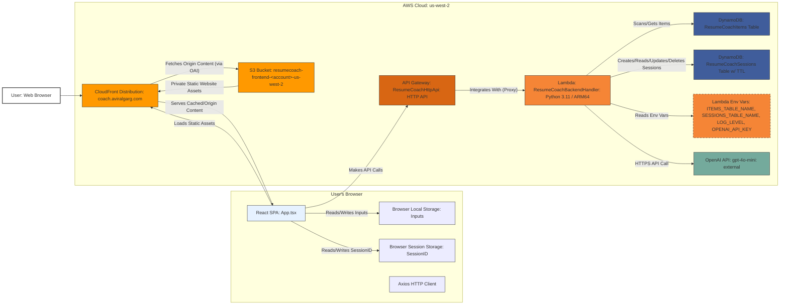

# Resume Coach

## 1. Introduction

Resume Coach is an AI-powered web application designed to help job applicants optimize their resumes for specific job descriptions. Users can paste their resume and a target job description, and the application leverages Large Language Models (LLMs) via LangChain and the OpenAI API (`gpt-4o-mini`) to provide structured feedback. This feedback includes a qualification assessment, identification of skill gaps, and highlighting of strengths.

A key feature is the **stateful follow-up chat**, allowing users to ask clarifying questions based on the resume, job description, and the initial AI analysis. Chat history is maintained within a session, providing context for subsequent interactions.

This README provides developers with the necessary information to understand, set up, deploy, and contribute to the Resume Coach project.

## 2. Project Status

The project is currently functional and deployed using AWS serverless technologies. Recent updates include:

*   Implementation of **DynamoDB-backed session management** for chat conversations, improving efficiency and enabling stateful interactions.
*   Enhanced UI/UX with markdown rendering for analysis and chat messages, refined styling, layout improvements, and better scrolling behavior.
*   Integration with a custom domain (`coach.aviralgarg.com` as configured).
*   General dependency updates and minor fixes.

## 3. Features

*   **AI-Powered Resume Analysis:** Compares resume text against job description text using `gpt-4o-mini`.
*   **Structured Feedback:** Provides feedback categorized into:
    *   Qualification Assessment
    *   Missing Skills/Experience
    *   Key Strengths
*   **Stateful Follow-up Chat:** Allows users to ask questions related to the analysis within a persistent session context.
*   **Load Default Examples:** Provides pre-defined resume/job description examples for quick testing.
*   **Input Persistence:** Resume and Job Description text fields persist in the browser's local storage.
*   **Session Persistence:** Chat session state (including context and history) is stored in DynamoDB with a TTL.
*   **Markdown Rendering:** Analysis and chat messages are rendered using Markdown for improved readability.

## 4. Architecture

Resume Coach utilizes a serverless architecture hosted on AWS (`us-west-2` region, with CloudFront global edge locations and ACM certificate in `us-east-1`).

**Architecture Diagram:**



**Component Breakdown:**

*   **Frontend (React SPA):** Built with React, TypeScript, and Vite. Handles UI rendering, user input, state management (`useState`, `localStorage`, `sessionStorage`), and API communication (`axios`). Includes `react-markdown` for rendering.
*   **CloudFront:** Global CDN serving static assets from S3. Provides HTTPS via an ACM certificate (managed in `us-east-1`) for the custom domain (`coach.aviralgarg.com`). Uses Origin Access Identity (OAI) for secure S3 access. Redirects 403/404 to `index.html` for SPA routing.
*   **S3 Bucket:** Private bucket storing the built frontend assets (`frontend/dist`).
*   **API Gateway (HTTP API):** Provides HTTPS endpoints for the backend Lambda. Routes requests (`/analyze`, `/chat`, `/items`, `/items/{id}`) and handles CORS.
*   **Lambda Function (Python):** The core backend logic in `backend/handler.py`.
    *   Handles routing based on API Gateway events.
    *   Interacts with OpenAI API using `langchain` and `langchain-openai` for analysis and chat.
    *   Manages session state (create, load, save) using the `ResumeCoachSessions` DynamoDB table. Serializes/deserializes chat history using `pickle`/`base64`.
    *   Fetches default example data from the `ResumeCoachItems` DynamoDB table using `boto3`.
    *   Reads configuration (table names, API key) from environment variables.
*   **DynamoDB (`ResumeCoachItems`):** Stores predefined default example items (`id`, `name`, `content`). Managed manually via AWS Console.
*   **DynamoDB (`ResumeCoachSessions`):** Stores active chat session state, including resume, job description, initial analysis, serialized chat history (`chat_history_blob`), and metadata. Uses `sessionId` as the partition key and has a `ttl` attribute for automatic cleanup.
*   **OpenAI API:** External LLM service providing the `gpt-4o-mini` model. Accessed via authenticated HTTPS requests from the Lambda function.
*   **Route 53:** Hosts the `aviralgarg.com` domain and provides DNS resolution, pointing `coach.aviralgarg.com` to the CloudFront distribution.
*   **ACM (AWS Certificate Manager):** Manages the SSL/TLS certificate for the custom domain (must be created in `us-east-1`).

## 5. Technology Stack

| Area           | Technology/Service                             | Purpose                                                    |
| :------------- | :--------------------------------------------- | :--------------------------------------------------------- |
| **Frontend**   | React 19, TypeScript, Vite                   | SPA framework, UI, type safety, build tool                 |
|                | Axios                                          | HTTP client for API calls                                  |
|                | `react-markdown`, `remark-gfm`               | Rendering Markdown content in UI                           |
|                | CSS (Variables, Modules)                       | Styling and Theming (Light/Dark)                           |
| **Backend**    | AWS Lambda (Python 3.11, ARM64)              | Serverless compute for API logic                           |
|                | LangChain (`langchain`, `langchain-openai`)    | LLM interaction framework (prompts, chains, model I/O)     |
|                | OpenAI API (`gpt-4o-mini`)                     | External LLM service for analysis and chat generation      |
|                | Boto3                                          | AWS SDK for Python (interacting with DynamoDB)             |
|                | `pickle`, `base64`                             | Serializing/deserializing chat history for DynamoDB storage|
| **API Layer**  | AWS API Gateway (HTTP API v2.0)              | Managed API endpoint, routing, CORS                        |
| **Database**   | AWS DynamoDB (Pay-per-request)               | NoSQL database for default items (`ResumeCoachItems`) & session state (`ResumeCoachSessions`) |
| **Infra (IaC)**| AWS CDK (v2, TypeScript)                     | Defining and deploying AWS resources                       |
| **Hosting/CDN**| AWS S3, AWS CloudFront                       | Static website hosting and content delivery                |
| **DNS/Domain** | AWS Route 53, AWS Certificate Manager (ACM)  | Custom domain routing and SSL/TLS certificate management   |
| **Packaging**  | Docker (via CDK Bundling)                    | Creating Lambda deployment package with dependencies       |

## 6. Project Structure

```
./ (ResumeCoach)
├── .gitignore              # Specifies intentionally untracked files
├── README.md               # This file
├── RECENT_COMMIT_LOG.md    # Log of recent commits (auto-generated)
├── extract_commits.py      # Script to generate RECENT_COMMIT_LOG.md
├── requirements.txt        # Root Python dependencies (mainly for IDE)
│
├── backend/                # Python Lambda Function Code
│   ├── handler.py          # Main Lambda handler (routing, LLM logic, DB access, session mgmt)
│   └── requirements.txt    # Python dependencies for Lambda (boto3, langchain, openai, etc.)
│
├── frontend/               # React Frontend Application
│   ├── dist/               # Built frontend assets (ignored by git, generated by `npm run build`)
│   ├── public/             # Static assets (e.g., favicon) (none used currently)
│   ├── src/                # Frontend source code
│   │   ├── App.css         # Main component styling
│   │   ├── App.tsx         # Main React component (UI, state, API calls)
│   │   ├── index.css       # Global styles and CSS variables
│   │   └── main.tsx        # React application entry point
│   ├── .env                # Frontend environment variables (VITE_API_URL) - REQUIRED for build
│   ├── index.html          # HTML entry point
│   ├── package.json        # Frontend Node.js dependencies and scripts
│   ├── tsconfig.app.json   # TypeScript config for application code
│   ├── tsconfig.json       # Base TypeScript config
│   ├── tsconfig.node.json  # TypeScript config for Node context (e.g., Vite config)
│   └── vite.config.ts      # Vite build tool configuration
│
└── infrastructure/         # AWS CDK Infrastructure as Code
    ├── bin/
    │   └── infrastructure.ts # CDK App entry point (instantiates stack)
    ├── lib/
    │   └── infrastructure-stack.ts # Main CDK stack definition (defines AWS resources)
    ├── test/
    │   └── infrastructure.test.ts # Unit tests for CDK stack (placeholder)
    ├── .npmignore          # Files to exclude from CDK npm package
    ├── README.md           # Default CDK README
    ├── cdk.json            # CDK toolkit configuration
    ├── package.json        # CDK Node.js dependencies and scripts
    └── tsconfig.json       # CDK TypeScript configuration
```

## 7. Getting Started / Setup

### 7.1. Prerequisites

*   **AWS Account:** With permissions to create resources (IAM, Lambda, API Gateway, DynamoDB, S3, CloudFront, Route 53, ACM).
*   **AWS CLI:** Configured with credentials and default region (e.g., `us-west-2`). Run `aws configure`.
*   **Node.js:** Version 18.x or later (`node --version`).
*   **npm:** (`npm --version`).
*   **Python:** Version 3.9 or later (`python --version` or `python3 --version`).
*   **pip:** (`pip --version` or `python3 -m pip --version`).
*   **AWS CDK Toolkit:** Install globally: `npm install -g aws-cdk` (`cdk --version`).
*   **Docker:** Must be installed and the Docker daemon **must be running** during `cdk deploy` for Lambda bundling.
*   **OpenAI API Key:** Obtain from [OpenAI](https://platform.openai.com/api-keys).
*   **Domain Name:** Registered and delegated to AWS Route 53 in your account (e.g., `aviralgarg.com`). Update domain names in `infrastructure/lib/infrastructure-stack.ts` and `infrastructure/bin/infrastructure.ts` if different.

### 7.2. Cloning the Repository

```bash
git clone <repository-url>
cd ResumeCoach
```

### 7.3. Configuration

1.  **Backend OpenAI API Key:** This key is **NOT** stored in code. It must be configured manually in the AWS Lambda console after the first deployment (see Deployment steps).
2.  **Frontend API URL (`frontend/.env`):**
    *   The API Gateway URL is generated during deployment. You will need to deploy the infrastructure *once* to get this URL.
    *   Create the file `frontend/.env`.
    *   Add the following line, replacing the placeholder with the `ApiGatewayUrl` output from the `cdk deploy` command:
        ```env
        VITE_API_URL=https://<your-api-id>.execute-api.us-west-2.amazonaws.com
        ```
    *   **Important:** Ensure there is no trailing slash (`/`) in the URL. This file is required *before* building the frontend for deployment.

### 7.4. Installation

1.  **Install Frontend Dependencies:**
    ```bash
    cd frontend
    npm install
    cd ..
    ```
2.  **Install Infrastructure Dependencies:**
    ```bash
    cd infrastructure
    npm install
    cd ..
    ```

### 7.5. Deployment

Deployment uses the AWS CDK. Ensure Docker is running.

1.  **CDK Bootstrap (If first time using CDK in the account/region):**
    ```bash
    cd infrastructure
    cdk bootstrap aws://<YOUR_ACCOUNT_ID>/us-west-2
    # Bootstrap us-east-1 as well if creating ACM certificate for the first time there
    cdk bootstrap aws://<YOUR_ACCOUNT_ID>/us-east-1
    ```
2.  **Build Frontend Assets:**
    *   Ensure `frontend/.env` exists and contains the correct `VITE_API_URL` (you might need to run `cdk deploy` once without this to get the URL, then update `.env` and deploy again).
    *   ```bash
        cd frontend
        npm run build
        cd ..
        ```
3.  **Deploy CDK Stack:**
    ```bash
    cd infrastructure
    # Ensure your AWS CLI is configured for the target account and us-west-2 region
    cdk deploy
    ```
    *   This command will:
        *   Synthesize a CloudFormation template.
        *   Build the Lambda deployment package using Docker (installing `backend/requirements.txt`).
        *   Upload assets (Lambda code, frontend build from `frontend/dist`) to S3.
        *   Create/update AWS resources (DynamoDB tables, Lambda, API Gateway, S3 bucket, CloudFront distribution, Route 53 record, ACM certificate validation if needed).
        *   Output values like the API Gateway URL and CloudFront domain name. Note the `ApiGatewayUrl` output.

4.  **Manual Step 1: Configure OpenAI API Key:**
    *   Go to the AWS Lambda Console in the `us-west-2` region.
    *   Find the `ResumeCoachBackendHandler` function.
    *   Navigate to Configuration -> Environment variables.
    *   Edit the environment variables.
    *   Replace the placeholder value `CONFIGURE_IN_LAMBDA_CONSOLE` for the `OPENAI_API_KEY` variable with your actual OpenAI secret key.
    *   Save the changes.

5.  **Manual Step 2: Populate Default Examples:**
    *   Go to the AWS DynamoDB Console in the `us-west-2` region.
    *   Find the `ResumeCoachItems` table.
    *   Manually create items representing default resumes and job descriptions. Each item **must** have:
        *   `id` (String, Partition Key) - e.g., `DEFAULT_RESUME_1`, `DEFAULT_JOB_DESC_1`
        *   `name` (String) - e.g., `Backend Engineer Resume`
        *   `content` (String) - The actual text of the resume or job description.

6.  **Access the Application:**
    *   Wait for the CloudFront distribution and DNS changes to propagate (can take several minutes).
    *   Access the application via your custom domain: `https://coach.aviralgarg.com` (or the domain you configured).

## 8. Running Locally

Direct local execution of the full stack is complex due to the reliance on managed AWS services (Lambda, API Gateway, DynamoDB, CloudFront).

*   **Frontend:** You can run the frontend development server locally:
    ```bash
    cd frontend
    # Ensure .env file exists with VITE_API_URL pointing to your deployed API Gateway
    npm run dev
    ```
    This will start a local server (e.g., `http://localhost:5173`), but it will make API calls to your *deployed* AWS backend.
*   **Backend:** Running the Python Lambda function locally requires mocking AWS services or using tools like:
    *   **AWS SAM CLI:** Can invoke Lambda functions locally, potentially connecting to DynamoDB Local.
    *   **LocalStack:** Provides a broader range of emulated AWS services.
    *   Setting up local emulation is beyond the scope of this basic README.

For most development tasks, it's common to develop the frontend locally (`npm run dev`) while interacting with the backend deployed to a development environment on AWS.

## 9. API Endpoints

All endpoints are deployed under the API Gateway URL (e.g., `https://<api-id>.execute-api.us-west-2.amazonaws.com`).

*   **`POST /analyze`**
    *   **Purpose:** Starts a new analysis session.
    *   **Request Body:** `application/json`
        ```json
        {
          "resume": "Text of the resume...",
          "job_description": "Text of the job description..."
        }
        ```
    *   **Response Body (Success - 200):** `application/json`
        ```json
        {
          "analysis": "Structured analysis text (Markdown format)...",
          "sessionId": "uuid-string-identifying-the-session"
        }
        ```
    *   **Actions:** Creates a new session in `ResumeCoachSessions` table, calls OpenAI for analysis, saves context and analysis to the session, returns analysis and `sessionId`.

*   **`POST /chat`**
    *   **Purpose:** Sends a follow-up question within an existing session.
    *   **Request Body:** `application/json`
        ```json
        {
          "question": "The user's follow-up question?",
          "sessionId": "uuid-string-from-analyze-response"
        }
        ```
    *   **Response Body (Success - 200):** `application/json`
        ```json
        {
          "answer": "AI's response to the question (Markdown format)..."
        }
        ```
    *   **Actions:** Loads session data using `sessionId`, constructs prompt including context and history, calls OpenAI, updates session history, saves session (updating TTL).
    *   **Errors:** Returns 404 if `sessionId` is not found or expired.

*   **`GET /items`**
    *   **Purpose:** Retrieves the list of available default examples (metadata only).
    *   **Request Body:** None
    *   **Response Body (Success - 200):** `application/json`
        ```json
        [
          { "id": "DEFAULT_RESUME_1", "name": "Backend Engineer Resume" },
          { "id": "DEFAULT_JOB_DESC_1", "name": "Example SWE Job Desc" },
          // ... other default items
        ]
        ```
    *   **Actions:** Performs a `Scan` on the `ResumeCoachItems` table, projecting `id` and `name`.

*   **`GET /items/{id}`**
    *   **Purpose:** Retrieves the full content of a specific default example.
    *   **Request Body:** None
    *   **Path Parameter:** `id` (e.g., `/items/DEFAULT_RESUME_1`)
    *   **Response Body (Success - 200):** `application/json`
        ```json
        {
          "id": "DEFAULT_RESUME_1",
          "content": "The full text content of the default resume..."
        }
        ```
    *   **Actions:** Performs a `GetItem` on the `ResumeCoachItems` table using the provided `id`.

## 10. Database Schema

Two DynamoDB tables are used:

1.  **`ResumeCoachItems`**
    *   **Purpose:** Stores predefined default examples.
    *   **Partition Key:** `id` (String) - Unique identifier (e.g., `DEFAULT_RESUME_1`).
    *   **Attributes:**
        *   `id` (String): Primary key.
        *   `name` (String): Display name for the example (e.g., "Backend Engineer Resume").
        *   `content` (String): The full text content of the example.
    *   **Management:** Data is added/updated manually via the AWS Console.

2.  **`ResumeCoachSessions`**
    *   **Purpose:** Stores active chat session state.
    *   **Partition Key:** `sessionId` (String) - UUID generated when analysis starts.
    *   **TTL Attribute:** `ttl` (Number) - Unix timestamp for automatic expiration (set to 24 hours after last update).
    *   **Attributes:**
        *   `sessionId` (String): Primary key.
        *   `resume` (String): The resume text used for the session.
        *   `jobDescription` (String): The job description text used.
        *   `initialAnalysis` (String): The result of the initial `/analyze` call.
        *   `chat_history_blob` (String): Base64 encoded, pickled list of LangChain `HumanMessage` and `AIMessage` objects representing the conversation.
        *   `createdAt` (String): ISO 8601 timestamp of session creation.
        *   `lastUpdated` (String): ISO 8601 timestamp of the last update.
        *   `ttl` (Number): Expiration timestamp.
    *   **Management:** Managed automatically by the `/analyze` (create) and `/chat` (load/update) endpoints in the Lambda function.

## 11. Key Concepts

### 11.1. Session Management

The chat functionality relies on server-side session management stored in the `ResumeCoachSessions` DynamoDB table.

*   **Creation:** A new session is created when the user successfully calls the `/analyze` endpoint. A unique `sessionId` is generated and returned to the frontend.
*   **State Storage:** The session stores the initial resume, job description, analysis, and the ongoing chat history (serialized).
*   **Chat Interaction:** When the user sends a message via the `/chat` endpoint, they must include the `sessionId`. The backend loads the session data, uses the stored context and history to interact with the LLM, updates the history, and saves the session back to DynamoDB, refreshing the TTL.
*   **Persistence:** The frontend stores the `sessionId` in the browser's `sessionStorage`, meaning it persists for the duration of the browser tab/session but is cleared when the tab/browser is closed.
*   **Expiration:** Sessions automatically expire after 24 hours of inactivity due to the DynamoDB TTL feature, helping manage costs and data retention. If a request uses an expired or non-existent `sessionId`, a 404 error is returned.

### 11.2. Default Examples

The `ResumeCoachItems` table provides sample data for users to quickly test the application without needing their own resume or job description readily available. The frontend fetches the list of names/IDs via `GET /items` and loads the content for a selected example via `GET /items/{id}`. These items must be manually populated in the DynamoDB table.

## 12. Troubleshooting

*   **Frontend Issues (UI glitches, buttons unresponsive):**
    *   Check Browser Developer Console (F12 -> Console) for JavaScript errors.
    *   Check Network tab (F12 -> Network) for failed API requests (4xx, 5xx errors). Verify `VITE_API_URL` in `.env` matches the deployed API Gateway URL.
    *   Hard refresh (Ctrl+Shift+R or Cmd+Shift+R) to clear browser cache.
    *   Ensure CloudFront propagation is complete after deployment.
*   **Analysis/Chat Failures:**
    *   **Check CloudWatch Logs:** Go to CloudWatch -> Log groups in `us-west-2`. Find the log group for `/aws/lambda/ResumeCoachBackendHandler`. Look for errors related to:
        *   `OPENAI_API_KEY`: Missing or invalid key errors (often result in 503 from frontend).
        *   DynamoDB access errors (permissions, item not found).
        *   Session loading/saving errors (`get_session`, `save_session`). Check `chat_history_blob` serialization/deserialization issues.
        *   LangChain/OpenAI API call errors (rate limits, model issues, prompt errors).
        *   Lambda timeouts.
    *   **Verify OpenAI Key:** Double-check the key is correctly set in Lambda environment variables.
    *   **Verify DynamoDB Data:** Ensure `ResumeCoachItems` has correctly structured default items. Check `ResumeCoachSessions` for potentially corrupted session data if chat fails consistently for a specific session.
    *   **Session Expired:** If chat returns a 404 error or "Session not found", the TTL likely expired. Start a new analysis.
*   **Deployment (`cdk deploy`) Failures:**
    *   **Docker Daemon:** Ensure Docker is running.
    *   **CDK/CloudFormation Errors:** Check terminal output for detailed errors (permissions, resource conflicts, syntax errors, custom domain validation issues). Check the CloudFormation console in `us-west-2` (and `us-east-1` for ACM certificate issues) for stack events.
    *   **AWS Credentials/Permissions:** Verify AWS CLI configuration and IAM user permissions.
    *   **Domain/Certificate Issues:** Ensure the domain is correctly delegated to Route 53 and that the ACM certificate validation (via DNS records created by CDK) succeeded.

## 13. Contributing

Currently, contribution guidelines are not formally defined. If interested, please open an issue on the repository to discuss potential contributions. General areas for improvement include:

*   Adding more robust error handling and user feedback.
*   Expanding the test suite (unit, integration, end-to-end).
*   Refactoring frontend/backend code for better maintainability.
*   Improving documentation.

## 14. Known Limitations & Future Enhancements

*   **Error Handling:** Can be more granular and user-friendly.
*   **Local Development:** No easy out-of-the-box local development setup for the full stack.
*   **Security:** API Gateway CORS is currently open (`*`); should be restricted to the frontend domain in production. OpenAI API key relies on Lambda environment variables; using AWS Secrets Manager is recommended for better security.
*   **Scalability:** DynamoDB `Scan` for `/items` is inefficient if the number of defaults grows significantly (unlikely for this use case). Lambda concurrency limits might be hit under very high load.
*   **LLM Cost/Rate Limits:** Dependent on OpenAI API usage, costs, and rate limits.
*   **Session State Size:** Very long chat histories stored in DynamoDB could potentially exceed item size limits (400KB), although unlikely with text data and current setup. Pickle/Base64 adds some overhead.

**Potential Future Enhancements:**

*   **User Authentication (Cognito):** Allow users to save/manage their resumes, job descriptions, and analysis history.
*   **File Upload:** Support uploading resume files (PDF, DOCX) instead of pasting text.
*   **More Sophisticated AI:** Use more advanced LangChain features (Agents, specific Memory types leveraging the DynamoDB store, Retrieval Augmented Generation - RAG), fine-tune models, or explore alternative LLMs.
*   **Enhanced Frontend State Management:** Introduce Zustand or Redux Toolkit if complexity grows.
*   **CI/CD Pipeline:** Automate testing and deployment (e.g., GitHub Actions, AWS CodePipeline).
*   **Improved Monitoring/Alerting:** Add custom CloudWatch metrics, dashboards, and alarms. Implement structured logging (`aws-lambda-powertools-python`).
*   **Secrets Management:** Migrate OpenAI key to AWS Secrets Manager.
*   **Admin Interface:** A way to manage default examples without using the AWS console.
*   **Token Usage Optimization:** Implement chat history windowing or summarization more formally to manage context length passed to the LLM.
