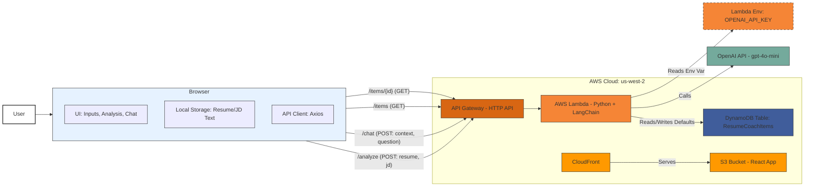

# Version 2 Requirements

Based on your request, combining the goals of the "Resume Coach" project (Appendix 2) with the existing V1 infrastructure and your specific preferences, here are the finalized requirements for Version 2:

1. **Core Functionality:** The application will analyze user-provided resume text against user-provided job description text using an LLM.
2. **LLM Integration:** Utilize the OpenAI API, specifically targeting the `gpt-4o-mini` model, for the analysis. LangChain will be used to structure the interaction with the LLM.
3. **Analysis Output:** The LLM analysis should provide:
    * An assessment of the candidate's qualification for the position, including an explanation.
    * Identification of missing skills or experience based on the job description.
    * Highlighting of key strengths from the resume that match the job description.
4. **Follow-up Chat:** Implement a basic chat interface allowing the user to ask follow-up questions *related to the most recent analysis*. The context for the chat will be the resume, job description, and the initial analysis provided. (Simplest path: Maintain chat history only for the current session/analysis).
5. **Inputs:**
    * Resume: Text area for pasting resume content.
    * Job Description: Text area for pasting job description content.
6. **Default/Example Data:**
    * Provide functionality to load pre-defined example resumes and job descriptions.
    * These examples will be stored in the existing DynamoDB table (`ResumeCoachItems`). The simple CRUD API (`/items` endpoints from V1) will be repurposed to manage these examples (e.g., fetching a list of available examples, fetching the content of a specific example).
    * Use specific, known IDs (e.g., `DEFAULT_RESUME_1`, `DEFAULT_JOB_DESC_1`) for these examples in DynamoDB.
    * The `content` field in DynamoDB for these items will store the actual text of the resume or job description.
7. **State Management (Simple):** Use the browser's local storage to remember the *text* of the last used resume and job description (whether loaded from defaults or pasted by the user) so the fields are pre-populated on page reload. This avoids needing IDs if we store the text directly. (This is a slight simplification from storing IDs, aligning with the "simplest path" goal for V2).
8. **Technology Stack:**
    * **Frontend:** React + TypeScript + Vite (from V1)
    * **Backend:** Python Lambda (from V1) + LangChain + OpenAI SDK
    * **Database:** DynamoDB (from V1, using the existing `ResumeCoachItems` table for default examples)
    * **Infrastructure:** AWS CDK (TypeScript) (from V1)
    * **Deployment:** API Gateway (HTTP API), S3, CloudFront (from V1)
9. **Secrets Management:** The OpenAI API key will be stored as an environment variable directly within the AWS Lambda function's configuration settings (managed via the AWS Console or CLI after deployment). It will *not* be managed by AWS Secrets Manager or hardcoded.
10. **API Endpoints:**
    * `/items` (GET): Fetch list of default/example items (e.g., names/IDs).
    * `/items/{id}` (GET): Fetch the content of a specific default/example item.
    * *(Optional V2 - Add POST/PUT/DELETE for `/items` later if needed to manage defaults programmatically)*
    * `/analyze` (POST): Accepts resume and job description text, performs LLM analysis, returns results.
    * `/chat` (POST): Accepts current resume, job description, analysis context, and user's follow-up question; returns the LLM's answer.
11. **Code Quality:** The entire codebase (backend and frontend) should be highly readable, well-commented, and easy for a new developer to understand quickly. Modifications will be made within existing files where possible.
12. **Dependencies:** Do not specify exact version numbers for Python (`requirements.txt`) or Node.js (`package.json`) dependencies. Allow the package managers (`pip`, `npm`) to resolve the latest compatible versions.
13. **User Interface:** Replace the V1 CRUD interface with a new UI tailored for the Resume Coach functionality (resume input, job description input, analysis display, chat interface, button to load defaults).

# Resume Coach - Version 2 Setup Guide

This guide details the steps required to upgrade the "Foundational Template: ResumeCoach (AWS CDK + Python + React)" (Version 1) application to the functional "Resume Coach" (Version 2). Version 2 introduces LLM-powered resume analysis using OpenAI and LangChain, replacing the basic CRUD example.

**Architecture Overview (Version 2):**

The core architecture remains similar to Version 1, but the Lambda function's role expands significantly, and the frontend UI is completely revamped.

1. **Frontend (React):** Hosted on S3, served via CloudFront. Provides UI for resume/job description input, displays LLM analysis and chat, interacts with backend API endpoints (`/analyze`, `/chat`, `/items`). Uses local storage to retain input text.
2. **Backend (Python Lambda):** Provides RESTful API via API Gateway.
    * Handles requests to `/analyze` by using LangChain and OpenAI (`gpt-4o-mini`) to compare resume and job description.
    * Handles requests to `/chat` for follow-up questions based on the analysis.
    * Handles requests to `/items` to fetch default/example resumes and job descriptions from DynamoDB.
    * Reads OpenAI API Key from Lambda environment variables.
3. **Database (DynamoDB):** Stores *default/example* resume and job description text in the `ResumeCoachItems` table created in V1. The primary user input is processed in memory and sent to the LLM, not persistently stored by default.
4. **Infrastructure (AWS CDK):** Defines and deploys all AWS resources. Minor updates needed for new API routes and Lambda environment variable configuration.

**Diagram (Conceptual Changes):**



---

## Prerequisites

1. **Version 1 Setup Completed:** You **must** have successfully completed all steps in the `version_1_setup.md` guide. This includes having the AWS CDK environment bootstrapped, the V1 stack deployed, and the basic CRUD application functional.
2. **OpenAI API Key:** You need an API key from OpenAI.
    * Go to [https://platform.openai.com/api-keys](https://platform.openai.com/api-keys).
    * Create a new secret key. **Copy it immediately and store it securely.** You won't be able to see it again.
    * Ensure your OpenAI account has sufficient credits/billing set up to use the `gpt-4o-mini` model.
3. **Docker:** Ensure the Docker daemon is running before executing `cdk deploy` commands, as CDK uses it to build the Lambda deployment package.

**Note on Package Versions:** This guide continues the practice of not specifying exact package versions in `requirements.txt` and `package.json`. `pip` and `npm` will install the latest available versions. If you encounter compatibility issues, you may need to consult library documentation or pin specific versions later.

---

## Step 1: Update Backend Dependencies

Navigate to the `backend` folder and update the `requirements.txt` file to include the necessary libraries for OpenAI and LangChain integration.

1. **Go to the backend directory:**
    ```bash
    cd backend
    # If you are not in the project root, navigate to ResumeCoach/backend
    ```

2. **Update `requirements.txt`:**
    Replace the content of `ResumeCoach/backend/requirements.txt` with the following:

    ```txt
    # ResumeCoach/backend/requirements.txt
    boto3
    openai
    langchain
    langchain-openai
    # Add other langchain components if needed later, e.g., langchain-community
    ```

3. **(Optional) Install locally for testing/IDE support:**
    If you use a local virtual environment for development, activate it and install the new requirements:
    ```bash
    # Assuming you have a virtual environment 'venv' in the root directory (if not, use `uv venv` to create one)
    # Activate the virtual environment
    source ../venv/bin/activate # macOS/Linux
    # Install the requirements
    uv pip install -r requirements.txt
    ```
    *Note: CDK will handle the installation within Docker during deployment regardless of local installation.*

4. **Navigate back to the root directory:**
    ```bash
    cd ..
    ```

---

## Step 2: Update Backend Lambda Code (`handler.py`)

Modify the `handler.py` file to implement the new analysis and chat logic using LangChain and OpenAI, and adapt the existing CRUD functions to fetch default data.

1. **Replace `ResumeCoach/backend/handler.py`:**
    Replace the *entire content* of `ResumeCoach/backend/handler.py` with the following code. This version includes:
    * Reading the OpenAI API key from environment variables.
    * Using LangChain for structuring prompts and interacting with `gpt-4o-mini`.
    * New functions `analyze_resume` and `chat_follow_up`.
    * Modified `get_all_items` and `get_item` to fetch default examples (assuming specific IDs like `DEFAULT_RESUME_1`, `DEFAULT_JOB_DESC_1`).
    * Updated main `handler` to route to the new functions.

    ```python
    # ResumeCoach/backend/handler.py
    import json
    import boto3
    import os
    import uuid
    from datetime import datetime
    import logging

    # --- LangChain & OpenAI Imports ---
    from langchain_openai import ChatOpenAI
    from langchain.prompts import ChatPromptTemplate, SystemMessagePromptTemplate, HumanMessagePromptTemplate
    from langchain.schema.output_parser import StrOutputParser
    from langchain.schema.runnable import RunnablePassthrough

    # --- Configuration ---

    # Configure logging
    logger = logging.getLogger()
    log_level = os.environ.get('LOG_LEVEL', 'INFO').upper()
    logger.setLevel(log_level)

    # Get DynamoDB table name from environment variables (set by CDK)
    TABLE_NAME = os.environ.get('TABLE_NAME')
    if not TABLE_NAME:
        logger.error("FATAL: Environment variable TABLE_NAME is not set.")
        raise ValueError("TABLE_NAME environment variable not set.")

    # Get OpenAI API Key from environment variables (set manually in Lambda console)
    OPENAI_API_KEY = os.environ.get('OPENAI_API_KEY')
    if not OPENAI_API_KEY:
        # Log an error, but allow function to load. Calls will fail later.
        logger.error("WARN: Environment variable OPENAI_API_KEY is not set. LLM calls will fail.")
        # We don't raise an error here to allow fetching defaults even if key is missing

    # --- AWS Clients ---
    # Use default session, credentials/region picked up from Lambda execution role/environment
    dynamodb_resource = boto3.resource('dynamodb')
    table = dynamodb_resource.Table(TABLE_NAME)
    dynamodb_client = dynamodb_resource.meta.client # For specific exceptions if needed

    # --- LLM Setup (Conditional) ---
    llm = None
    if OPENAI_API_KEY:
        try:
            # Initialize the ChatOpenAI model (using gpt-4o-mini as requested)
            llm = ChatOpenAI(
                model="gpt-4o-mini",
                openai_api_key=OPENAI_API_KEY,
                temperature=0.3, # Adjust temperature for creativity vs consistency
                max_tokens=1500  # Adjust based on expected output length
            )
            logger.info("ChatOpenAI model initialized successfully.")
        except Exception as e:
            logger.error(f"Failed to initialize ChatOpenAI model: {e}", exc_info=True)
            # llm remains None, API calls requiring it will fail gracefully later
    else:
        logger.warning("LLM not initialized because OPENAI_API_KEY is missing.")


    # --- CORS Headers ---
    CORS_HEADERS = {
        'Content-Type': 'application/json',
        'Access-Control-Allow-Origin': '*', # Adjust in production!
        'Access-Control-Allow-Headers': 'Content-Type,X-Amz-Date,Authorization,X-Api-Key,X-Amz-Security-Token',
        'Access-Control-Allow-Methods': 'OPTIONS,POST,GET,PUT,DELETE' # Include methods used
    }

    # --- Helper Function for Responses ---
    def create_response(status_code, body):
        """Creates a standard API Gateway response."""
        return {
            'statusCode': status_code,
            'headers': CORS_HEADERS,
            'body': json.dumps(body)
        }

    # --- Default Data Functions (Modified V1 CRUD) ---

    def get_all_default_items(event):
        """
        Retrieves metadata (id, name) for all items currently in the DynamoDB table
        by performing a Scan operation.
        WARNING: Scan operations can be inefficient on very large tables.
        This is acceptable here assuming the number of 'default' items remains small.
        Ensure items added manually include both 'id' (String) and 'name' (String) attributes.
        """
        logger.info("Attempting to fetch all items from DynamoDB via Scan.")
        try:
            # Perform a Scan operation.
            # Project only 'id' and 'name' attributes to minimize data transfer.
            # '#nm' is used because 'name' is a reserved keyword in DynamoDB.
            response = table.scan(
                ProjectionExpression='id, #nm',
                ExpressionAttributeNames={'#nm': 'name'}
            )
            items = response.get('Items', [])

            # Handle pagination if the table grows larger (Scan results are limited to 1MB)
            while 'LastEvaluatedKey' in response:
                logger.info("Scan response paginated, fetching next page...")
                response = table.scan(
                    ProjectionExpression='id, #nm',
                    ExpressionAttributeNames={'#nm': 'name'},
                    ExclusiveStartKey=response['LastEvaluatedKey']
                )
                items.extend(response.get('Items', []))

            logger.info(f"Successfully scanned and retrieved {len(items)} items.")

            # Filter out items that might be missing 'id' or 'name' (optional, defensive coding)
            valid_items = [item for item in items if 'id' in item and 'name' in item]
            if len(valid_items) != len(items):
                logger.warning("Some scanned items were missing 'id' or 'name' attributes.")

            return create_response(200, valid_items)

        except Exception as e:
            logger.error(f"Error scanning DynamoDB table: {e}", exc_info=True)
            return create_response(500, {'error': 'Internal server error while fetching default items list'})

    def get_default_item(event):
        """Retrieves the content of a specific default item by ID."""
        item_id = None
        try:
            item_id = event['pathParameters']['id']
            logger.info(f"Attempting to fetch default item with ID: {item_id}")

            # Basic validation for expected default IDs (optional but good practice)
            # expected_defaults = ["DEFAULT_RESUME_1", "DEFAULT_JOB_DESC_1"]
            # if item_id not in expected_defaults:
            #     logger.warning(f"Requested ID '{item_id}' is not a known default item ID.")
            #     return create_response(404, {'error': f"Default item '{item_id}' not found"})

            response = table.get_item(Key={'id': item_id})
            item = response.get('Item')

            if item:
                logger.info(f"Successfully retrieved default item with ID: {item_id}")
                # Return only necessary fields (e.g., id and content)
                # Ensure 'content' exists before returning
                return create_response(200, {'id': item.get('id'), 'content': item.get('content', 'Error: Content missing')})
            else:
                logger.warning(f"Default item not found in DynamoDB with ID: {item_id}")
                # Even if it's an expected ID, it might not have been added to the table yet
                return create_response(404, {'error': f"Default item content not found for ID: {item_id}"})

        except KeyError:
            logger.error("Missing 'id' in pathParameters for get_default_item")
            return create_response(400, {'error': "Missing 'id' in request path"})
        except Exception as e:
            logger.error(f"Error getting default item {item_id}: {e}", exc_info=True)
            return create_response(500, {'error': 'Internal server error while fetching default item'})

    # --- V2 Core Functions ---

    def analyze_resume(event):
        """Analyzes resume against job description using LangChain and OpenAI."""
        if not llm:
            logger.error("LLM not available for analysis. Check OPENAI_API_KEY.")
            return create_response(503, {'error': 'LLM service is unavailable. Check API Key configuration.'})

        try:
            body = json.loads(event.get('body', '{}'))
            resume_text = body.get('resume')
            job_description_text = body.get('job_description')

            if not resume_text or not job_description_text:
                logger.warning("Analysis request missing resume or job description.")
                return create_response(400, {'error': 'Both "resume" and "job_description" are required in the request body.'})

            logger.info("Starting resume analysis.")

            # --- LangChain Prompt Template ---
            system_template = """You are an expert Resume Coach AI. Your task is to analyze a provided resume against a job description.
            Provide clear, concise, and actionable feedback structured in three sections:
            1.  **Qualification Assessment:** Briefly state how well the resume aligns with the job description (e.g., Highly Qualified, Qualified, Partially Qualified, Not Qualified) and provide a 1-2 sentence explanation referencing specific resume points and job requirements.
            2.  **Missing Skills/Experience:** List the key skills or experiences mentioned in the job description that are *not* clearly present in the resume. Be specific. If nothing significant is missing, state that clearly.
            3.  **Key Strengths:** Highlight 2-3 key strengths or experiences from the resume that *directly* match important requirements in the job description. Quote or reference specific parts of the resume and job description.

            Analyze the following:
            Job Description:
            {job_description}

            Resume:
            {resume}

            Provide only the structured analysis as described above."""

            human_template = "{input}" # We'll pass the combined context here, though the system prompt does most work

            prompt = ChatPromptTemplate.from_messages([
                SystemMessagePromptTemplate.from_template(system_template),
                # HumanMessagePromptTemplate.from_template(human_template) # Not strictly needed if system prompt has all info
            ])

            # --- LangChain Chain ---
            # Using LCEL (LangChain Expression Language)
            chain = (
                # Pass resume and JD directly to the prompt formatting
                RunnablePassthrough()
                | prompt
                | llm
                | StrOutputParser()
            )

            # --- Invoke Chain ---
            logger.info("Invoking LLM chain for analysis...")
            analysis_result = chain.invoke({
                "resume": resume_text,
                "job_description": job_description_text,
                # "input": "" # Not needed if using RunnablePassthrough and system prompt directly
            })
            logger.info("LLM analysis completed successfully.")

            # Return the structured analysis from the LLM
            return create_response(200, {'analysis': analysis_result})

        except json.JSONDecodeError:
            logger.error("Error decoding JSON body for analysis request.")
            return create_response(400, {'error': 'Invalid JSON format in request body'})
        except Exception as e:
            logger.error(f"Error during resume analysis: {e}", exc_info=True)
            return create_response(500, {'error': 'Internal server error during analysis'})

    def chat_follow_up(event):
        """Handles follow-up chat questions based on the analysis context."""
        if not llm:
            logger.error("LLM not available for chat. Check OPENAI_API_KEY.")
            return create_response(503, {'error': 'LLM service is unavailable. Check API Key configuration.'})

        try:
            body = json.loads(event.get('body', '{}'))
            resume_text = body.get('resume')
            job_description_text = body.get('job_description')
            analysis_context = body.get('analysis_context') # The initial analysis result
            question = body.get('question')

            if not all([resume_text, job_description_text, analysis_context, question]):
                logger.warning("Chat request missing required context or question.")
                return create_response(400, {'error': 'Missing required fields: "resume", "job_description", "analysis_context", "question".'})

            logger.info(f"Starting chat follow-up for question: '{question}'")

            # --- LangChain Prompt Template for Chat ---
            # Provide context to the LLM for the follow-up
            system_template = """You are the Resume Coach AI, continuing a conversation with a user about their resume and a job description.
            You have already provided an initial analysis. Now, answer the user's follow-up question based *only* on the information contained within the resume, the job description, and your previous analysis.
            Do not invent new information or make assumptions beyond this context. Keep your answer concise and directly related to the question.

            Context:
            --- Job Description ---
            {job_description}
            --- Resume ---
            {resume}
            --- Previous Analysis You Provided ---
            {analysis_context}
            --- End Context ---

            Now, answer the user's question.
            User Question: {question}"""

            prompt = ChatPromptTemplate.from_messages([
                SystemMessagePromptTemplate.from_template(system_template),
            ])

            # --- LangChain Chain ---
            chain = prompt | llm | StrOutputParser()

            # --- Invoke Chain ---
            logger.info("Invoking LLM chain for chat...")
            answer = chain.invoke({
                "resume": resume_text,
                "job_description": job_description_text,
                "analysis_context": analysis_context,
                "question": question
            })
            logger.info("LLM chat response generated successfully.")

            return create_response(200, {'answer': answer})

        except json.JSONDecodeError:
            logger.error("Error decoding JSON body for chat request.")
            return create_response(400, {'error': 'Invalid JSON format in request body'})
        except Exception as e:
            logger.error(f"Error during chat follow-up: {e}", exc_info=True)
            return create_response(500, {'error': 'Internal server error during chat'})


    # --- Main Handler ---
    def handler(event, context):
        """Main Lambda handler function routing requests."""
        try:
            http_method = event['requestContext']['http']['method']
            path = event['requestContext']['http']['path']

            logger.info(f"Received event: Method={http_method}, Path={path}")
            logger.debug(f"Full event: {json.dumps(event)}") # Be careful with sensitive data in production logs

            # --- Routing Logic ---

            # Route for analysis
            if path == '/analyze' and http_method == 'POST':
                return analyze_resume(event)

            # Route for chat follow-up
            elif path == '/chat' and http_method == 'POST':
                return chat_follow_up(event)

            # Routes for default items (repurposed V1 CRUD)
            elif path == '/items':
                if http_method == 'GET':
                    # Get list/metadata of default items
                    return get_all_default_items(event)
                # POST/PUT/DELETE for /items are not implemented for V2 user features
                # Could be added later for admin management of defaults

            elif path.startswith('/items/') and http_method == 'GET':
                # Check if path matches /items/{id} pattern
                path_parts = path.split('/')
                if len(path_parts) == 3 and 'pathParameters' in event and 'id' in event['pathParameters']:
                    # Get content of a specific default item
                    return get_default_item(event)
                else:
                    logger.warning(f"Path matched /items/{{id}} pattern but structure or parameters invalid: {path}")
                    return create_response(400, {'error': "Invalid request path or missing 'id' parameter for default item."})

            # --- Default Not Found ---
            logger.warning(f"Unhandled route: Method={http_method}, Path={path}")
            return create_response(404, {'error': 'Not Found'})

        except Exception as e:
            # Catch-all for unexpected errors during routing/event processing
            logger.error(f"Unhandled exception in handler: {e}", exc_info=True)
            return create_response(500, {'error': 'Internal Server Error'})

    ```

2. **Navigate back to the root directory:**
    ```bash
    cd ..
    ```

---

## Step 3: Update Infrastructure (AWS CDK)

Modify the CDK stack definition to include the new API Gateway routes (`/analyze`, `/chat`) and prepare for the OpenAI API key environment variable (which will be set manually later).

1. **Navigate to the infrastructure directory:**
    ```bash
    cd infrastructure
    ```

2. **Update `infrastructure/lib/infrastructure-stack.ts`:**
    Edit the file `ResumeCoach/infrastructure/lib/infrastructure-stack.ts`. You only need to add the new routes and potentially add the `OPENAI_API_KEY` to the environment variables section *as a placeholder* (it won't have the real value here).

    * Find the `backendLambda` definition (`new lambda.Function(...)`).
    * Inside the `environment` block, add a placeholder for the OpenAI key. **Do not put your actual key here.**
    * Find the `httpApi` definition (`new apigwv2.HttpApi(...)`).
    * After the existing `httpApi.addRoutes` calls for `/items` and `/items/{id}`, add new calls for `/analyze` and `/chat`.

    Modify the relevant sections like this:

    ```typescript
    // ResumeCoach/infrastructure/lib/infrastructure-stack.ts
    import * as cdk from 'aws-cdk-lib';
    import { Construct } from 'constructs';
    import * as dynamodb from 'aws-cdk-lib/aws-dynamodb';
    import * as lambda from 'aws-cdk-lib/aws-lambda';
    import * as apigwv2 from 'aws-cdk-lib/aws-apigatewayv2';
    import { HttpLambdaIntegration } from 'aws-cdk-lib/aws-apigatewayv2-integrations';
    import * as s3 from 'aws-cdk-lib/aws-s3';
    import * as s3deploy from 'aws-cdk-lib/aws-s3-deployment';
    import * as cloudfront from 'aws-cdk-lib/aws-cloudfront';
    import * as origins from 'aws-cdk-lib/aws-cloudfront-origins';
    import * as path from 'path';
    import { Duration, RemovalPolicy } from 'aws-cdk-lib';

    export class InfrastructureStack extends cdk.Stack {
      constructor(scope: Construct, id: string, props?: cdk.StackProps) {
        super(scope, id, props);

        // --- Database (No changes needed for V2) ---
        const dynamoTable = new dynamodb.Table(this, 'ResumeCoachItemsTable', {
          tableName: 'ResumeCoachItems',
          partitionKey: { name: 'id', type: dynamodb.AttributeType.STRING },
          billingMode: dynamodb.BillingMode.PAY_PER_REQUEST,
          removalPolicy: RemovalPolicy.DESTROY,
          timeToLiveAttribute: 'ttl',
        });

        // --- Backend Lambda (Update Environment Placeholder) ---
        const backendLambda = new lambda.Function(this, 'ResumeCoachBackendLambda', {
          runtime: lambda.Runtime.PYTHON_3_11, // Or your chosen Python runtime
          handler: 'handler.handler',
          code: lambda.Code.fromAsset(path.join(__dirname, '../../backend'), {
            bundling: {
              image: lambda.Runtime.PYTHON_3_11.bundlingImage, // Match runtime
              command: [
                'bash', '-c', `
                pip install -r requirements.txt -t /asset-output &&
                cp -au . /asset-output
                `
              ],
            },
          }),
          environment: {
            TABLE_NAME: dynamoTable.tableName,
            LOG_LEVEL: 'INFO',
            // Add placeholder for OpenAI API Key.
            // IMPORTANT: The actual key will be set manually in the AWS Lambda Console
            // after deployment for security reasons. Do NOT commit your real key here.
            OPENAI_API_KEY: 'CONFIGURE_IN_LAMBDA_CONSOLE', // Placeholder value
          },
          timeout: Duration.seconds(60), // Increase timeout for potentially longer LLM calls
          memorySize: 256, // Increase memory slightly for LangChain/OpenAI libs if needed
          functionName: 'ResumeCoachBackendHandler',
          description: 'Handles ResumeCoach analysis, chat, and default item fetching.',
          architecture: lambda.Architecture.ARM_64,
        });

        // Grant Lambda permissions to access DynamoDB (No changes needed)
        dynamoTable.grantReadWriteData(backendLambda); // Read needed for defaults, Write might be needed if adding defaults via API later

        // --- API Gateway (Add New Routes) ---
        const httpApi = new apigwv2.HttpApi(this, 'ResumeCoachHttpApi', {
          apiName: 'ResumeCoachHttpApi',
          description: 'HTTP API for ResumeCoach analysis, chat, and defaults.',
          corsPreflight: {
            allowHeaders: ['Content-Type', 'X-Amz-Date', 'Authorization', 'X-Api-Key', 'X-Amz-Security-Token', 'X-Amz-User-Agent'],
            allowMethods: [
              apigwv2.CorsHttpMethod.OPTIONS, apigwv2.CorsHttpMethod.GET,
              apigwv2.CorsHttpMethod.POST, // Ensure POST is allowed for analyze/chat
              // PUT/DELETE might not be needed by frontend V2 unless managing defaults
              // apigwv2.CorsHttpMethod.PUT, apigwv2.CorsHttpMethod.DELETE,
            ],
            allowCredentials: false,
            allowOrigins: ['*'], // TODO: Restrict in production to CloudFront domain
            maxAge: Duration.days(1),
          },
        });

        // Create Lambda integration (No changes needed)
        const lambdaIntegration = new HttpLambdaIntegration(
          'LambdaIntegration',
          backendLambda
        );

        // --- Define API routes ---

        // V1 Routes (Repurposed for Defaults)
        httpApi.addRoutes({
          path: '/items',
          methods: [apigwv2.HttpMethod.GET], // Only GET needed by frontend V2
          integration: lambdaIntegration,
        });
        httpApi.addRoutes({
          path: '/items/{id}',
          methods: [apigwv2.HttpMethod.GET], // Only GET needed by frontend V2
          integration: lambdaIntegration,
        });

        // V2 New Routes
        httpApi.addRoutes({
          path: '/analyze',
          methods: [apigwv2.HttpMethod.POST], // Analyze endpoint
          integration: lambdaIntegration,
        });
        httpApi.addRoutes({
          path: '/chat',
          methods: [apigwv2.HttpMethod.POST], // Chat endpoint
          integration: lambdaIntegration,
        });


        // --- Frontend Hosting (S3 + CloudFront) (No changes needed for V2) ---
        const frontendBucket = new s3.Bucket(this, 'ResumeCoachFrontendBucket', {
          bucketName: `resumecoach-frontend-${this.account}-${this.region}`,
          publicReadAccess: false,
          blockPublicAccess: s3.BlockPublicAccess.BLOCK_ALL,
          removalPolicy: RemovalPolicy.DESTROY,
          autoDeleteObjects: true,
          encryption: s3.BucketEncryption.S3_MANAGED,
          enforceSSL: true,
          versioned: true,
        });

        const originAccessIdentity = new cloudfront.OriginAccessIdentity(this, 'OAI', {
            comment: `OAI for ResumeCoach frontend bucket (us-west-2)`
        });
        frontendBucket.grantRead(originAccessIdentity);

        const distribution = new cloudfront.Distribution(this, 'ResumeCoachDistribution', {
          comment: 'CloudFront distribution for ResumeCoach frontend (Origin: us-west-2)',
          defaultBehavior: {
            origin: new origins.S3Origin(frontendBucket, { originAccessIdentity }),
            viewerProtocolPolicy: cloudfront.ViewerProtocolPolicy.REDIRECT_TO_HTTPS,
            allowedMethods: cloudfront.AllowedMethods.ALLOW_GET_HEAD_OPTIONS,
            cachedMethods: cloudfront.CachedMethods.CACHE_GET_HEAD_OPTIONS,
            compress: true,
            cachePolicy: cloudfront.CachePolicy.CACHING_OPTIMIZED,
          },
          defaultRootObject: 'index.html',
          priceClass: cloudfront.PriceClass.PRICE_CLASS_100,
           errorResponses:[
             { httpStatus: 403, responseHttpStatus: 200, responsePagePath: '/index.html', ttl: Duration.minutes(0) },
             { httpStatus: 404, responseHttpStatus: 200, responsePagePath: '/index.html', ttl: Duration.minutes(0) }
           ],
           minimumProtocolVersion: cloudfront.SecurityPolicyProtocol.TLS_V1_2_2021,
        });

        // --- S3 Bucket Deployment (No changes needed for V2, still deploys 'frontend/dist') ---
        new s3deploy.BucketDeployment(this, 'DeployReactApp', {
          sources: [s3deploy.Source.asset(path.join(__dirname, '../../frontend/dist'))],
          destinationBucket: frontendBucket,
          distribution: distribution,
          distributionPaths: ['/*'],
          prune: true,
        });


        // --- Stack Outputs (No changes needed for V2) ---
        new cdk.CfnOutput(this, 'ApiGatewayUrl', {
          value: httpApi.apiEndpoint,
          description: 'The base URL of the API Gateway endpoint (us-west-2)',
          exportName: 'ResumeCoachApiEndpoint',
        });

        new cdk.CfnOutput(this, 'CloudFrontDomainName', {
          value: distribution.distributionDomainName,
          description: 'The domain name of the CloudFront distribution',
          exportName: 'ResumeCoachCloudFrontDomain',
        });

         new cdk.CfnOutput(this, 'FrontendBucketName', {
          value: frontendBucket.bucketName,
          description: 'The name of the S3 bucket hosting the frontend (us-west-2)',
        });
      }
    }
    ```

3. **Navigate back to the root directory:**
    ```bash
    cd ..
    ```

---

## Step 4: Update Frontend Application (React)

Replace the V1 CRUD interface with the new Resume Coach UI. This involves significant changes to `App.tsx` and potentially minor updates to `App.css`.

1. **Navigate to the frontend directory:**
    ```bash
    cd frontend
    # If you are not in the project root, navigate to ResumeCoach/frontend
    ```

2. **(Optional) Install Frontend Dependencies:** Usually no new dependencies are needed for this change, but it's good practice to ensure everything is up-to-date.
    ```bash
    npm install
    # or yarn install
    ```

3. **Update `frontend/src/App.tsx`:**
    Replace the *entire content* of `ResumeCoach/frontend/src/App.tsx` with the following code. This new component includes:
    * State variables for resume text, job description text, analysis results, chat history, loading states, errors, etc.
    * Text areas for input.
    * Display areas for analysis and chat.
    * Functions to call the `/analyze`, `/chat`, and `/items` API endpoints.
    * Logic to load/save resume/JD text from/to local storage.
    * Functionality to load default examples.

    ```typescript
    // ResumeCoach/frontend/src/App.tsx
    import { useState, useEffect, useCallback, useRef } from 'react';
    import axios from 'axios';
    import './App.css'; // Assuming V1 styles are a decent base

    // --- Interfaces ---
    interface ApiError {
        message: string;
        status?: number;
    }

    interface AnalysisResult {
        analysis: string; // The structured text from the LLM
    }

    interface ChatMessage {
        sender: 'user' | 'ai';
        text: string;
    }

    interface DefaultItem {
        id: string;
        name: string;
    }

    interface DefaultItemContent {
        id: string;
        content: string;
    }

    // --- Constants ---
    const LOCAL_STORAGE_RESUME_KEY = 'resumeCoach_resumeText';
    const LOCAL_STORAGE_JD_KEY = 'resumeCoach_jobDescriptionText';

    function App() {
      // --- State Variables ---
      const [resumeText, setResumeText] = useState<string>(() => localStorage.getItem(LOCAL_STORAGE_RESUME_KEY) || '');
      const [jobDescriptionText, setJobDescriptionText] = useState<string>(() => localStorage.getItem(LOCAL_STORAGE_JD_KEY) || '');
      const [analysisResult, setAnalysisResult] = useState<string | null>(null);
      const [chatHistory, setChatHistory] = useState<ChatMessage[]>([]);
      const [chatInput, setChatInput] = useState<string>('');
      const [isLoadingAnalysis, setIsLoadingAnalysis] = useState<boolean>(false);
      const [isLoadingChat, setIsLoadingChat] = useState<boolean>(false);
      const [isLoadingDefaults, setIsLoadingDefaults] = useState<boolean>(false);
      const [error, setError] = useState<ApiError | null>(null);
      const [statusMessage, setStatusMessage] = useState<string>('');
      const [defaultItems, setDefaultItems] = useState<DefaultItem[]>([]);

      // Refs for scrolling
      const analysisEndRef = useRef<null | HTMLDivElement>(null);
      const chatEndRef = useRef<null | HTMLDivElement>(null);

      // Get API URL from environment variables
      const apiUrl = import.meta.env.VITE_API_URL;

      // --- Effects ---

      // Save text to local storage on change
      useEffect(() => {
        localStorage.setItem(LOCAL_STORAGE_RESUME_KEY, resumeText);
      }, [resumeText]);

      useEffect(() => {
        localStorage.setItem(LOCAL_STORAGE_JD_KEY, jobDescriptionText);
      }, [jobDescriptionText]);

      // Scroll to bottom of analysis/chat when content updates
      useEffect(() => {
        analysisEndRef.current?.scrollIntoView({ behavior: "smooth" });
      }, [analysisResult]);

      useEffect(() => {
        chatEndRef.current?.scrollIntoView({ behavior: "smooth" });
      }, [chatHistory]);

      // Fetch default items on mount
      useEffect(() => {
        fetchDefaultItems();
        // eslint-disable-next-line react-hooks/exhaustive-deps
      }, [apiUrl]); // Dependency: apiUrl

      // --- Helper Functions ---
      const formatError = (err: unknown): ApiError => {
          if (axios.isAxiosError(err)) {
              const serverError = err.response?.data?.error;
              return {
                  message: serverError || err.message || 'An Axios error occurred',
                  status: err.response?.status
              };
          } else if (err instanceof Error) {
              return { message: err.message };
          } else {
              return { message: 'An unknown error occurred' };
          }
      };

      const clearStatus = () => {
          setError(null);
          setStatusMessage('');
      };

      // --- API Call Functions ---

      const fetchDefaultItems = useCallback(async () => {
          if (!apiUrl) {
              setError({ message: "API URL is not configured." });
              return;
          }
          setIsLoadingDefaults(true);
          clearStatus();
          console.log(`Fetching default items from: ${apiUrl}/items`);
          try {
              const response = await axios.get<DefaultItem[]>(`${apiUrl}/items`);
              setDefaultItems(response.data || []);
              setStatusMessage('Default examples list loaded.');
          } catch (err) {
              const formattedError = formatError(err);
              console.error("Error fetching default items:", err);
              setError({ message: `Failed to fetch default items: ${formattedError.message}`, status: formattedError.status });
              setDefaultItems([]); // Clear defaults on error
          } finally {
              setIsLoadingDefaults(false);
          }
      }, [apiUrl]);

      const loadDefaultContent = async (id: string, type: 'resume' | 'job_description') => {
          if (!apiUrl) { setError({ message: "API URL not configured." }); return; }
          setIsLoadingDefaults(true); // Reuse loading state
          clearStatus();
          console.log(`Loading content for default item ID: ${id}`);
          try {
              const response = await axios.get<DefaultItemContent>(`${apiUrl}/items/${id}`);
              if (response.data && response.data.content) {
                  if (type === 'resume') {
                      setResumeText(response.data.content);
                  } else {
                      setJobDescriptionText(response.data.content);
                  }
                  setStatusMessage(`Loaded content for ${id}.`);
              } else {
                   throw new Error("Content not found in response.");
              }
          } catch (err) {
              const formattedError = formatError(err);
              console.error(`Error loading default content for ${id}:`, err);
              setError({ message: `Failed to load content for ${id}: ${formattedError.message}`, status: formattedError.status });
          } finally {
              setIsLoadingDefaults(false);
          }
      };


      const handleAnalyze = async () => {
          if (!apiUrl) { setError({ message: "API URL not configured." }); return; }
          if (!resumeText.trim() || !jobDescriptionText.trim()) {
              setError({ message: "Please provide both resume and job description text." });
              return;
          }

          setIsLoadingAnalysis(true);
          clearStatus();
          setAnalysisResult(null); // Clear previous analysis
          setChatHistory([]); // Clear previous chat
          console.log(`Sending analysis request to: ${apiUrl}/analyze`);

          try {
              const response = await axios.post<AnalysisResult>(`${apiUrl}/analyze`, {
                  resume: resumeText,
                  job_description: jobDescriptionText,
              });
              setAnalysisResult(response.data.analysis);
              setStatusMessage("Analysis complete.");
          } catch (err) {
              const formattedError = formatError(err);
              console.error("Error during analysis:", err);
              setError({ message: `Analysis failed: ${formattedError.message}`, status: formattedError.status });
              if (formattedError.status === 503) { // Specific message for missing API key
                  setError({ message: `Analysis failed: ${formattedError.message}. Please ensure the backend OpenAI API Key is configured correctly.`, status: formattedError.status });
              }
          } finally {
              setIsLoadingAnalysis(false);
          }
      };

      const handleChatSubmit = async () => {
          if (!apiUrl) { setError({ message: "API URL not configured." }); return; }
          if (!chatInput.trim()) { return; } // Don't send empty messages
          if (!analysisResult) { setError({ message: "Please run an analysis before starting chat." }); return; }

          const newUserMessage: ChatMessage = { sender: 'user', text: chatInput };
          setChatHistory(prev => [...prev, newUserMessage]); // Show user message immediately
          setChatInput(''); // Clear input field
          setIsLoadingChat(true);
          clearStatus();
          console.log(`Sending chat request to: ${apiUrl}/chat`);

          try {
              const response = await axios.post<{ answer: string }>(`${apiUrl}/chat`, {
                  resume: resumeText,
                  job_description: jobDescriptionText,
                  analysis_context: analysisResult, // Send the initial analysis as context
                  question: newUserMessage.text, // Send the user's question
              });

              const aiResponse: ChatMessage = { sender: 'ai', text: response.data.answer };
              setChatHistory(prev => [...prev, aiResponse]); // Add AI response

          } catch (err) {
              const formattedError = formatError(err);
              console.error("Error during chat:", err);
              const errorResponse: ChatMessage = { sender: 'ai', text: `Sorry, I encountered an error: ${formattedError.message}` };
              setChatHistory(prev => [...prev, errorResponse]); // Show error in chat
              if (formattedError.status === 503) { // Specific message for missing API key
                 setError({ message: `Chat failed: ${formattedError.message}. Please ensure the backend OpenAI API Key is configured correctly.`, status: formattedError.status });
              } else {
                 setError({ message: `Chat failed: ${formattedError.message}`, status: formattedError.status });
              }
          } finally {
              setIsLoadingChat(false);
          }
      };

      // --- Render ---
      return (
          <div className="App">
              <h1>Resume Coach (v2)</h1>

              {/* --- Status/Error Display --- */}
              <div className="status-container">
                  { (isLoadingAnalysis || isLoadingChat || isLoadingDefaults) && <p className="status loading"><i>Loading...</i></p> }
                  { error && <p className="status error"><b>Error:</b> {error.message} {error.status ? `(Status: ${error.status})` : ''}</p> }
                  { statusMessage && !error && <p className="status success"><b>Status:</b> {statusMessage}</p> }
                  { !apiUrl && <p className="status warning"><b>Warning:</b> VITE_API_URL is not set. API calls will fail.</p> }
              </div>

              {/* --- Default Loaders --- */}
              <div className="card defaults-loader">
                  <h2>Load Examples</h2>
                  <div className="default-buttons">
                      {defaultItems.filter(item => item.id.includes('RESUME')).map(item => (
                          <button key={item.id} onClick={() => loadDefaultContent(item.id, 'resume')} disabled={isLoadingDefaults || !apiUrl}>
                              Load: {item.name}
                          </button>
                      ))}
                      {defaultItems.filter(item => item.id.includes('JOB_DESC')).map(item => (
                          <button key={item.id} onClick={() => loadDefaultContent(item.id, 'job_description')} disabled={isLoadingDefaults || !apiUrl}>
                              Load: {item.name}
                          </button>
                      ))}
                  </div>
                   <button onClick={fetchDefaultItems} disabled={isLoadingDefaults || !apiUrl} className="secondary">
                       Refresh Examples List
                   </button>
              </div>


              {/* --- Inputs --- */}
              <div className="card input-area">
                  <h2>Inputs</h2>
                  <div className="input-grid">
                      <div className="input-column">
                          <label htmlFor="resumeInput">Resume Text</label>
                          <textarea
                              id="resumeInput"
                              aria-label="Resume Text"
                              placeholder="Paste your resume text here..."
                              value={resumeText}
                              onChange={(e) => setResumeText(e.target.value)}
                              disabled={isLoadingAnalysis || isLoadingChat}
                              rows={15}
                          />
                      </div>
                      <div className="input-column">
                          <label htmlFor="jobDescriptionInput">Job Description Text</label>
                          <textarea
                              id="jobDescriptionInput"
                              aria-label="Job Description Text"
                              placeholder="Paste the job description text here..."
                              value={jobDescriptionText}
                              onChange={(e) => setJobDescriptionText(e.target.value)}
                              disabled={isLoadingAnalysis || isLoadingChat}
                              rows={15}
                          />
                      </div>
                  </div>
                  <button
                      onClick={handleAnalyze}
                      disabled={isLoadingAnalysis || isLoadingChat || !apiUrl || !resumeText.trim() || !jobDescriptionText.trim()}
                      className="analyze-button"
                  >
                      {isLoadingAnalysis ? 'Analyzing...' : 'Analyze Resume'}
                  </button>
              </div>

              {/* --- Analysis Results --- */}
              {analysisResult && (
                  <div className="card analysis-results">
                      <h2>Analysis Results</h2>
                      {/* Use pre-wrap to preserve formatting from the LLM */}
                      <pre className="analysis-content">{analysisResult}</pre>
                      <div ref={analysisEndRef} /> {/* Scroll target */}
                  </div>
              )}

              {/* --- Chat Interface --- */}
              {analysisResult && ( // Only show chat after analysis
                  <div className="card chat-interface">
                      <h2>Follow-up Chat</h2>
                      <div className="chat-history">
                          {chatHistory.map((msg, index) => (
                              <div key={index} className={`chat-message ${msg.sender}`}>
                                  <span className="sender-label">{msg.sender === 'user' ? 'You' : 'AI'}:</span>
                                  {/* Use pre-wrap for chat messages too */}
                                  <pre className="message-text">{msg.text}</pre>
                              </div>
                          ))}
                          {isLoadingChat && <div className="chat-message ai loading"><i>AI is thinking...</i></div>}
                           <div ref={chatEndRef} /> {/* Scroll target */}
                      </div>
                      <div className="chat-input-area">
                          <input
                              type="text"
                              aria-label="Chat input"
                              placeholder="Ask a follow-up question about the analysis..."
                              value={chatInput}
                              onChange={(e) => setChatInput(e.target.value)}
                              onKeyPress={(e) => e.key === 'Enter' && !isLoadingChat && handleChatSubmit()}
                              disabled={isLoadingChat || !apiUrl}
                          />
                          <button onClick={handleChatSubmit} disabled={isLoadingChat || !apiUrl || !chatInput.trim()}>
                              Send
                          </button>
                      </div>
                  </div>
              )}
          </div>
      );
    }

    export default App;

    ```

4. **Update `frontend/src/App.css` (Optional but Recommended):**
    Add or modify styles in `ResumeCoach/frontend/src/App.css` to accommodate the new layout (text areas, analysis display, chat). Here are some example additions/modifications you might make to the V1 CSS:

    ```css
    /* Add these styles or modify existing ones in ResumeCoach/frontend/src/App.css */

    /* Layout for Input Areas */
    .input-area .input-grid {
      display: grid;
      grid-template-columns: 1fr 1fr; /* Two equal columns */
      gap: 1.5em; /* Space between columns */
      margin-bottom: 1em;
    }

    .input-column label {
      display: block;
      margin-bottom: 0.5em;
      font-weight: bold;
      text-align: left;
    }

    textarea {
      width: 100%; /* Full width of column */
      padding: 0.8em 1em;
      border: 1px solid #555;
      border-radius: 4px;
      font-size: 0.95em;
      font-family: inherit; /* Use app's font */
      background-color: #333;
      color: #eee;
      box-sizing: border-box; /* Include padding/border in width */
      resize: vertical; /* Allow vertical resize */
      min-height: 200px; /* Minimum height */
    }

    .analyze-button {
      margin-top: 1em;
      padding: 0.8em 1.5em;
      font-size: 1.1em;
    }

    /* Analysis Results */
    .analysis-results h2, .chat-interface h2, .defaults-loader h2 {
      margin-bottom: 0.8em;
    }

    .analysis-content {
      white-space: pre-wrap; /* Preserve whitespace and wrap lines */
      word-wrap: break-word; /* Break long words */
      text-align: left;
      background-color: #282c34; /* Slightly different background */
      padding: 1em;
      border-radius: 4px;
      font-family: monospace; /* Use monospace for potentially formatted output */
      font-size: 0.9em;
      line-height: 1.6;
      max-height: 500px; /* Limit height and make scrollable */
      overflow-y: auto;
    }

    /* Chat Interface */
    .chat-history {
      height: 400px; /* Fixed height */
      overflow-y: auto; /* Enable scrolling */
      border: 1px solid #444;
      border-radius: 4px;
      padding: 1em;
      margin-bottom: 1em;
      background-color: #282c34;
    }

    .chat-message {
      margin-bottom: 1em;
      text-align: left;
    }

    .chat-message .sender-label {
      font-weight: bold;
      margin-right: 0.5em;
      display: block; /* Put label on its own line */
      margin-bottom: 0.2em;
      color: #aaa;
    }

     .chat-message.user .sender-label {
        color: #88aaff; /* Different color for user */
     }
     .chat-message.ai .sender-label {
        color: #7fdd7f; /* Different color for AI */
     }


    .chat-message .message-text {
      white-space: pre-wrap; /* Preserve formatting */
      word-wrap: break-word;
      margin: 0; /* Remove default pre margin */
      font-family: inherit; /* Use app font */
      font-size: 1em;
      line-height: 1.5;
    }

    .chat-input-area {
      display: flex;
      gap: 0.5em;
    }

    .chat-input-area input[type="text"] {
      flex-grow: 1; /* Take available space */
      margin: 0; /* Override default margins */
    }

    .chat-input-area button {
      margin: 0; /* Override default margins */
      white-space: nowrap; /* Prevent button text wrapping */
    }

    /* Defaults Loader */
    .defaults-loader .default-buttons {
        display: flex;
        flex-wrap: wrap;
        gap: 0.5em;
        margin-bottom: 1em;
    }
    .defaults-loader button {
        font-size: 0.9em;
        padding: 0.5em 1em;
    }

    /* Status Area */
    .status-container {
        margin-bottom: 1.5em;
    }
    .status {
        margin: 0.5em 0; /* Tighter spacing */
    }


    /* Responsive adjustments (Example) */
    @media (max-width: 768px) {
      .input-area .input-grid {
        grid-template-columns: 1fr; /* Stack columns on smaller screens */
      }
      textarea {
        min-height: 150px;
      }
      .chat-history {
        height: 300px;
      }
    }

    /* Light mode adjustments for new elements */
    @media (prefers-color-scheme: light) {
      textarea {
        background-color: #fff;
        color: #333;
        border-color: #ccc;
      }
      .analysis-content, .chat-history {
        background-color: #f8f8f8;
        border-color: #eee;
      }
       .chat-message .sender-label { color: #555; }
       .chat-message.user .sender-label { color: #0056b3; }
       .chat-message.ai .sender-label { color: #28a745; }
    }

    ```

5. **Check `.env` file:**
    Ensure the `ResumeCoach/frontend/.env` file still contains the correct `VITE_API_URL` obtained from your V1 deployment. It should look like this (with your actual API ID and region):
    ```env
    # ResumeCoach/frontend/.env
    VITE_API_URL=https://abcdef123.execute-api.us-west-2.amazonaws.com
    ```

6. **Navigate back to the root directory:**
    ```bash
    cd ..
    ```

---

**Step 5: Add/Verify Default Data in DynamoDB (Manual Step)**

Before deploying and testing, you need to manually add or verify the default/example items in your DynamoDB table (`ResumeCoachItems`) in the `us-west-2` region. **Each item MUST have an `id` (String) attribute and a `name` (String) attribute.** The `content` (String) attribute holds the actual text.

1.  **Go to the AWS DynamoDB Console:** Navigate to the DynamoDB service in the `us-west-2` region.
2.  **Select your table:** Click on "Tables" and select `ResumeCoachItems`.
3.  **Explore table items:** Click "Explore table items".
4.  **Verify/Edit Existing Items:** Check your existing items (`DEFAULT_RESUME_1`, `DEFAULT_JOB_DESC_1`, and any others you added). If they are missing the `name` attribute:
    *   Select the item.
    *   Click "Edit item".
    *   Ensure the view is "JSON".
    *   Add the `"name": "..."` line.
    *   Click "Save changes".
5.  **Create/Verify Item 1 (Default Resume):**
    *   Ensure the item looks like this (adjust content as needed):
        ```json
        {
          "id": "DEFAULT_RESUME_1",
          "name": "Example SWE Resume",
          "content": "John Doe\nSoftware Engineer\nAnytown, USA | 555-123-4567 | john.doe@email.com | linkedin.com/in/johndoe | github.com/johndoe\n\nSummary\nHighly motivated Software Engineer with 3+ years of experience...\n\nExperience\nSoftware Engineer | Tech Solutions Inc. | 2021-Present\n- Developed RESTful APIs...\n\nSkills\nLanguages: Python, JavaScript...\n\nEducation\nB.S. Computer Science | State University | 2021"
        }
        ```
6.  **Create/Verify Item 2 (Default Job Description):**
    *   Ensure the item looks like this (adjust content as needed):
        ```json
        {
          "id": "DEFAULT_JOB_DESC_1",
          "name": "Example SWE Job Desc",
          "content": "Software Engineer - Backend Focus\n\nAbout Us:\nWe are a fast-growing tech company...\n\nResponsibilities:\n- Design, build, and maintain Python code...\n\nQualifications:\n- Bachelor's degree...\n- 2+ years experience..."
        }
        ```
6.  **Create/Verify Additional Items (Example: Resume 2):**
    *   If you added another resume, ensure it has `id`, `name`, and `content`. Example:
        ```json
        {
          "id": "DEFAULT_RESUME_2",
          "name": "Example Jr Dev Resume",
          "content": "Jane Smith\nJunior Developer\nAnytown, USA | 555-987-6543 | jane.smith@email.com\n\nSummary\nEnthusiastic entry-level developer eager to contribute...\n\nProjects\nPersonal Portfolio Website (React, CSS)...\n\nSkills\nLanguages: HTML, CSS, JavaScript (Basic), Python (Learning)\nTools: Git\n\nEducation\nCoding Bootcamp Certificate | Tech Academy | 2023"
        }
        ```
    *   Add any other default resumes or job descriptions following this pattern (`id`, `name`, `content`).

---

## Step 6: Deployment Process

Now, deploy the updated infrastructure, backend code, and frontend application. **Ensure Docker is running.**

1. **Build Frontend:**
    Navigate to the frontend directory and build the updated React application. This incorporates the new UI and API calls into the `dist` folder.
    ```bash
    cd frontend
    echo "Building updated frontend application..."
    npm run build
    # Or using yarn: yarn build
    cd ..
    ```

2. **Deploy CDK Stack:**
    Navigate to the infrastructure directory and deploy the changes. This will:
    * Update the Lambda function's code with the new `handler.py` and dependencies (using Docker).
    * Update the Lambda function's configuration (timeout, memory, environment variable *placeholder*).
    * Update the API Gateway with the new `/analyze` and `/chat` routes.
    * Re-deploy the contents of `frontend/dist` to the S3 bucket via the `BucketDeployment` construct and invalidate CloudFront.

    ```bash
    cd infrastructure
    # Ensure latest infrastructure dependencies (usually not needed if no CDK libs changed)
    # npm install

    # Compile CDK code (if you made changes to .ts files)
    echo "Compiling CDK code..."
    npm run build

    # Deploy the updated stack
    echo "Deploying V2 stack updates to us-west-2 (Requires Docker)..."
    # Make sure Docker Desktop or Docker Engine is running!
    cdk deploy
    ```
    Wait for the deployment to complete. Note the `ApiGatewayUrl` and `CloudFrontDomainName` outputs (they should be the same as V1 unless you changed stack naming).

---

## Step 7: Configure OpenAI API Key in Lambda

This is a crucial **manual step** to provide the actual OpenAI API key to the Lambda function.

1. **Go to the AWS Lambda Console:** Navigate to the Lambda service in the `us-west-2` region.
2. **Find your function:** Select the `ResumeCoachBackendHandler` function (or the name you gave it).
3. **Go to Configuration:** Click on the "Configuration" tab.
4. **Select Environment Variables:** Click on "Environment variables" in the left-side menu within the Configuration tab.
5. **Edit Environment Variables:** Click the "Edit" button.
6. **Update OPENAI_API_KEY:**
    * Find the variable with the key `OPENAI_API_KEY`.
    * Its value should currently be the placeholder (`CONFIGURE_IN_LAMBDA_CONSOLE`).
    * **Replace the placeholder value with your actual OpenAI API key** that you saved earlier.
7. **Save Changes:** Click the "Save" button.

The Lambda function will now use this key when initializing the `ChatOpenAI` client.

---

## Step 8: Testing Version 2

1. **Access the Application:** Open your web browser and navigate to the `https://<YourCloudFrontDomainName>` URL from the CDK output.
2. **Hard Refresh:** Perform a hard refresh (Ctrl+Shift+R or Cmd+Shift+R) to ensure you are loading the latest frontend code, bypassing any browser cache.
3. **Verify UI:** You should see the new "Resume Coach (v2)" interface with text areas for resume and job description, buttons to load examples, an "Analyze Resume" button, and potentially empty areas for analysis/chat.
4. **Load Defaults:**
    * Click the "Load: Example Software Engineer Resume" button. The resume text area should populate.
    * Click the "Load: Example Software Engineer Job Description" button. The job description text area should populate.
5. **Run Analysis:**
    * Click the "Analyze Resume" button.
    * You should see a loading indicator.
    * After a short wait (LLM calls take time), the "Analysis Results" section should appear, displaying the structured feedback from the AI.
    * Check for errors in the status area or browser console (F12).
6. **Test Chat:**
    * Once analysis is complete, the chat interface should be visible.
    * Type a follow-up question related to the analysis (e.g., "Can you elaborate on the missing skills?") into the chat input and press Enter or click "Send".
    * You should see your message appear, followed by a loading indicator, and then the AI's response in the chat history.
7. **Test Manual Input:** Clear the text areas and paste your own resume/job description text. Run the analysis and chat again.
8. **Check Local Storage:** Reload the page. The text areas should retain the last used resume and job description text.
9. **Monitor Logs (Troubleshooting):** If you encounter issues:
    * Check the browser's developer console (F12) for frontend errors or failed network requests (check the Network tab).
    * Check CloudWatch Logs for the `ResumeCoachBackendHandler` Lambda function in the `us-west-2` region for backend errors, especially related to API key issues or LLM calls.

---

## Step 9: Cleanup (When Finished)

To avoid ongoing AWS charges, destroy the stack when you are done.

1. Navigate to the `infrastructure` directory:
    ```bash
    # Make sure you are in ResumeCoach/infrastructure
    cd infrastructure
    ```
2. Run the destroy command:
    ```bash
    echo "Destroying AWS CDK stack (V2) from us-west-2..."
    cdk destroy
    ```
3. Confirm the deletion by typing `y` when prompted.

This completes the upgrade to Version 2. You now have a functional Resume Coach application using the V1 infrastructure foundation.
